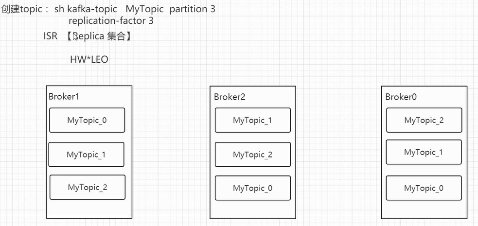

sh kafka-topics.sh --create --zookeeper 192.168.238.150:2181 --replication-factor=1 --partitions=3 --topic MyTopic2

ls /tmp/kafka-logs/
MyTopic2-2

ls /tmp/kafka-logs/
MyTopic2-0

ls /tmp/kafka-logs/

MyTopic2-1

ls /brokers/topics/MyTopic2/partitions 
[0, 1, 2]
get /brokers/topics/MyTopic2/partitions/0
null
cZxid = 0xe0000008d
ctime = Sun Apr 14 09:48:53 EDT 2019
mZxid = 0xe0000008d
mtime = Sun Apr 14 09:48:53 EDT 2019
pZxid = 0xe00000090
cversion = 1
dataVersion = 0
aclVersion = 0
ephemeralOwner = 0x0
dataLength = 0
numChildren = 1

get /brokers/topics/MyTopic2/partitions/0/state
{"controller_epoch":18,"leader":1,"version":1,"leader_epoch":8,"isr":[1]}
cZxid = 0xe00000090
ctime = Sun Apr 14 09:48:53 EDT 2019
mZxid = 0x100000001b
mtime = Sun Apr 14 09:54:33 EDT 2019
pZxid = 0xe00000090
cversion = 0
dataVersion = 8
aclVersion = 0
ephemeralOwner = 0x0
dataLength = 73
numChildren = 0

创建副本
sh kafka-topics.sh --create --zookeeper 192.168.238.150:2181 --replication-factor=3 --partitions=3 --topic MyTopic3

看到互为备份
ls /tmp/kafka-logs/
MyTopic3-0
MyTopic3-1
MyTopic3-2

可以看到副本队列isr 0,1,2
get /brokers/topics/MyTopic3/partitions/0/state
{"controller_epoch":18,"leader":0,"version":1,"leader_epoch":0,"isr":[0,1,2]}
cZxid = 0x100000004a
ctime = Sun Apr 14 09:59:08 EDT 2019
mZxid = 0x100000004a
mtime = Sun Apr 14 09:59:08 EDT 2019
pZxid = 0x100000004a
cversion = 0
dataVersion = 0
aclVersion = 0
ephemeralOwner = 0x0
dataLength = 77
numChildren = 0

kafka的文件存储
index与log成对出现
ll /tmp/kafka-logs/MyTopic2-2/
00000000000000000000.index
00000000000000000000.log

sh kafka-console-producer.sh --broker-list 192.168.238.150:9092 --topic MyTopic
sh kafka-console-consumer.sh --bootstrap-server 192.168.238.150:9092 --topic MyTopic --from-beginning

查看日志文件，可以看到记录的是日志baseOffset、lastOffset
sh kafka-run-class.sh kafka.tools.DumpLogSegments --files=/tmp/kafka-logs/MyTopic-0/00000000000000000000.log --print-data-log
baseOffset: 0 lastOffset: 1

