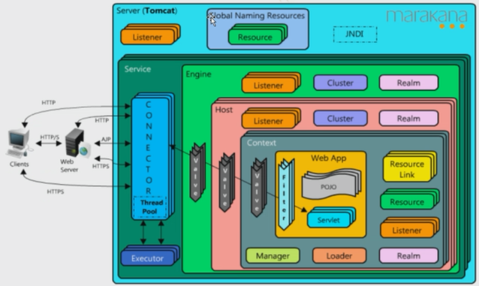
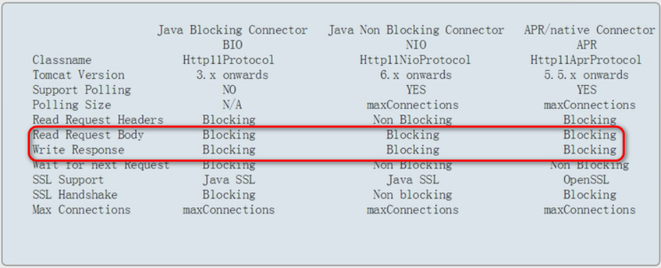
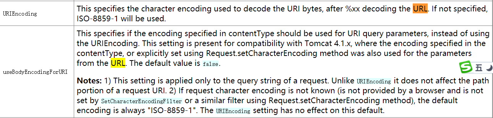
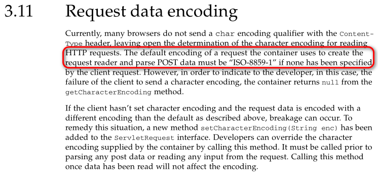

# 一、tomcat架构

overview 



## 目录结构

### /bin

### /conf

#### `catalina.policy`

​	Tomcat安全策略文件，控制JVM相关权限，俱体可以参考`java.security.Permission`

#### `catalina.properties`

 	tomcat catalina行为控制配置文件，比如Common ClassLoader

#### `logging.properties`

​	tomcat 日志配置文件，JDK Logging

#### `server.xml`

* `Listener`节点，监听者模式，如内存泄露保护

```xml
<Listener className="org.apache.catalina.startup.VersionLoggerListener" />
<Listener className="org.apache.catalina.core.AprLifecycleListener" SSLEngine="on" />
<Listener className="org.apache.catalina.core.JreMemoryLeakPreventionListener" />
<Listener className="org.apache.catalina.mbeans.GlobalResourcesLifecycleListener" />
<Listener className="org.apache.catalina.core.ThreadLocalLeakPreventionListener" />
```

* `GlobalNamingResources`全局JNDI（[Java Naming and Directory Interface](http://docs.oracle.com/javase/7/docs/technotes/guides/jndi/index.html) ）资源

* `Service`

  * `Connector`

  * `Engine`

    * `Realm`安全认证

      Realm文件实现方式： `tomcat-users.xml`tomcat角色相关

      ```xml
      <role rolename="manager-gui"/>
      <role rolename="manager-script"/>
      <role rolename="manager-jmx"/>
      <role rolename="manager-status"/>
      <user username="tomcat" password="admin123" roles="manager-gui,manager-script,manager-jmx,manager-status"/>
      ```

    * `Host`虚拟主机

#### `context.xml`

​	全局的context配置

#### `web.xml`

​	Servlet标准的web.xml部署文件，tomcat默认实现了部分配置：

* `org.apache.catalina.servlets.DefaultServlet`

  tomcat静态文件处理，自己对静态文件的优化,

  ```
  Status Code: 304 
  If-Modified-Since: Thu, 18 Jan 2018 12:13:10 GMT
  If-None-Match: W/"5103-1516277590000" -- hash值
  ```

* `org.apache.jasper.servlet.JspServlet`

### /logs

* `localhost.{date}.log`：当Tomcat启不来的时候看这个文件，比如类冲突

  * `NoClassDefFoundError`
  * `ClassNotFoundException`

* `localhost_access_log.{date}.txt`: 访问日志

* `catalina.{date}.log`: 控制台输出，`System.out`外置 

  ```java
  java.lang.System#setOut
  public static void setOut(PrintStream out) {
        checkIO();
        setOut0(out);
  }
  ```

  

### /webapps

简化Web部署应用方式

### /lib 公共类库

* `ecj-*.jar`：Eclipse java 编译器，可能不兼容

* `jasper.jar`: JSP编辑器

## 应用上下文

## 连接器

```xml
<Connector port="8080" protocol="HTTP/1.1"
               connectionTimeout="20000"
               redirectPort="8443" />
```

实现`org.apache.catalina.connector.Connector#Connector(java.lang.String)`

```java
public Connector(String protocol) {
        boolean aprConnector = AprLifecycleListener.isAprAvailable() &&
                AprLifecycleListener.getUseAprConnector();

        if ("HTTP/1.1".equals(protocol) || protocol == null) {
            if (aprConnector) {
                protocolHandlerClassName = "org.apache.coyote.http11.Http11AprProtocol";
            } else {
                protocolHandlerClassName = "org.apache.coyote.http11.Http11NioProtocol";
            }
        } else if ("AJP/1.3".equals(protocol)) {
            if (aprConnector) {
                protocolHandlerClassName = "org.apache.coyote.ajp.AjpAprProtocol";
            } else {
                protocolHandlerClassName = "org.apache.coyote.ajp.AjpNioProtocol";
            }
        } else {
            protocolHandlerClassName = protocol;
        }

        // Instantiate protocol handler
        ProtocolHandler p = null;
        try {
            Class<?> clazz = Class.forName(protocolHandlerClassName);
            p = (ProtocolHandler) clazz.getConstructor().newInstance();
        } catch (Exception e) {
            log.error(sm.getString(
                    "coyoteConnector.protocolHandlerInstantiationFailed"), e);
        } finally {
            this.protocolHandler = p;
        }

        // Default for Connector depends on this system property
        setThrowOnFailure(Boolean.getBoolean("org.apache.catalina.startup.EXIT_ON_INIT_FAILURE"));
    }
```

### BIO&NIO比较



## 线程池

注意配置中：

```xml
  <!-- A "Connector" using the shared thread pool-->
    <!--
    <Connector executor="tomcatThreadPool"
               port="8080" protocol="HTTP/1.1"
               connectionTimeout="20000"
               redirectPort="8443" />
    -->
```

tomcat的线程池

```java
public interface Executor extends java.util.concurrent.Executor, Lifecycle {

    public String getName();

    /**
     * Executes the given command at some time in the future.  The command
     * may execute in a new thread, in a pooled thread, or in the calling
     * thread, at the discretion of the <tt>Executor</tt> implementation.
     * If no threads are available, it will be added to the work queue.
     * If the work queue is full, the system will wait for the specified
     * time until it throws a RejectedExecutionException
     *
     * @param command the runnable task
     * @param timeout the length of time to wait for the task to complete
     * @param unit    the units in which timeout is expressed
     *
     * @throws java.util.concurrent.RejectedExecutionException if this task
     * cannot be accepted for execution - the queue is full
     * @throws NullPointerException if command or unit is null
     */
    void execute(Runnable command, long timeout, TimeUnit unit);
}
```

标准实现，`org.apache.catalina.core.StandardThreadExecutor`将连接处理交给JDK标准的线程池（`java.util.concurrent.Executor`）

`org.apache.tomcat.util.threads.ThreadPoolExecutor`

## Java EE 组件


## References

1. [生成War包及部署](../servlet/生成War包及部署.md)

2. http://tomcat.apache.org/tomcat-7.0-doc/connectors.html

3. http://tomcat.apache.org/tomcat-7.0-doc/config/http.html

4. 乱码问题

   `http://localhost:8080/demo?message=tom小强`

   在页面的响应为乱码

   `http://tomcat.apache.org/tomcat-7.0-doc/config/http.html`中描述

   

   servlet3.1规范中说明

   

   * 在`server.xml`中指定为`UTF-8`

       ```xml
          <Connector port="8080" protocol="HTTP/1.1"
                      connectionTimeout="20000"
                      redirectPort="8443" URIEncoding="UTF-8"/>
       ```

   * 方法中指定编码

       ```java
       req.setCharacterEncoding(StandardCharsets.UTF_8.name());
       resp.setCharacterEncoding(StandardCharsets.UTF_8.name());
       resp.setContentType("text/html;charset:UTF-8");
       ```

5. 热部署 
   修改`<Context>`的`reloadable="true"`属性
   
6. JNDI

   http://tomcat.apache.org/tomcat-7.0-doc/jndi-resources-howto.html

   接口`javax.naming.Context`

   ```java
       /**
        * Retrieves the named object.
        * If <tt>name</tt> is empty, returns a new instance of this context
        * (which represents the same naming context as this context, but its
        * environment may be modified independently and it may be accessed
        * concurrently).
        *
        * @param name
        *          the name of the object to look up
        * @return  the object bound to <tt>name</tt>
        * @throws  NamingException if a naming exception is encountered
        *
        * @see #lookup(String)
        * @see #lookupLink(Name)
        */
       public Object lookup(Name name) throws NamingException;
   ```

   如配置：

   ```xml
   <Context ...>
     ...
     <Resource name="mail/Session" auth="Container"
               type="javax.mail.Session"
               mail.smtp.host="localhost"/>
     ...
   </Context>
   ```

    那么可以通过

   ```java
   Context initCtx = new InitialContext();
   Context envCtx = (Context) initCtx.lookup("java:comp/env");
   Session session = (Session) envCtx.lookup("mail/Session");
   
   Message message = new MimeMessage(session);
   message.setFrom(new InternetAddress(request.getParameter("from")));
   InternetAddress to[] = new InternetAddress[1];
   to[0] = new InternetAddress(request.getParameter("to"));
   message.setRecipients(Message.RecipientType.TO, to);
   message.setSubject(request.getParameter("subject"));
   message.setContent(request.getParameter("content"), "text/plain");
   Transport.send(message);
   ```

   

