# 1. 分布式概述

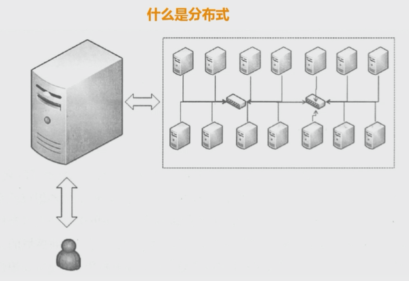

## 为什么要用分布式？

高并发、海量数据

## 什么是分布式？

1.  任务分解

2.  节点通信

## 分布式和集群的关系？

电商平台：  用户、 商品、订单、 交易

分布式： 一个业务拆分成多个子系统，部署在不同的服务器上

集群：  同一个业务，部署在多个服务器上

## 计算机的发展历史

1.	1946  情人节

2. 1964  IBM  SYSTEM/360

   超强的计算能力、 高可靠性

3. X86 CPU

4. RISC CPU  小型机

   软件架构往集中式发展， 成为当时软件架构的主流

   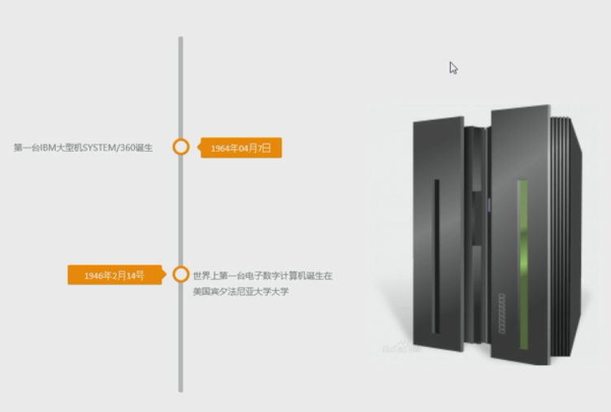

## 分布式架构的发展

1.	时机成熟了
PC机的性能不断提升

2. 企业必须要做

   Taobao 去IOE
   IBM小型机 、 Oracle Rac、 EMC存储设备

   PC mysql ---> mariadb   

   2013年5月17号，最后一台IMB小型机下线

   

## 单机计算机的架构->分布式计算机架构

架构的发展演变过程

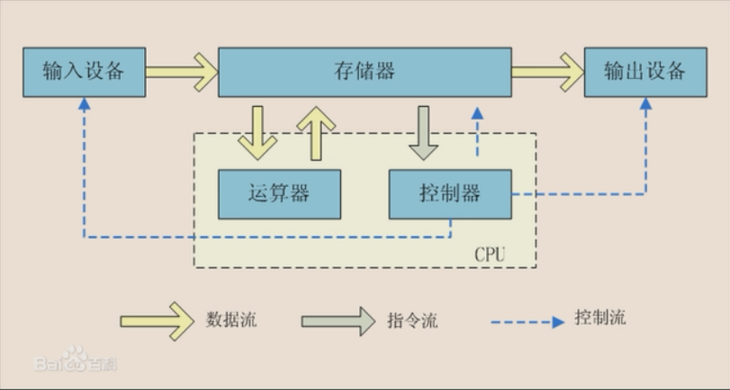

lamp

BAT

什么是大型网站
1.	访问量（tps、qps）
2.	数据量（存储数据量

## 电商平台的发展
用户、 商品、订单

容器： tomcat   ；jsp/servlet
数据库存储： mysql

网络层面的知识：tcp/udp

### 第一版应用

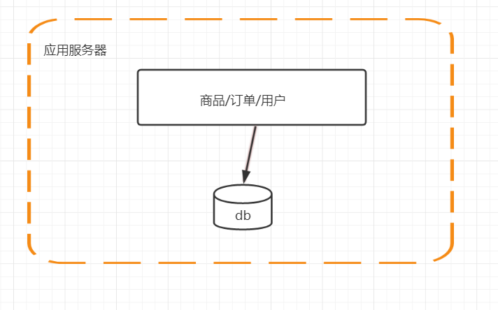

### 第二版 单击负载越来越高，数据库服务器和应用服务器分离

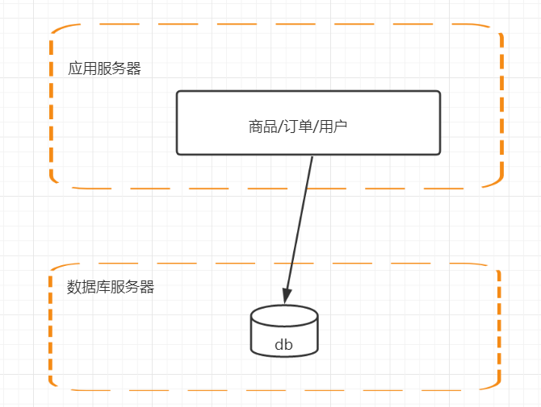

### 第三版  应用服务器做集群

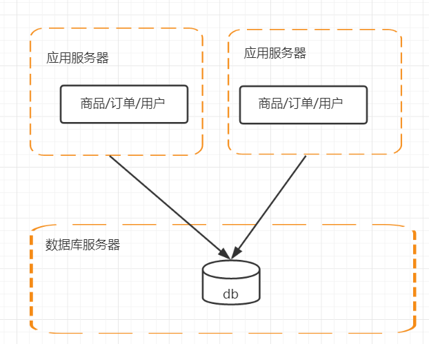

1 .session 

cookie 存储的是JSESSIONID
ConcurrentMap   key JSESSIONID  values session

解决session跨域共享问题
1.	 session sticky

2.	session replication

3.	session 集中存储
存储在db、 存储在缓存服务器 （redis）
4.	cookie (主流)
access_token(userid/token/timestamp)  
jwt=json web token
soa架构和微服务架构

3.	如何做请求转发

### 第四版 数据库的高性能操作

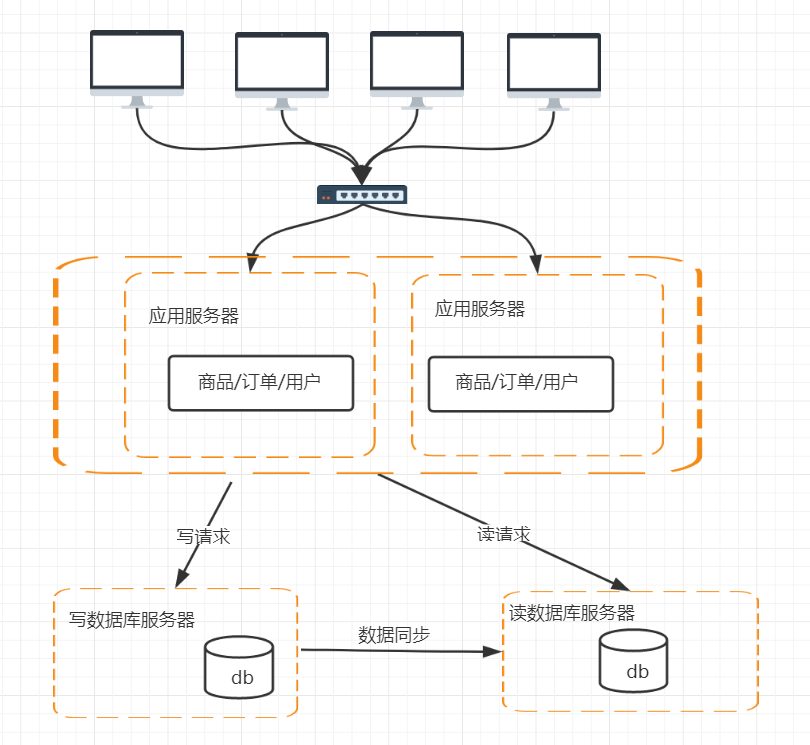

1.	数据库读写分离怎么操作
2.	数据库的数据同步
3.	数据库路由 mycat

### 第五版 电商平台最多的操作： 搜索商品

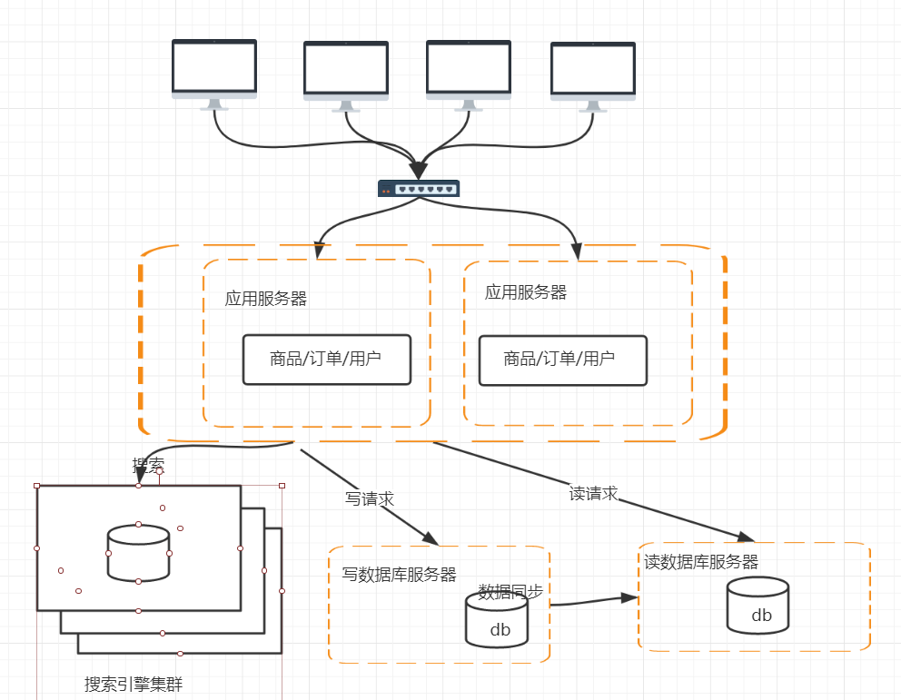

问题： 

1.	搜索引擎的索引数据怎么去做同步，实时增量同步？ 还是定时全量同步？

### 第六版 解决访问量持续增高，引入缓存机制
用户量是没有上限的
缓存、 限流、 降级

页面级缓存 CDN

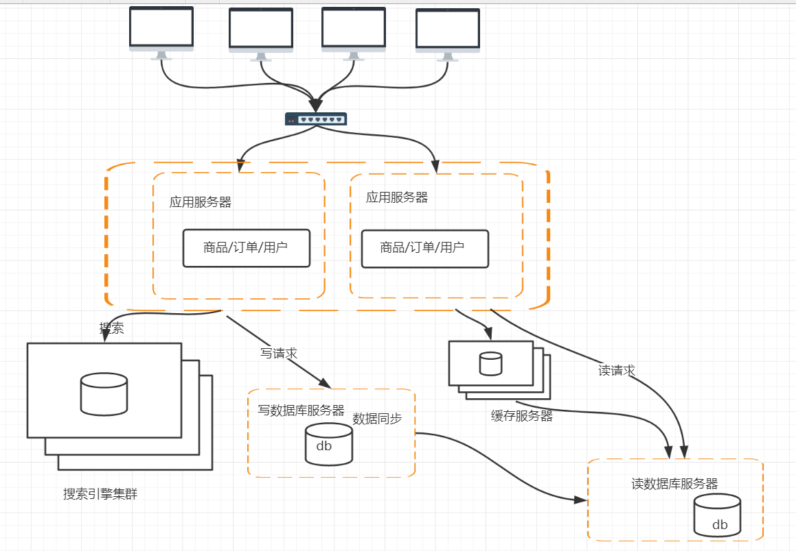

### 第8️版本 数据库的水平/垂直拆分

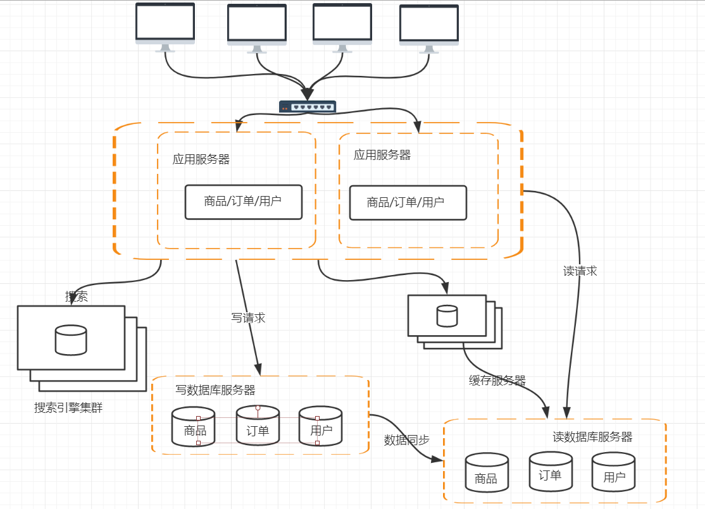

### 第9版本

单表500万~1000万

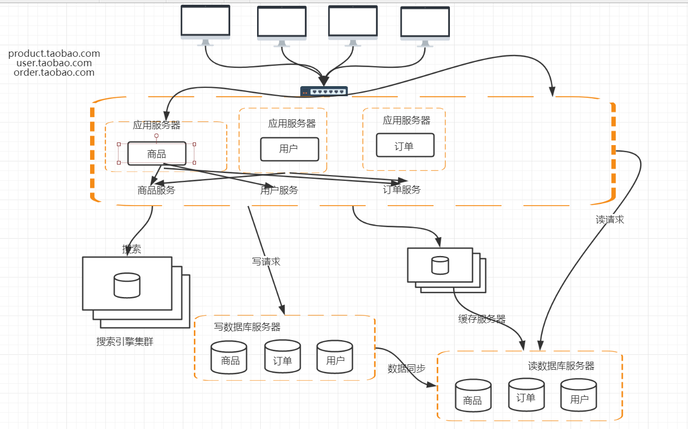

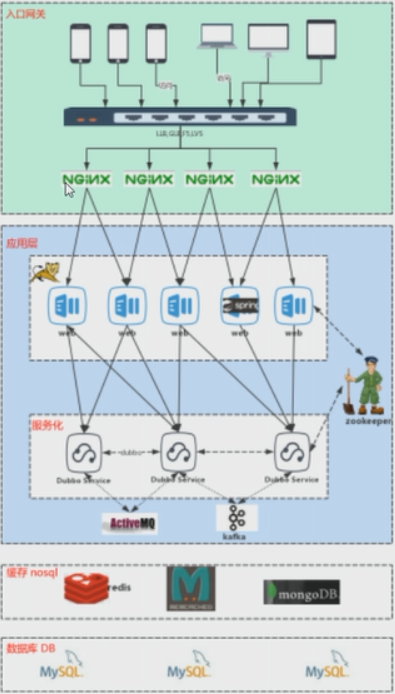

日志采集、数据分析   nagois storm fluent spark 

EIK

## cookie与session的区别

cookies nagois storm fluent spark 

Session  ConcurrentMap key JSESSIONID value session

## session跨域

1.  session sticky

2. session replication

3. session集中存储

   存储在DB，存储在缓存服务器(redis)

4. cookie(主流)

   access_token(UserId+token+timestamp)

## soa架构、微服务架构的区别

   