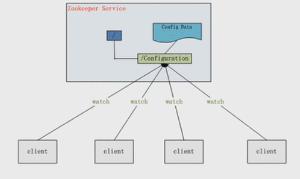
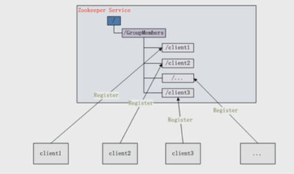
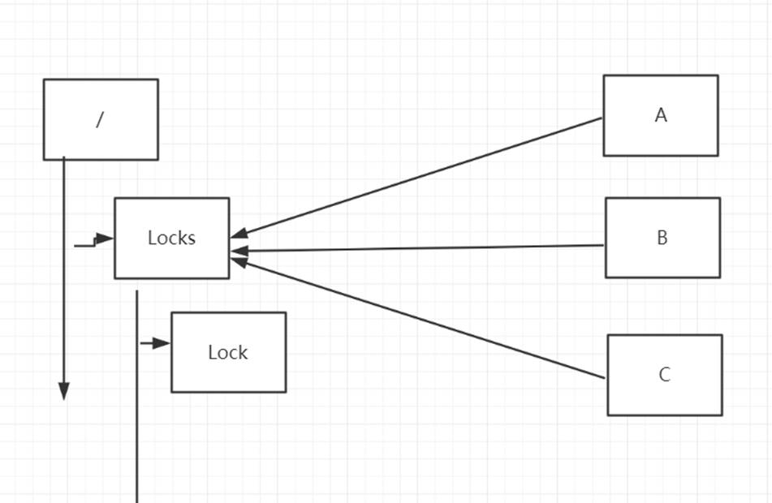

# 10.分布式协调服务-zookeeper之实际应用场景

## 数据发布订阅/ 配置中心

实现配置信息的集中式管理和数据的动态更新



实现配置中心有两种模式：push 、pull。

长轮训

zookeeper采用的是推拉相结合的方式。 客户端向服务器端注册自己需要关注的节点。一旦节点数据发生变化，那么服务器端就会向客户端

发送watcher事件通知。客户端收到通知后，主动到服务器端获取更新后的数据

主要的特点：

1. 数据量比较小

2. 数据内容在运行时会发生动态变更

3. 集群中的各个机器共享配置

## 负载均衡

请求/数据分摊多个计算机单元上

所谓集群管理无外乎两点：是否有机器加入和退出、选举master。
对于第一点，所有机器约定在父目录GroupMembers下创建临时目录节点，然后监听父目录节点的子节点变化消息。一旦有机器挂掉，该机器与 zookeeper的连接断开，其所创建的临时目录节点被删除，所有其他机器都收到通知：某个兄弟目录被删除，于是，所有人都知道了。新机器加入也是类似，所有机器收到通知：新兄弟目录加入，highcount又有了。
对于第二点，所有机器创建临时顺序编号目录节点，通过master选举算法选举出来。



## 分布式锁

通常实现分布式锁有几种方式

1. redis。 setNX 存在则会返回0， 不存在

2. 数据方式去实现

   创建一个表， 通过索引唯一的方式

   create table (id , methodname …)  methodname增加唯一索引

   insert 一条数据XXX  delete 语句删除这条记录

   mysql for update

3. zookeeper实现

   排他锁



 

共享锁（读锁）

实现共享锁，使用java api的方式

### `ZooKeeperClient.java`

```java
public class ZooKeeperClient {
    private static final int SESSION_TIMEOUT = 5000;
    public static ZooKeeper getInstance() throws IOException, InterruptedException {
        final CountDownLatch countDownLatch = new CountDownLatch(1);
        ZooKeeper zooKeeper = new ZooKeeper(CONNECT, SESSION_TIMEOUT, new Watcher() {
            @Override
            public void process(WatchedEvent watchedEvent) {
                if (watchedEvent.getState() == Event.KeeperState.SyncConnected) {
                    countDownLatch.countDown();
                }
            }
        });
        countDownLatch.await();
        return zooKeeper;
    }
}
```

### `DistributeLock.java`

```java
public class DistributeLock {
    public final static String ROOT_LOCK = "/LOCK";
    ZooKeeper instance;
    /**
     * 记录会话超时时间
     */
    int sessionTimeout = 0;
    public final static byte[] DATA = new byte[]{1, 2};
    /**
     * 记录锁节点ID
     */
    String lockId;
    private CountDownLatch countDownLatch;

    public DistributeLock() throws IOException, InterruptedException, KeeperException {
        this.instance = ZooKeeperClient.getInstance();
        this.sessionTimeout = instance.getSessionTimeout();
        this.countDownLatch = new CountDownLatch(1);
    }


    public boolean lock() {
        try {
            this.lockId = this.instance.create(ROOT_LOCK + "/", DATA, ZooDefs.Ids.OPEN_ACL_UNSAFE, CreateMode.EPHEMERAL_SEQUENTIAL);
            String name = Thread.currentThread().getName();
            System.out.println(name + "成功的创建了节点" + this.lockId + "，开始去竞争锁");
            List<String> children = this.instance.getChildren(ROOT_LOCK, true);
            SortedSet<String> objects = new TreeSet<>();
            children.forEach(child -> {
                objects.add(ROOT_LOCK + "/" + child);
            });
            String first = objects.first();
            if (StringUtils.equals(first, this.lockId)) {
                System.out.println(name + "成功的获取了锁，节点为【" + this.lockId + "】");
                return true;
            }
            SortedSet<String> lessThanLockId = objects.headSet(this.lockId);
            if (!lessThanLockId.isEmpty()) {
                String preLockId = lessThanLockId.last();
                this.instance.exists(preLockId, new WatcherLock(this.countDownLatch));
                //表示删除了节点或会话超时
                this.countDownLatch.await(this.sessionTimeout, TimeUnit.MILLISECONDS);
                System.out.println(name + " 成功的获得了锁：【" + this.lockId + "】");
                return true;
            }
        } catch (KeeperException e) {
            e.printStackTrace();
        } catch (InterruptedException e) {
            e.printStackTrace();
        }
        return false;
    }

    public boolean unlock() {
        System.out.println(Thread.currentThread().getName() + "->开始释放锁");
        try {
            this.instance.delete(this.lockId, -1);
            System.out.println(Thread.currentThread().getName() + "节点" + this.lockId + "被成功删除");
            return true;
        } catch (InterruptedException e) {
            e.printStackTrace();
        } catch (KeeperException e) {
            e.printStackTrace();
        }
        return false;
    }
}
```

### `WatcherLock.java`

```java
public class WatcherLock implements Watcher {
    private CountDownLatch countDownLatch;

    public WatcherLock(CountDownLatch countDownLatch) {
        this.countDownLatch = countDownLatch;
    }

    @Override
    public void process(WatchedEvent watchedEvent) {
        if (watchedEvent.getType() == Event.EventType.NodeDeleted) {
            countDownLatch.countDown();
        }
    }
}
```

### `TestDistributeLock.java`

```java
public class TestDistributeLock {
    private static synchronized void createRootLock() throws KeeperException, InterruptedException, IOException {
        final CountDownLatch lock = new CountDownLatch(1);
        ZooKeeper instance = ZooKeeperClient.getInstance();
        Stat exists = instance.exists(ROOT_LOCK, new Watcher() {
            @Override
            public void process(WatchedEvent watchedEvent) {
                if (watchedEvent.getType() == Event.EventType.NodeCreated) {
                    lock.countDown();
                }
            }
        });
        if (exists == null) {
            String result = instance.create(ROOT_LOCK, DATA, ZooDefs.Ids.OPEN_ACL_UNSAFE, CreateMode.PERSISTENT);
            lock.await();
            System.out.println("创建根节点：" + result);
        }
    }

    public static void main(String[] args) {
        try {
            createRootLock();
        } catch (KeeperException e) {
            e.printStackTrace();
        } catch (InterruptedException e) {
            e.printStackTrace();
        } catch (IOException e) {
            e.printStackTrace();
        }
        final CountDownLatch countDownLatch = new CountDownLatch(10);

        Random random = new Random();
        for (int idx = 0; idx < 10; idx++) {
            new Thread(() -> {
                DistributeLock lock = null;
                try {
                    lock = new DistributeLock();
                    countDownLatch.countDown();
                    countDownLatch.await();
                    lock.lock();
                    Thread.sleep(random.nextInt(500));
                } catch (IOException | InterruptedException e) {
                    e.printStackTrace();
                } catch (KeeperException e) {
                    e.printStackTrace();
                } finally {
                    if (lock != null) {
                        lock.unlock();
                    }
                }
            }).start();

        }
    }
}
```

输出

```java
Thread-9成功的创建了节点/LOCK/0000000022，开始去竞争锁
Thread-7成功的创建了节点/LOCK/0000000021，开始去竞争锁
Thread-4成功的创建了节点/LOCK/0000000020，开始去竞争锁
Thread-6成功的创建了节点/LOCK/0000000023，开始去竞争锁
Thread-2成功的创建了节点/LOCK/0000000024，开始去竞争锁
Thread-8成功的创建了节点/LOCK/0000000025，开始去竞争锁
Thread-5成功的创建了节点/LOCK/0000000027，开始去竞争锁
Thread-1成功的创建了节点/LOCK/0000000026，开始去竞争锁
Thread-3成功的创建了节点/LOCK/0000000028，开始去竞争锁
Thread-0成功的创建了节点/LOCK/0000000029，开始去竞争锁
Thread-4成功的获取了锁，节点为【/LOCK/0000000020】
Thread-4->开始释放锁
Thread-7 成功的获得了锁：【/LOCK/0000000021】
Thread-4节点/LOCK/0000000020被成功删除
Thread-7->开始释放锁
Thread-9 成功的获得了锁：【/LOCK/0000000022】
Thread-7节点/LOCK/0000000021被成功删除
Thread-9->开始释放锁
Thread-6 成功的获得了锁：【/LOCK/0000000023】
Thread-9节点/LOCK/0000000022被成功删除
Thread-6->开始释放锁
Thread-6节点/LOCK/0000000023被成功删除
Thread-2 成功的获得了锁：【/LOCK/0000000024】
Thread-2->开始释放锁
Thread-8 成功的获得了锁：【/LOCK/0000000025】
Thread-2节点/LOCK/0000000024被成功删除
Thread-8->开始释放锁
Thread-1 成功的获得了锁：【/LOCK/0000000026】
Thread-8节点/LOCK/0000000025被成功删除
Thread-1->开始释放锁
Thread-5 成功的获得了锁：【/LOCK/0000000027】
Thread-1节点/LOCK/0000000026被成功删除
Thread-5->开始释放锁
Thread-3 成功的获得了锁：【/LOCK/0000000028】
Thread-5节点/LOCK/0000000027被成功删除
Thread-3->开始释放锁
Thread-3节点/LOCK/0000000028被成功删除
Thread-0 成功的获得了锁：【/LOCK/0000000029】
Thread-0->开始释放锁
Thread-0节点/LOCK/0000000029被成功删除
```

## 命名服务

## master选举

7*24小时可用， 99.999%可用

master-slave模式

使用zookeeper解决

 ### `UserCenter.java`

```java
@Setter
@Getter
@AllArgsConstructor
public class UserCenter implements Serializable {
    private static final long serialVersionUID = -3501462815715742297L;
    /**
     * 机器的ID
     */
    private int mcId;
    /**
     * 机器的名字
     */
    private String mcName;
}
```

### `MasterSelector.java`

```java
public class MasterSelector {
    /**
     * master选举节点
     */
    private final static String MASTER_ROOT = "/master";
    private ZkClient zkClient;
    /**
     * master节点
     */
    private UserCenter master;
    /**
     * 其它服务器
     */
    private UserCenter server;
    /**
     * 节点内容的变化
     */
    private IZkDataListener dataListener;
    /**
     * 是否在选举
     */
    private boolean isRunning = false;

    public MasterSelector(ZkClient zkClient, UserCenter server) {
        System.out.println("服务器"+server.getMcName()+"来争抢master");
        this.zkClient = zkClient;
        this.server = server;
        this.dataListener = new IZkDataListener() {
            @Override
            public void handleDataChange(String s, Object o) throws Exception {

            }

            @Override
            public void handleDataDeleted(String s) throws Exception {
                System.out.println("解发节点删除事件："+s);
//如果根节点被删除发起选举操作
                chooseMaster();
            }
        };
    }

    private boolean isMaster() {
        UserCenter userCenter = zkClient.readData(MASTER_ROOT,true);
        if (userCenter!=null&&StringUtils.equals(userCenter.getMcName(), this.server.getMcName())) {
            this.master = userCenter;
            return true;
        }
        return false;
    }


    ScheduledExecutorService executorService = Executors.newScheduledThreadPool(1);


    private void chooseMaster() {
        if (!isRunning) {
           System.out.println("服务没有启动");
           return;
        }
        try {
            this.zkClient.createEphemeral(MASTER_ROOT, this.server);
            this.master = this.server;
            System.out.println(this.server.getMcName()+"选举成功，你们都要听我的！");
            //模拟出故障
            executorService.schedule(() -> {
                //master服务器挂了，其它服务器要顶上
                releaseMaster();
            }, 1, TimeUnit.SECONDS);

        } catch (ZkNodeExistsException e) {
            UserCenter userCenter = this.zkClient.readData(MASTER_ROOT, true);
            //master服务器不存在
            if (userCenter == null) {
                chooseMaster();
            } else {
                this.master = userCenter;
            }
        }
    }

    public void start() {
        if (!isRunning) {
            isRunning = true;
            zkClient.subscribeDataChanges(MASTER_ROOT, dataListener);
            chooseMaster();
        }
    }

    public void stop() {
        if (isRunning) {
            isRunning = false;
            executorService.shutdown();
            zkClient.unsubscribeDataChanges(MASTER_ROOT, dataListener);
            releaseMaster();
        }

    }

    private void releaseMaster() {
        if (isMaster()) {
            this.zkClient.delete(MASTER_ROOT);
        }
    }
}
```

### `MasterSelectorTest.java`

```java
public class MasterSelectorTest {
    public static void main(String[] args) throws IOException {
        List<MasterSelector> list = Lists.newArrayList();
        try {
            IntStream.range(0, 10).forEach(idx -> {
                ZkClient zkClient = new ZkClient(CONNECT, 5000, 5000, new SerializableSerializer());
                UserCenter userCenter = new UserCenter(idx, "服务器" + idx);
                MasterSelector masterSelector = new MasterSelector(zkClient, userCenter);
                masterSelector.start();
                list.add(masterSelector);
                try {
                    TimeUnit.SECONDS.sleep(1);
                } catch (InterruptedException e) {
                    e.printStackTrace();
                }
            });
        } finally {
            list.stream().forEach(masterSelector ->
                    masterSelector.stop()
            );
        }
        System.in.read();

    }
}
```

输出

```cmd
服务器服务器0来争抢master
服务器0选举成功，你们都要听我的！
服务器服务器1来争抢master
服务器1选举成功，你们都要听我的！
服务器服务器2来争抢master
服务器2选举成功，你们都要听我的！
解发节点删除事件：/master
解发节点删除事件：/master
服务器服务器3来争抢master
解发节点删除事件：/master
解发节点删除事件：/master
服务器3选举成功，你们都要听我的！
解发节点删除事件：/master
解发节点删除事件：/master
解发节点删除事件：/master
解发节点删除事件：/master
服务器1选举成功，你们都要听我的！
服务器服务器4来争抢master
解发节点删除事件：/master
解发节点删除事件：/master
解发节点删除事件：/master
解发节点删除事件：/master
服务器1选举成功，你们都要听我的！
服务器服务器5来争抢master
解发节点删除事件：/master
解发节点删除事件：/master
解发节点删除事件：/master
解发节点删除事件：/master
解发节点删除事件：/master
服务器2选举成功，你们都要听我的！
服务器服务器6来争抢master
解发节点删除事件：/master
解发节点删除事件：/master
解发节点删除事件：/master
解发节点删除事件：/master
解发节点删除事件：/master
解发节点删除事件：/master
服务器0选举成功，你们都要听我的！
服务器服务器7来争抢master
解发节点删除事件：/master
解发节点删除事件：/master
解发节点删除事件：/master
解发节点删除事件：/master
解发节点删除事件：/master
解发节点删除事件：/master
服务器3选举成功，你们都要听我的！
服务器服务器8来争抢master
解发节点删除事件：/master
解发节点删除事件：/master
解发节点删除事件：/master
解发节点删除事件：/master
解发节点删除事件：/master
服务器6选举成功，你们都要听我的！
服务器服务器9来争抢master
解发节点删除事件：/master
解发节点删除事件：/master
解发节点删除事件：/master
解发节点删除事件：/master
解发节点删除事件：/master
解发节点删除事件：/master
解发节点删除事件：/master
服务器0选举成功，你们都要听我的！
解发节点删除事件：/master
解发节点删除事件：/master
解发节点删除事件：/master
解发节点删除事件：/master
解发节点删除事件：/master
解发节点删除事件：/master
解发节点删除事件：/master
服务没有启动
服务器3选举成功，你们都要听我的！
解发节点删除事件：/master
解发节点删除事件：/master
解发节点删除事件：/master
服务器7选举成功，你们都要听我的！
解发节点删除事件：/master
服务器8选举成功，你们都要听我的！
解发节点删除事件：/master
服务没有启动
```


下堂课的内容：per实现原理讲解

 

**分布式队列**

**1.**  **作业**

**master****选举改成多线程(多进程)模型（master-slave） 创建三个工程，while去抢**

**2.**  **分布式队列**

**activeMQ****、kafka、….**

 

​	先进先出队列

1. 通过getChildren获取指定根节点下的所有子节点，子节点就是任务

2. 确定自己节点在子节点中的顺序

3. 如果自己不是最小的子节点，那么监控比自己小的上一个子节点，否则处于等待

4. 接收watcher通知，重复流程
Barrier模式