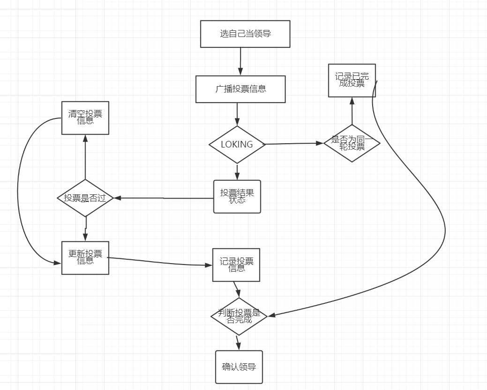
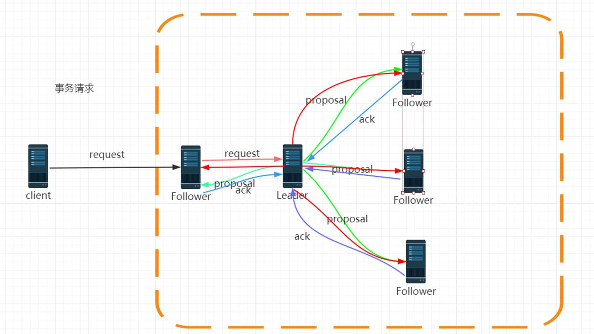

## curator 提供应用场景的封装

curator-reciples 

* master/leader选举 

* 分布式锁（读锁、写锁）

* 分布式队列

 

### LeaderLatch

写一个master 

LeaderSelector

每一个应用都写一个临时有序节点，根据最小的节点来获得优先权

`MasterSelector.java`

```java
public class MasterSelector {
    private static final String MASTER_PATH = "/MASTER_SELECTOR";

    public static void main(String[] args) throws Exception {
        CuratorFramework build = CuratorFrameworkFactory.builder().connectString(CONNECT).retryPolicy(new ExponentialBackoffRetry(1000, 3)).build();
        LeaderSelector leaderSelector = new LeaderSelector(build, MASTER_PATH, new LeaderSelectorListener() {
            @Override
            public void takeLeadership(CuratorFramework curatorFramework) throws Exception {
                System.out.println("获得Leader成功");
                TimeUnit.SECONDS.sleep(3);
            }

            @Override
            public void stateChanged(CuratorFramework client, ConnectionState newState) {

            }
        });
        leaderSelector.autoRequeue();
        //开始竞争
        leaderSelector.start();
        build.start();
        System.out.println(build.getState());
        String result = build.create().creatingParentsIfNeeded().withMode(CreateMode.EPHEMERAL_SEQUENTIAL)
                .forPath(MASTER_PATH+"/create_order", "123".getBytes());
        System.out.println("完成选举"+result);
    }
}
```

## zookeeper集群角色

### leader

  leader是zookeeper集群的核心。

1. 事务请求的唯一调度者和处理者，保证集群事务处理的顺序性

2. 集群内部各个服务器的调度者

### follower

1. 处理客户端非事务请求，以及转发事务请求给leader服务器

2. 参与事务请求提议（proposal）的投票（客户端的一个事务请求，需要半数服务器投票通过以后才能通知leader commit； leader会发起一个提案，要求follower投票）

3. 参与leader选举的投票

### observer

观察zookeeper集群中最新状态的变化并将这些状态同步到observer服务器上

增加observer不影响集群中事务处理能力，同时还能提升集群的非事务处理能力

## zookeeper的集群组成

zookeeper一般是由 2n+1台服务器组成

## leader选举

leaderElection/AuthFastLeaderElection/FastLeaderElection

QuorumPeer   startLeaderElection

源码地址：https://github.com/apache/zookeeper.git

需要的条件： jdk 1.7以上 、ant 、idea

FastLeaderElection

serverid : 在配置server集群的时候，给定服务器的标识id（myid）

zxid : 服务器在运行时产生的数据ID， zxid的值越大，表示数据越新

Epoch: 选举的轮数

server的状态：Looking、 Following、Observering、Leading

第一次初始化启动的时候： LOOKING

1. 所有在集群中的server都会推荐自己为leader，然后把（myid、zxid、epoch）作为广播信息，广播给集群中的其他server, 然后等待其他服务器返回

2. 每个服务器都会接收来自集群中的其他服务器的投票。集群中的每个服务器在接受到投票后，开始判断投票的有效性

   a)  判断逻辑时钟(Epoch) ，如果Epoch大于自己当前的Epoch，说明自己保存的Epoch是过期。更新Epoch，同时clear其他服务器发送过来的选举数据。判断是否需要更新当前自己的选举情况

   b)  如果Epoch小于目前的Epoch，说明对方的epoch过期了，也就意味着对方服务器的选举轮数是过期的。这个时候，只需要讲自己的信息发送给对方

   c)   

3. 

## ZAB协议

拜占庭问题

paxos协议主要就是如何保证在分布式环网络环境下，各个服务器如何达成一致最终保证数据的一致性问题

ZAB协议，基于paxos协议的一个改进。

zab协议为分布式协调服务zookeeper专门设计的一种支持崩溃恢复的原子广播协议

zookeeper并没有完全采用paxos算法， 而是采用zab Zookeeper atomic broadcast

### zab协议的原理

1. 在zookeeper 的主备模式下，通过zab协议来保证集群中各个副本数据的一致性

2. zookeeper使用的是单一的主进程来接收并处理所有的事务请求，并采用zab协议，把数据的状态变更以事务请求的形式广播到其他的节点

3. zab协议在主备模型架构中，保证了同一时刻只能有一个主进程来广播服务器的状态变更

4. 所有的事务请求必须由全局唯一的服务器来协调处理，这个的服务器叫leader，其他的叫follower

   leader节点主要负责把客户端的事务请求转化成一个事务提议（proposal），并分发给集群中的所有follower节点

   再等待所有follower节点的反馈。一旦超过半数服务器进行了正确的反馈，那么leader就会commit这条消息

 

崩溃恢复

原子广播

### zab协议的工作原理

1. 什么情况下zab协议会进入崩溃恢复模式

1. 当服务器启动时

2. 当leader服务器出现网络中断、崩溃或者重启的情况

3. 集群中已经不存在过半的服务器与该leader保持正常通信

2. zab协议进入崩溃恢复模式会做什么

1. 当leader出现问题，zab协议进入崩溃恢复模式，并且选举出新的leader。当新的leader选举出来以后，如果集群中已经有过半机器完成了leader服务器的状态同（数据同步），退出崩溃恢复，进入消息广播模式

2. 当新的机器加入到集群中的时候，如果已经存在leader服务器，那么新加入的服务器就会自觉进入数据恢复模式，找到leader进行数据同步



问题

假设一个事务在leader服务器被提交了，并且已经有过半的follower返回了ack。 在leader节点把commit消息发送给folower机器之前

leader服务器挂了怎么办

zab协议，一定需要保证已经被leader提交的事务也能够被所有follower提交

zab协议需要保证，在崩溃恢复过程中跳过哪些已经被丢弃的事务

## 总结zookeeper

### zookeeper数据模型 
临时节点（有序）、 持久化节点（有序）
zookeeper是一个开源的分布式协调框架; 数据发布订阅、负载均衡、集群、master选举
* 原子性
  要么同时成功、要么同时失败 （分布式事务）
* 单一视图
  无论客户端连接到哪个服务器，所看到的模型都是一样
* 可靠性
  一旦服务器端提交了一个事务并且获得了服务器端返回成功的标识，那么这个事务所引起的服务器端的变更会一直保留
* 实时性
  近实时 
zookeeper并不是用来存储数据的，通过监控数据状态的变化，达到基于数据的集群管理。
数据模型是一个树形结构，最小的数据单元是ZNODE
* 临时节点
* 持久化节点
* 临时有序节点
* 持久化有序节点
### 集群配置

1. 修改zoo.cfg

   server.id=ip:port:port 第一个Port 数据同步通信、 第二个port ：leader选举（3181）

   id=myid (myid 参与leader选举、 在整个集群中表示唯一服务器的标识)

    ```config
   cat /opt/zookeeper-3.4.10/conf/zoo.cfg 
   # The number of milliseconds of each tick
   tickTime=2000
   # The number of ticks that the initial 
   # synchronization phase can take
   initLimit=10
   # The number of ticks that can pass between 
   # sending a request and getting an acknowledgement
   syncLimit=5
   # the directory where the snapshot is stored.
   # do not use /tmp for storage, /tmp here is just 
   # example sakes.
   # the port at which the clients will connect
   # the maximum number of client connections.
   # increase this if you need to handle more clients
   #maxClientCnxns=60
   #
   # Be sure to read the maintenance section of the 
   # administrator guide before turning on autopurge.
   #
   # http://zookeeper.apache.org/doc/current/zookeeperAdmin.html#sc_maintenance
   #
   # The number of snapshots to retain in dataDir
   #autopurge.snapRetainCount=3
   # Purge task interval in hours
   # Set to "0" to disable auto purge feature
   #autopurge.purgeInterval=1
   clientPort=2181
   dataDir=/opt/zookeeper/data
   dataLogDir=/opt/zookeeper/dataLog
   server.1=192.168.238.150:2888:3888
   server.2=192.168.238.155:2888:3888
   server.3=192.168.238.160:2888:3888
   server.4=192.168.238.165:2888:3888:observer
    ```

   

2. dataDir目录下 创建一个myid的文件 ， 内容： server.id对应当前服务器的id号

3. 如果增加observer 

   需要在第一步中， 

   server.id=ip:port:port:observer

   peerType=observer

   ```
   peerType=observer
   clientPort=2181
   dataDir=/opt/zookeeper/data
   dataLogDir=/opt/zookeeper/dataLog
   server.1=192.168.238.150:2888:3888
   server.2=192.168.238.155:2888:3888
   server.3=192.168.238.160:2888:3888
   server.4=192.168.238.160:2888:3888:observer
   ```

### 会话

NOT_CONNECTED  - > CONNECTING ->CONNECTED ->ClOSE

```java
KeeperState.Unknown;
KeeperState.Disconnected;
KeeperState.NoSyncConnected;
KeeperState.SyncConnected;
KeeperState.AuthFailed;
KeeperState.ConnectedReadOnly;
KeeperState.SaslAuthenticated;
KeeperState.Expired;
```

### 状态信息

Stat

 ```bash
get /MASTER_SELECTOR
cZxid = 0x5400000005
ctime = Fri Dec 27 19:08:37 EST 2019
mZxid = 0x5400000005
mtime = Fri Dec 27 19:08:37 EST 2019
pZxid = 0x5400000009
cversion = 4
dataVersion = 0
aclVersion = 0
ephemeralOwner = 0x0
dataLength = 0
numChildren = 0
 ```

zab协议 ： 如果客户端发了一个事务请求给到leader， 而leader发送给各个follower以后，并且收到了ack，leader已经commit。 在准备ack给各个follower节点comit的时候，leader挂了，怎么处理的。 

1. 选举新的leader（zxid的最大值）
2. 同步给其他的folower

### watcher

EventyType

```java
None (-1) #客户端与服务器端成功建立会话
NodeCreated (1), 节点创建
NodeDeleted (2), 节点删除
NodeDataChanged (3),数据变更：数据内容
NodeChildrenChanged (4);子节点发生变更： 子节点删除、新增的时候，才会触发
```

watcher的特性
 一次性触发： 事件被处理一次后，会被移除，如果需要永久监听，则需要反复注册

zkClient （ 永久监听的封装）

curator 

java api的话， zk.exists , zk.getData 创建一个watcher监听

zookeeper序列化使用的是Jute

### Acl权限的操作

保证存储在zookeeper上的数据安全性问题

schema(ip/**Digest**/world/super)
 授权对象（192.168.1.1/11 , root:root / world:anyone/ super） 

 ### 数据存储

内存数据和磁盘数据 

zookeeper会定时把数据存储在磁盘上。

DataDir = 存储的是数据的快照

快照： 存储某一个时刻全量的内存数据内容

### DataLogDir 存储事务日志

log.zxid

查看事务日志的命令

```bash
export ZK_HOME=/opt/zookeeper-3.4.10                           
java -cp:$ZK_HOME/lib/slf4j-api-1.6.1.jar:$ZK_HOME/zookeeper-3.4.10.jar org.apache.zookeeper.server.LogFormatter log.1400000021
```

zookeeper 有三种日志

* zookeeper.out 运行日志

* 快照   存储某一时刻的全量数据

* 事务日志 事务操作的日志记录