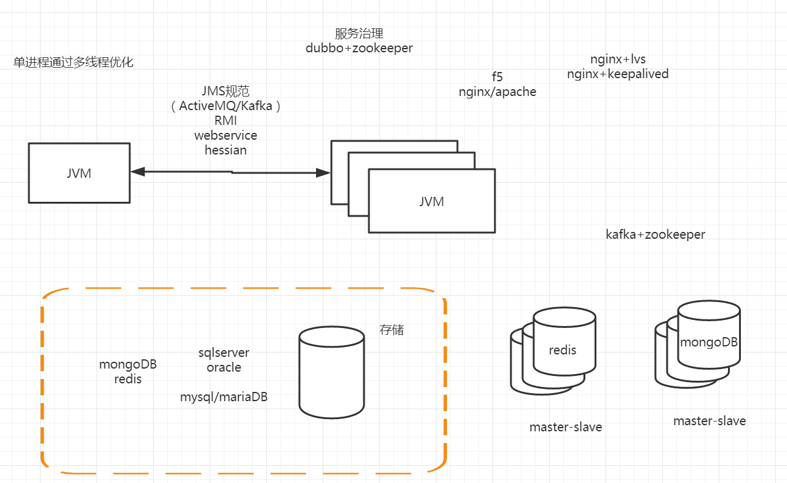
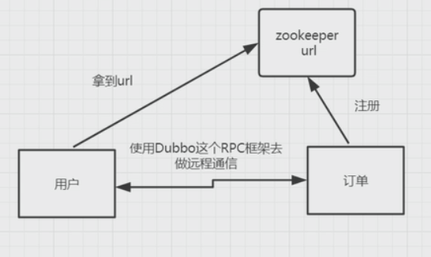
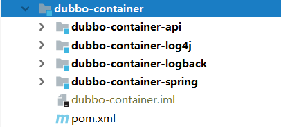

# dubbo初探

Dubbo官网：

[http://dubbo.apache.org](http://dubbo.apache.org/)

dubbo+spring boot +docker

https://github.com/apache/dubbo.git

## dubbo能解决什么问题

1. 怎么去维护url

   通过注册中心去维护url（zookeeper、redis、memcache…）

   各个应用节点中的url管理维护很困难、 依赖关系很模糊

2. F5硬件负载均衡器的单点压力比较大

   软负载均衡

3. 怎么去整理出服务之间的依赖关系。

   自动去整理各个服务之间的依赖

4. 如果服务器的调用量越来越大，服务器的容量问题怎么去评估，扩容的指标

   需要一个监控平台，可以监控调用量、响应时间

   每个应用节点的性能、访问量、响应时间，没办法评估

   

## Dubbo是什么

dubbo是一个分布式的服务框架，提供高性能的以及透明化的RPC远程服务调用解决方法，以及SOA服务治理方案。

Dubbo的核心部分：

* 远程通信

* 集群容错

* 服务的自动发现

* 负载均衡

### Dubbo的架构

核心角色

Provider

Consumer

Registry

Monitor

Container


 

> 一台高性能的刀片机
>
> 32G内存  16核心 
>
> 虚拟化
>
> 4G  2核心 – 8台 
>
> PAAS (platform-as-a-service）
>
> IAAS (infrastucture-as-a-service)
>
> SAAS(软件即服务)
>
> kvm  vm window server

## Dubbo的使用入门

### Order-API模块

`pom.xml`

```xml
<?xml version="1.0" encoding="UTF-8"?>
<project xmlns="http://maven.apache.org/POM/4.0.0"
         xmlns:xsi="http://www.w3.org/2001/XMLSchema-instance"
         xsi:schemaLocation="http://maven.apache.org/POM/4.0.0 http://maven.apache.org/xsd/maven-4.0.0.xsd">
    <modelVersion>4.0.0</modelVersion>
    <groupId>com.tom</groupId>
    <artifactId>gs-dubbo-demo</artifactId>
    <version>1.0-SNAPSHOT</version>
    <properties>
        <project.build.sourceEncoding>UTF-8</project.build.sourceEncoding>
        <maven.compiler.source>1.8</maven.compiler.source>
        <maven.compiler.target>1.8</maven.compiler.target>
    </properties>
    <modules>
        <module>order-api</module>
        <module>order-provider</module>
        <module>user-provider</module>
    </modules>
    <packaging>pom</packaging>
    <dependencyManagement>
        <dependencies>
            <dependency>
                <groupId>com.alibaba</groupId>
                <artifactId>fastjson</artifactId>
                <version>1.2.61</version>
            </dependency>
            <dependency>
                <groupId>com.tom</groupId>
                <artifactId>order-api</artifactId>
                <version>1.0-SNAPSHOT</version>
            </dependency>
            <dependency>
                <groupId>org.slf4j</groupId>
                <artifactId>slf4j-simple</artifactId>
                <version>1.7.6</version>
            </dependency>
            <dependency>
                <groupId>org.projectlombok</groupId>
                <artifactId>lombok</artifactId>
                <version>1.18.10</version>
                <scope>provided</scope>
            </dependency>
            <dependency>
                <groupId>junit</groupId>
                <artifactId>junit</artifactId>
                <version>4.11</version>
                <scope>test</scope>
            </dependency>
            <dependency>
                <groupId>com.alibaba</groupId>
                <artifactId>dubbo</artifactId>
                <version>2.5.3</version>
            </dependency>
        </dependencies>
    </dependencyManagement>
</project> 
```

请求参数`DoOrderReq.java`

```java
@Setter
@Getter
public class DoOrderReq implements Serializable {
    private static final long serialVersionUID = -2466295291144760322L;
    private String name;
}
```

响应参数`DoOrderRes.java`

```java
@Setter
@Getter
public class DoOrderRes implements Serializable {
    private static final long serialVersionUID = 1249320143365638280L;
    private String returnCode;
    private String returnDesc;
    private Object data;
}
```

订单接口`OrderService.java`

```java
public interface OrderService {
    DoOrderRes doOrder(DoOrderReq doOrderReq);
}
```

### Order-Provider模块

`pom.xml`

```xml
<?xml version="1.0" encoding="UTF-8"?>
<project xmlns="http://maven.apache.org/POM/4.0.0" xmlns:xsi="http://www.w3.org/2001/XMLSchema-instance"
         xsi:schemaLocation="http://maven.apache.org/POM/4.0.0 http://maven.apache.org/xsd/maven-4.0.0.xsd">
    <parent>
        <artifactId>gs-dubbo-demo</artifactId>
        <groupId>com.tom</groupId>
        <version>1.0-SNAPSHOT</version>
    </parent>
    <modelVersion>4.0.0</modelVersion>
    <artifactId>order-provider</artifactId>
    <name>order-provider</name>
    <packaging>jar</packaging>
    <dependencies>
        <dependency>
            <groupId>junit</groupId>
            <artifactId>junit</artifactId>
        </dependency>
        <dependency>
            <groupId>com.tom</groupId>
            <artifactId>order-api</artifactId>
        </dependency>
        <dependency>
            <groupId>com.alibaba</groupId>
            <artifactId>fastjson</artifactId>
        </dependency>
        <dependency>
            <groupId>org.slf4j</groupId>
            <artifactId>slf4j-simple</artifactId>
        </dependency>
        <dependency>
            <groupId>org.projectlombok</groupId>
            <artifactId>lombok</artifactId>
        </dependency>
        <dependency>
            <groupId>com.alibaba</groupId>
            <artifactId>dubbo</artifactId>
        </dependency>
    </dependencies>
</project>
```

`OrderServiceImpl.java`

```java
@Slf4j
public class OrderServiceImpl implements OrderService {
    @Override
    public DoOrderRes doOrder(DoOrderReq doOrderReq) {
        log.info("客户端过来的请求数据：{}",JSON.toJSONString(doOrderReq));
        DoOrderRes doOrderRes = new DoOrderRes();
        doOrderRes.setReturnCode("000");
        doOrderRes.setReturnDesc("下订单成功");
        return doOrderRes;
    }
}
```

`META-INF/spring/provider.xml`

```xml
<beans xmlns="http://www.springframework.org/schema/beans"
       xmlns:xsi="http://www.w3.org/2001/XMLSchema-instance"
       xmlns:dubbo="http://code.alibabatech.com/schema/dubbo"
       xsi:schemaLocation="http://www.springframework.org/schema/beans
        http://www.springframework.org/schema/beans/spring-beans.xsd
         http://code.alibabatech.com/schema/dubbo
           http://code.alibabatech.com/schema/dubbo/dubbo.xsd">
    <!-- provider's application name, used for tracing dependency relationship -->
    <dubbo:application name="order-provider" owner="tom"/>
    <!-- use multicast registry center to export service -->
    <dubbo:registry address="N/A"/>
    <!-- use dubbo protocol to export service on port 20880 -->
    <dubbo:protocol name="dubbo" port="20880"/>
    <!-- service implementation, as same as regular local bean -->
    <bean id="orderService" class="com.tom.OrderServiceImpl"/>
    <!-- declare the service interface to be exported -->
    <dubbo:service interface="com.tom.OrderService" ref="orderService"/>
</beans>
```

`log4j.properties`

```properties
###set log levels###
log4j.rootLogger=info, stdout
###output to the console###
log4j.appender.stdout=org.apache.log4j.ConsoleAppender
log4j.appender.stdout.Target=System.out
log4j.appender.stdout.layout=org.apache.log4j.PatternLayout
log4j.appender.stdout.layout.ConversionPattern=[%d{dd/MM/yy hh:mm:ss:sss z}] %t %5p %c{2}: %m%n
```

启动服务`App.java`

```java
import com.alibaba.dubbo.container.Main;

public class App {
    public static void main(String[] args) {
        System.setProperty("java.net.preferIPv4Stack", "true");
        Main.main(args);
    }
}
```

### 消费模块user-provider

`src\main\resources\order-consumer.xml`

```xml
<beans xmlns="http://www.springframework.org/schema/beans"
       xmlns:xsi="http://www.w3.org/2001/XMLSchema-instance"
       xmlns:dubbo="http://code.alibabatech.com/schema/dubbo"
       xsi:schemaLocation="http://www.springframework.org/schema/beans
        http://www.springframework.org/schema/beans/spring-beans.xsd
         http://code.alibabatech.com/schema/dubbo
         http://code.alibabatech.com/schema/dubbo/dubbo.xsd">
    <!-- provider's application name, used for tracing dependency relationship -->
    <dubbo:application name="order-provider"/>
    <!-- use multicast registry center to export service -->
    <dubbo:registry address="N/A"/>
    <dubbo:reference id="orderService" interface="com.tom.OrderService"
                     url="dubbo://192.168.56.1:20880/com.tom.OrderService"/>
</beans>
```

`App.java`

```java
public class App {
    public static void main(String[] args) {
        ClassPathXmlApplicationContext context = new ClassPathXmlApplicationContext("order-consumer.xml");
        OrderService orderService =(OrderService) context.getBean("orderService");
        DoOrderReq doOrderReq = new DoOrderReq();
        doOrderReq.setName("大众汽车");
        DoOrderRes doOrderRes = orderService.doOrder(doOrderReq);
        System.out.println(JSON.toJSONString(doOrderRes));
    }
}
```

分别启动服务提供者和服务消费者

日志输出

```cmd
[main] INFO com.alibaba.dubbo.common.logger.LoggerFactory - using logger: com.alibaba.dubbo.common.logger.slf4j.Slf4jLoggerAdapter
[main] INFO com.alibaba.dubbo.container.Main -  [DUBBO] Use container type([spring]) to run dubbo serivce., dubbo version: 2.5.3, current host: 127.0.0.1
12月 29, 2019 12:24:24 上午 org.springframework.context.support.AbstractApplicationContext prepareRefresh
信息: Refreshing org.springframework.context.support.ClassPathXmlApplicationContext@1b26f7b2: display name [org.springframework.context.support.ClassPathXmlApplicationContext@1b26f7b2]; startup date [Sun Dec 29 00:24:24 GMT+08:00 2019]; root of context hierarchy
12月 29, 2019 12:24:24 上午 org.springframework.beans.factory.xml.XmlBeanDefinitionReader loadBeanDefinitions
信息: Loading XML bean definitions from file [E:\data\wwwtest\gs-dubbo-demo\order-provider\target\classes\META-INF\spring\provider.xml]
12月 29, 2019 12:24:24 上午 org.springframework.context.support.AbstractApplicationContext obtainFreshBeanFactory
信息: Bean factory for application context [org.springframework.context.support.ClassPathXmlApplicationContext@1b26f7b2]: org.springframework.beans.factory.support.DefaultListableBeanFactory@31f9b85e
WARNING: An illegal reflective access operation has occurred
WARNING: Illegal reflective access by javassist.ClassPool (file:/E:/server/repository/org/javassist/javassist/3.15.0-GA/javassist-3.15.0-GA.jar) to method java.lang.ClassLoader.defineClass(java.lang.String,byte[],int,int)
WARNING: Please consider reporting this to the maintainers of javassist.ClassPool
WARNING: Use --illegal-access=warn to enable warnings of further illegal reflective access operations
WARNING: All illegal access operations will be denied in a future release
12月 29, 2019 12:24:25 上午 org.springframework.beans.factory.support.DefaultListableBeanFactory preInstantiateSingletons
信息: Pre-instantiating singletons in org.springframework.beans.factory.support.DefaultListableBeanFactory@31f9b85e: defining beans [order-provider,com.alibaba.dubbo.config.RegistryConfig,dubbo,orderService,com.tom.OrderService]; root of factory hierarchy
[main] INFO com.alibaba.dubbo.config.AbstractConfig -  [DUBBO] The service ready on spring started. service: com.tom.OrderService, dubbo version: 2.5.3, current host: 127.0.0.1
[main] INFO com.alibaba.dubbo.config.AbstractConfig -  [DUBBO] Export dubbo service com.tom.OrderService to local registry, dubbo version: 2.5.3, current host: 127.0.0.1
[main] INFO com.alibaba.dubbo.config.AbstractConfig -  [DUBBO] Export dubbo service com.tom.OrderService to url dubbo://192.168.56.1:20880/com.tom.OrderService?anyhost=true&application=order-provider&dubbo=2.5.3&interface=com.tom.OrderService&methods=doOrder&owner=tom&pid=7696&side=provider&timestamp=1577550265141, dubbo version: 2.5.3, current host: 127.0.0.1
[main] INFO com.alibaba.dubbo.remoting.transport.AbstractServer -  [DUBBO] Start NettyServer bind /0.0.0.0:20880, export /192.168.56.1:20880, dubbo version: 2.5.3, current host: 127.0.0.1
[main] INFO com.alibaba.dubbo.container.Main -  [DUBBO] Dubbo SpringContainer started!, dubbo version: 2.5.3, current host: 127.0.0.1
[2019-12-29 00:24:26] Dubbo service server started!
[DubboServerHandler-192.168.56.1:20880-thread-2] INFO com.tom.OrderServiceImpl - 客户端过来的请求数据：{"name":"大众汽车"}
[New I/O server worker #1-1] WARN com.alibaba.dubbo.remoting.transport.AbstractServer -  [DUBBO] All clients has discontected from /192.168.56.1:20880. You can graceful shutdown now., dubbo version: 2.5.3, current host: 127.0.0.1
[DubboServerHandler-192.168.56.1:20880-thread-3] INFO com.alibaba.dubbo.rpc.protocol.dubbo.DubboProtocol -  [DUBBO] disconected from /192.168.56.1:53878,url:dubbo://192.168.56.1:20880/com.tom.OrderService?anyhost=true&application=order-provider&channel.readonly.sent=true&codec=dubbo&dubbo=2.5.3&heartbeat=60000&interface=com.tom.OrderService&methods=doOrder&owner=tom&pid=7696&side=provider&timestamp=1577550265141, dubbo version: 2.5.3, current host: 127.0.0.1
```

消费者

```bash
12月 29, 2019 12:24:31 上午 org.springframework.context.support.AbstractApplicationContext prepareRefresh
信息: Refreshing org.springframework.context.support.ClassPathXmlApplicationContext@6ebc05a6: display name [org.springframework.context.support.ClassPathXmlApplicationContext@6ebc05a6]; startup date [Sun Dec 29 00:24:31 GMT+08:00 2019]; root of context hierarchy
12月 29, 2019 12:24:31 上午 org.springframework.beans.factory.xml.XmlBeanDefinitionReader loadBeanDefinitions
信息: Loading XML bean definitions from class path resource [order-consumer.xml]
[main] INFO com.alibaba.dubbo.common.logger.LoggerFactory - using logger: com.alibaba.dubbo.common.logger.slf4j.Slf4jLoggerAdapter
12月 29, 2019 12:24:31 上午 org.springframework.context.support.AbstractApplicationContext obtainFreshBeanFactory
信息: Bean factory for application context [org.springframework.context.support.ClassPathXmlApplicationContext@6ebc05a6]: org.springframework.beans.factory.support.DefaultListableBeanFactory@65e98b1c
12月 29, 2019 12:24:31 上午 org.springframework.beans.factory.support.DefaultListableBeanFactory preInstantiateSingletons
信息: Pre-instantiating singletons in org.springframework.beans.factory.support.DefaultListableBeanFactory@65e98b1c: defining beans [order-provider,com.alibaba.dubbo.config.RegistryConfig,dubbo,orderService]; root of factory hierarchy
WARNING: An illegal reflective access operation has occurred
WARNING: Illegal reflective access by javassist.ClassPool (file:/E:/server/repository/org/javassist/javassist/3.15.0-GA/javassist-3.15.0-GA.jar) to method java.lang.ClassLoader.defineClass(java.lang.String,byte[],int,int)
WARNING: Please consider reporting this to the maintainers of javassist.ClassPool
WARNING: Use --illegal-access=warn to enable warnings of further illegal reflective access operations
WARNING: All illegal access operations will be denied in a future release
[main] INFO com.alibaba.dubbo.remoting.transport.AbstractClient -  [DUBBO] Successed connect to server /192.168.56.1:20880 from NettyClient 192.168.56.1 using dubbo version 2.5.3, channel is NettyChannel [channel=[id: 0x7922d892, /192.168.56.1:53878 => /192.168.56.1:20880]], dubbo version: 2.5.3, current host: 192.168.56.1
[main] INFO com.alibaba.dubbo.remoting.transport.AbstractClient -  [DUBBO] Start NettyClient HP-TOM-LXQ/192.168.56.1 connect to the server /192.168.56.1:20880, dubbo version: 2.5.3, current host: 192.168.56.1
[main] INFO com.alibaba.dubbo.config.AbstractConfig -  [DUBBO] Refer dubbo service com.tom.OrderService from url dubbo://192.168.56.1:20880/com.tom.OrderService?application=order-provider&dubbo=2.5.3&interface=com.tom.OrderService&methods=doOrder&pid=17136&side=consumer&timestamp=1577550271686, dubbo version: 2.5.3, current host: 192.168.56.1
{"returnCode":"000","returnDesc":"下订单成功"}
[DubboShutdownHook] INFO com.alibaba.dubbo.config.AbstractConfig -  [DUBBO] Run shutdown hook now., dubbo version: 2.5.3, current host: 192.168.56.1
[DubboShutdownHook] INFO com.alibaba.dubbo.registry.support.AbstractRegistryFactory -  [DUBBO] Close all registries [], dubbo version: 2.5.3, current host: 192.168.56.1
[DubboShutdownHook] INFO com.alibaba.dubbo.rpc.protocol.dubbo.DubboProtocol -  [DUBBO] Close dubbo connect: /192.168.56.1:53878-->/192.168.56.1:20880, dubbo version: 2.5.3, current host: 192.168.56.1
[DubboShutdownHook] INFO com.alibaba.dubbo.remoting.transport.netty.NettyChannel -  [DUBBO] Close netty channel [id: 0x7922d892, /192.168.56.1:53878 => /192.168.56.1:20880], dubbo version: 2.5.3, current host: 192.168.56.1
[DubboSharedHandler-thread-1] INFO com.alibaba.dubbo.rpc.protocol.dubbo.DubboProtocol -  [DUBBO] disconected from /192.168.56.1:20880,url:dubbo://192.168.56.1:20880/com.tom.OrderService?application=order-provider&codec=dubbo&dubbo=2.5.3&heartbeat=60000&interface=com.tom.OrderService&methods=doOrder&pid=17136&side=consumer&timestamp=1577550271686, dubbo version: 2.5.3, current host: 192.168.56.1
[DubboShutdownHook] INFO com.alibaba.dubbo.rpc.protocol.dubbo.DubboProtocol -  [DUBBO] Close dubbo connect: 192.168.56.1:0-->192.168.56.1:20880, dubbo version: 2.5.3, current host: 192.168.56.1
[DubboShutdownHook] INFO com.alibaba.dubbo.rpc.protocol.dubbo.DubboProtocol -  [DUBBO] Destroy reference: dubbo://192.168.56.1:20880/com.tom.OrderService?application=order-provider&dubbo=2.5.3&interface=com.tom.OrderService&methods=doOrder&pid=17136&side=consumer&timestamp=1577550271686, dubbo version: 2.5.3, current host: 192.168.56.1
```

### 改成将注册地址由zookeeper管理



服务提供方`src\main\resources\META-INF\spring\provider.xml`

```xml
<beans xmlns="http://www.springframework.org/schema/beans"
       xmlns:xsi="http://www.w3.org/2001/XMLSchema-instance"
       xmlns:dubbo="http://code.alibabatech.com/schema/dubbo"
       xsi:schemaLocation="http://www.springframework.org/schema/beans
        http://www.springframework.org/schema/beans/spring-beans.xsd
         http://code.alibabatech.com/schema/dubbo
           http://code.alibabatech.com/schema/dubbo/dubbo.xsd">
    <!-- provider's application name, used for tracing dependency relationship -->
    <dubbo:application name="order-provider" owner="tom"/>
    <!-- use multicast registry center to export service -->
    <dubbo:registry address="zookeeper://192.168.238.150:2181?backup=192.168.238.155:2181,192.168.238.160:2181,192.168.238.165:2181"/>
    <!-- use dubbo protocol to export service on port 20880 -->
    <dubbo:protocol name="dubbo" port="20880"/>
    <!-- service implementation, as same as regular local bean -->
    <bean id="orderService" class="com.tom.OrderServiceImpl"/>
    <!-- declare the service interface to be exported -->
    <dubbo:service interface="com.tom.OrderService" ref="orderService"/>
</beans>
```

服务消费方`src\main\resources\order-consumer.xml`

```xml
<beans xmlns="http://www.springframework.org/schema/beans"
       xmlns:xsi="http://www.w3.org/2001/XMLSchema-instance"
       xmlns:dubbo="http://code.alibabatech.com/schema/dubbo"
       xsi:schemaLocation="http://www.springframework.org/schema/beans
        http://www.springframework.org/schema/beans/spring-beans.xsd
         http://code.alibabatech.com/schema/dubbo
         http://code.alibabatech.com/schema/dubbo/dubbo.xsd">
    <!-- provider's application name, used for tracing dependency relationship -->
    <dubbo:application name="order-provider"/>
    <!-- use multicast registry center to export service -->
    <dubbo:registry address="zookeeper://192.168.238.150:2181?backup=192.168.238.155:2181,192.168.238.160:2181,192.168.238.165:2181"/>
    <dubbo:reference id="orderService" interface="com.tom.OrderService"/>
</beans>
```

`pom.xml`引入jar包

```xml
<dependency>
    <groupId>com.github.sgroschupf</groupId>
    <artifactId>zkclient</artifactId>
    <version>0.1</version>
</dependency>
```

## Main方法怎么启动的

 

`dubbo-2.5.3.jar!/META-INF/dubbo/internal/com.alibaba.dubbo.container.Container`

```
spring=com.alibaba.dubbo.container.spring.SpringContainer
jetty=com.alibaba.dubbo.container.jetty.JettyContainer
log4j=com.alibaba.dubbo.container.log4j.Log4jContainer
logback=com.alibaba.dubbo.container.logback.LogbackContainer
```

如何启动

```java
public class SpringContainer implements Container {

    public static final String SPRING_CONFIG = "dubbo.spring.config";
    public static final String DEFAULT_SPRING_CONFIG = "classpath*:META-INF/spring/*.xml";
    private static final Logger logger = LoggerFactory.getLogger(SpringContainer.class);
    static ClassPathXmlApplicationContext context;

    public static ClassPathXmlApplicationContext getContext() {
        return context;
    }

    @Override
    public void start() {
        String configPath = ConfigUtils.getProperty(SPRING_CONFIG);
        if (StringUtils.isEmpty(configPath)) {
            configPath = DEFAULT_SPRING_CONFIG;
        }
        context = new ClassPathXmlApplicationContext(configPath.split("[,\\s]+"), false);
        context.refresh();
        context.start();
    }
    ...
}
```

默认从`META-INF/spring/*.xml`加载文件

通过`org.apache.dubbo.container.spring.SpringContainer#start`启动	

## 日志怎么集成

 `org.apache.dubbo.common.logger.LoggerFactory`

```java
public class LoggerFactory {

    private static final ConcurrentMap<String, FailsafeLogger> LOGGERS = new ConcurrentHashMap<>();
    private static volatile LoggerAdapter LOGGER_ADAPTER;

    // search common-used logging frameworks
    static {
        String logger = System.getProperty("dubbo.application.logger", "");
        switch (logger) {
            case "slf4j":
                setLoggerAdapter(new Slf4jLoggerAdapter());
                break;
            case "jcl":
                setLoggerAdapter(new JclLoggerAdapter());
                break;
            case "log4j":
                setLoggerAdapter(new Log4jLoggerAdapter());
                break;
            case "jdk":
                setLoggerAdapter(new JdkLoggerAdapter());
                break;
            case "log4j2":
                setLoggerAdapter(new Log4j2LoggerAdapter());
                break;
            default:
                List<Class<? extends LoggerAdapter>> candidates = Arrays.asList(
                        Log4jLoggerAdapter.class,
                        Slf4jLoggerAdapter.class,
                        Log4j2LoggerAdapter.class,
                        JclLoggerAdapter.class,
                        JdkLoggerAdapter.class
                );
                for (Class<? extends LoggerAdapter> clazz : candidates) {
                    try {
                        setLoggerAdapter(clazz.newInstance());
                        break;
                    } catch (Throwable ignored) {
                    }
                }
        }
    }
    ...
}
```

`dubbo-common\src\main\resources\META-INF\dubbo\internal\org.apache.dubbo.common.logger.LoggerAdapter`可以看到目前支持的日志类型

```
slf4j=org.apache.dubbo.common.logger.slf4j.Slf4jLoggerAdapter
jcl=org.apache.dubbo.common.logger.jcl.JclLoggerAdapter
log4j=org.apache.dubbo.common.logger.log4j.Log4jLoggerAdapter
jdk=org.apache.dubbo.common.logger.jdk.JdkLoggerAdapter
log4j2=org.apache.dubbo.common.logger.log4j2.Log4j2LoggerAdapter
```


## admin控制台的安装

1. 下载dubbo的源码

2. 找到dubbo-admin

3. 修改`dubbo-admin-server\src\main\resources\application.properties`

   `dubbo.registry.address=zookeeper的集群地址`

   ```
   # centers in dubbo2.7
   admin.registry.address=zookeeper://192.168.238.150:2181?backup=192.168.238.155:2181,192.168.238.160:2181,192.168.238.165:2181
   admin.config-center=zookeeper://192.168.238.150:2181?backup=192.168.238.155:2181,192.168.238.160:2181,192.168.238.165:2181
   admin.metadata-report.address=zookeeper://192.168.238.150:2181?backup=192.168.238.155:2181,192.168.238.160:2181,192.168.238.165:2181
   ```
   
   控制中心是用来做服务治理的，比如控制服务的权重、服务的路由
   
   
   
   修改完毕即可启动server中的DubboAdminApplication，在浏览器中输入`localhost:8080/swagger-ui.html`
   
   可以看见Swagger文档，其中，Swagger是一个规范且完整的框架，提供描述、生产、消费和可视化RESTful Web Service。若成功显示，这说明后端程序运行成功。
   
4. 运行`dubbo-admin-ui`

    1）使用命令`npm congfig get registry`，结果为`http://registry.npmjs.org`，由于是国外的镜像，所以下载速度堪忧，使用set命令`npm config set registry http://registry.npm.taobao.org`将其换成淘宝的镜像。

    2）使用cd命令，进入文件`dubbo-admin-ui`目录，使用命令`npm install`，进行安装。
    3）使用命令`npm run dev`，运行成功

    4）打开浏览器输入`localhost:8081`，即可看到运行成功页面
    
    > dubbo-admin是一个十分方便的工具，但是若想进入管理页面，每次必须得先启动服务。故可以直接生成war包，丢到自己服务器tomcat目录下的webapp中。运行tomcat直接输入ip:8081就可以查看了。
    >
    > 用户名和密码用root/root

## simple监控中心

Monitor也是一个dubbo服务，所以也会有端口和url

修改/conf目录下dubbo.properties /order-provider.xml

dubbo.registry.address=zookeeper://192.168.11.129:2181?backup=192.168.11.137:2181,192.168.11.138:2181,192.168.11.139:2181 

监控服务的调用次数、调用关系、响应事件 

https://github.com/apache/dubbo-admin.git

### telnet命令

`telnet ${ip} ${port} `

`ls`、`cd`、`pwd`、`clear`、`invoker`

```cmd
telnet localhost 20880  
dubbo>ls                                                                                 com.tom.OrderService  
dubbo>ls com.tom.OrderService                                                             doOrder   
dubbo>invoke com.tom.OrderService.doOrder({name:"tom"})                                   {"returnCode":"000","data":null,"returnDesc":"下订单成功"}                                  elapsed: 0 ms.                                                                           
```

## Issuers

* 安装no

* 。0s

  由于前端页面使用到了vue框架，所以需要下载nodejs，进入官网，进行下载。

  下载地址：http://nodejs.cn/download/

  安装完毕后，配置环境变量：

  1）修改用户变量PATH：新建变量，内容为"E:\server\node-v12.14.0-win-x64"。

  2）新增系统变量NODE_PATH：设置为：“E:\server\node-v12.14.0-win-x64\node_modules"。

  重新打开cmd，使用命令：node -v 与npm -v，如果出现版本号，则说明安装成功！

* `webpack-dev-server` 不是内部或外部命令，也不是可运行的程序

  解决方案：删除当前目录下的node_modules文件，重新执行`npm install`命令。

* 设置npm的registry几种方法

  1. 临时使用
     npm --registry [https://registry.npm.taobao.org](https://registry.npm.taobao.org/) install express

  2. 持久使用
     npm config set registry [https://registry.npm.taobao.org](https://registry.npm.taobao.org/)
     配置后可通过下面方式来验证是否成功 
     npm config get registry 或 npm info express

  3. 通过cnpm使用
     npm install -g cnpm --registry=[https://registry.npm.taobao.org](https://registry.npm.taobao.org/)

* win10的cmd中显示：telnet不是内部或外部命令也不是可运行的程序或批处理？

  如果在cmd中使用telnet指令发现报错：telnet不是内部或外部命令也不是可运行的程序

  这是说明电脑上telnet这个功能没有打开

  1、打开电脑的控制面板

  2、找到程序和功能

  3、左侧的启动或关闭Windows功能

  4、找到“telnet客户端”，打上对勾就可以啦