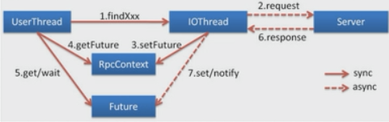
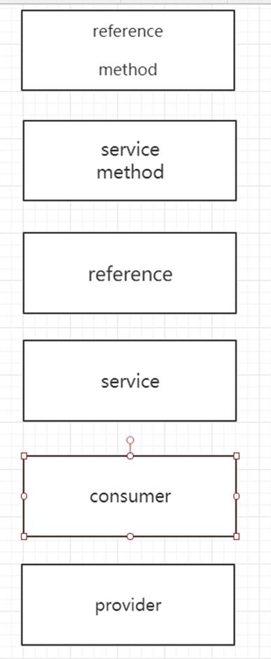

# dubbo的配置

## 启动服务检查

如果提供方没有启动的时候，默认会去检测所依赖的服务是否正常提供服务

如果check为false，表示启动的时候不去检查。当服务出现循环依赖的时候，check设置成false

dubbo:reference 属性： check 默认值是true 、false 

dubbo:consumer check=”false” 没有服务提供者的时候，报错

dubbo:registry check=false  注册订阅失败报错

dubbo:provider 

## 多协议支持

dubbo支持的协议： dubbo、RMI、**hessian**、webservice、http、Thrift 

hessian协议演示

### 服务端配置

引入包

```xml
<dependency>
    <groupId>com.caucho</groupId>
    <artifactId>hessian</artifactId>
    <version>4.0.63</version>
</dependency>
<dependency>
    <groupId>javax.servlet</groupId>
    <artifactId>servlet-api</artifactId>
    <version>3.0-alpha-1</version>
</dependency>
<dependency>
    <groupId>org.mortbay.jetty</groupId>
    <artifactId>jetty</artifactId>
    <version>6.1.26</version>
</dependency>
```

修改`META-INF/spring/provider.xml`

```xml
<beans xmlns="http://www.springframework.org/schema/beans"
       xmlns:xsi="http://www.w3.org/2001/XMLSchema-instance"
       xmlns:dubbo="http://code.alibabatech.com/schema/dubbo"
       xsi:schemaLocation="http://www.springframework.org/schema/beans
        http://www.springframework.org/schema/beans/spring-beans.xsd
         http://code.alibabatech.com/schema/dubbo
           http://code.alibabatech.com/schema/dubbo/dubbo.xsd">
    <!-- provider's application name, used for tracing dependency relationship -->
    <dubbo:application name="order-provider" owner="tom"/>
    <!-- use multicast registry center to export service -->
   <!-- <dubbo:registry address="zookeeper://192.168.238.150:2181?backup=192.168.238.155:2181,192.168.238.160:2181,192.168.238.165:2181"/>-->
    <dubbo:registry protocol="zookeeper" address="192.168.238.150:2181,192.168.238.155:2181,192.168.238.160:2181,192.168.238.165:2181"/>
    <!-- use dubbo protocol to export service on port 20880 -->
    <dubbo:protocol name="dubbo" port="20880"/>
    <!-- service implementation, as same as regular local bean -->
    <bean id="orderService" class="com.tom.OrderServiceImpl"/>
    <!-- declare the service interface to be exported -->
    <dubbo:protocol name="hessian" port="8090" server="jetty"/>
    <dubbo:service interface="com.tom.OrderService" ref="orderService" protocol="hessian,dubbo"/>
</beans>
```

### 消费端配置

消费端`order-consumer.xml`

```xml
<beans xmlns="http://www.springframework.org/schema/beans"
       xmlns:xsi="http://www.w3.org/2001/XMLSchema-instance"
       xmlns:dubbo="http://code.alibabatech.com/schema/dubbo"
       xsi:schemaLocation="http://www.springframework.org/schema/beans
        http://www.springframework.org/schema/beans/spring-beans.xsd
         http://code.alibabatech.com/schema/dubbo
         http://code.alibabatech.com/schema/dubbo/dubbo.xsd">
    <!-- provider's application name, used for tracing dependency relationship -->
    <dubbo:application name="order-provider"/>
    <!-- use multicast registry center to export service -->
    <dubbo:registry address="zookeeper://192.168.238.150:2181?backup=192.168.238.155:2181,192.168.238.160:2181,192.168.238.165:2181"/>
    <dubbo:reference id="orderService" interface="com.tom.OrderService" protocol="hessian"/>
</beans>
```

引入hessian的包

```xml
<dependency>
    <groupId>com.caucho</groupId>
    <artifactId>hessian</artifactId>
</dependency>
```

## 多注册中心支持

```xml
    <dubbo:registry  id="zkOne" protocol="zookeeper"
                    address="192.168.238.150:2181,192.168.238.155:2181,192.168.238.160:2181,192.168.238.165:2181"/>
    <dubbo:registry  id="zkTwo" protocol="zookeeper"
                     address="192.168.238.150:2181,192.168.238.155:2181,192.168.238.160:2181,192.168.238.165:2181"/>
    <!-- use dubbo protocol to export service on port 20880 -->
    <dubbo:protocol name="dubbo" port="20880"/>
    <!-- declare the service interface to be exported -->
    <dubbo:protocol name="hessian" port="8090" server="jetty"/>
    <dubbo:service interface="com.tom.OrderService" ref="orderService" protocol="hessian,dubbo" register="zkOne"/>
```

## 多版本支持

`order-provider\src\main\resources\META-INF\spring\provider.xml`

```xml
<?xml version="1.0" encoding="UTF-8"?>

<beans default-autowire="byName"
       xsi:schemaLocation="http://www.springframework.org/schema/beans http://www.springframework.org/schema/beans/spring-beans.xsd http://www.springframework.org/schema/context http://www.springframework.org/schema/context/spring-context.xsd http://code.alibabatech.com/schema/dubbo http://code.alibabatech.com/schema/dubbo/dubbo.xsd"
       xmlns:dubbo="http://code.alibabatech.com/schema/dubbo"
       xmlns:context="http://www.springframework.org/schema/context"
       xmlns:xsi="http://www.w3.org/2001/XMLSchema-instance" xmlns="http://www.springframework.org/schema/beans">
    <context:annotation-config/>
    <context:component-scan base-package="com.tom"/>
    <!-- provider's application name, used for tracing dependency relationship -->
    <dubbo:application name="order-provider" owner="tom"/>
    <!-- use multicast registry center to export service -->
    <!-- <dubbo:registry address="zookeeper://192.168.238.150:2181?backup=192.168.238.155:2181,192.168.238.160:2181,192.168.238.165:2181"/>-->
    <dubbo:registry protocol="zookeeper"
                    address="192.168.238.150:2181,192.168.238.155:2181,192.168.238.160:2181,192.168.238.165:2181"/>
    <!-- use dubbo protocol to export service on port 20880 -->
    <dubbo:protocol name="dubbo" port="20880"/>
    <!-- declare the service interface to be exported -->
    <dubbo:protocol name="hessian" port="8090" server="jetty"/>
    <dubbo:service interface="com.tom.OrderService" ref="orderService" protocol="hessian,dubbo"/>
    <dubbo:service interface="com.tom.OrderQueryService" ref="orderQueryService" version="1.0.0"/>
    <dubbo:service interface="com.tom.OrderQueryService" ref="orderQueryService2" version="2.0.0"/>
</beans>
```

接增接口`OrderQueryService.java`

```java
public interface OrderQueryService {
    String query(String name);
}
```

`OrderQueryServiceImpl.java`

```java
@Slf4j
@Service("orderQueryService")
public class OrderQueryServiceImpl implements OrderQueryService {
    @Override
    public String query(String name) {
        log.info("客户端过来的请求数据：{}",JSON.toJSONString(name));
      return  String.format(Locale.ROOT,"hello,version1,I'm %s",name);
    }
}
```

`OrderQueryService2Impl.java`

```java
@Slf4j
@Service("orderQueryService2")
public class OrderQueryService2Impl implements OrderQueryService {
    @Override
    public String query(String name) {
        log.info("客户端过来的请求数据：{}",JSON.toJSONString(name));
        return String.format(Locale.ROOT,"hello,version2,I'm %s",name);
    }
}
```

消费端调用

`pom.xml`

```xml
<beans xmlns="http://www.springframework.org/schema/beans"
       xmlns:xsi="http://www.w3.org/2001/XMLSchema-instance"
       xmlns:dubbo="http://code.alibabatech.com/schema/dubbo"
       xsi:schemaLocation="http://www.springframework.org/schema/beans
        http://www.springframework.org/schema/beans/spring-beans.xsd
         http://code.alibabatech.com/schema/dubbo
         http://code.alibabatech.com/schema/dubbo/dubbo.xsd">
    <!-- provider's application name, used for tracing dependency relationship -->
    <dubbo:application name="order-provider"/>
    <!-- use multicast registry center to export service -->
    <dubbo:registry address="zookeeper://192.168.238.150:2181?backup=192.168.238.155:2181,192.168.238.160:2181,192.168.238.165:2181"/>
    <dubbo:reference id="orderService" interface="com.tom.OrderService" protocol="hessian"/>
    <dubbo:reference id="orderQueryService" interface="com.tom.OrderQueryService"  version="1.0.0"/>
    <dubbo:reference id="orderQueryService2" interface="com.tom.OrderQueryService" version="2.0.0"/>
</beans>
```

`App.java`

```java
public class App {
    public static void main(String[] args) throws IOException {
        ClassPathXmlApplicationContext context = new ClassPathXmlApplicationContext("order-consumer.xml");
        OrderService orderService = (OrderService) context.getBean("orderService");
        DoOrderReq doOrderReq = new DoOrderReq();
        doOrderReq.setName("大众汽车");
        DoOrderRes doOrderRes = orderService.doOrder(doOrderReq);
        System.out.println(JSON.toJSONString(doOrderRes));
        OrderQueryService orderQueryService = (OrderQueryService) context.getBean("orderQueryService");
        OrderQueryService orderQueryService2 = (OrderQueryService) context.getBean("orderQueryService2");
        System.out.println(orderQueryService.query("jack"));
        System.out.println(orderQueryService2.query("jack"));
        System.in.read();
    }
}
```

输出

```bash
{"returnCode":"000","returnDesc":"下订单成功"}
hello,version1,I'm jack
hello,version2,I'm jack
```

## 异步调用



调用方`pom.xml配置`

```xml
<dubbo:reference id="orderQueryService2" interface="com.tom.OrderQueryService" version="2.0.0" async="true"/>
```

调用方调用

```java
OrderQueryService orderQueryService2 = (OrderQueryService) context.getBean("orderQueryService2");
orderQueryService2.query("jack");
Future<Object> future = RpcContext.getContext().getFuture();
System.out.println("当前时间："+System.currentTimeMillis());
//这儿是阻塞的
String result = (String) future.get();
System.out.println("当前时间："+System.currentTimeMillis());
System.out.println(result);
```

## 主机绑定

`org.apache.dubbo.config.ServiceConfig#findConfigedHosts`

```java
/**
     * Register & bind IP address for service provider, can be configured separately.
     * Configuration priority: environment variables -> java system properties -> host property in config file ->
     * /etc/hosts -> default network address -> first available network address
     *
     * @param protocolConfig
     * @param registryURLs
     * @param map
     * @return
     */
    private String findConfigedHosts(ProtocolConfig protocolConfig,
                                     List<URL> registryURLs,
                                     Map<String, String> map) {
        boolean anyhost = false;

        String hostToBind = getValueFromConfig(protocolConfig, DUBBO_IP_TO_BIND);
        if (hostToBind != null && hostToBind.length() > 0 && isInvalidLocalHost(hostToBind)) {
            throw new IllegalArgumentException("Specified invalid bind ip from property:" + DUBBO_IP_TO_BIND + ", value:" + hostToBind);
        }

        // if bind ip is not found in environment, keep looking up
        if (StringUtils.isEmpty(hostToBind)) {
            hostToBind = protocolConfig.getHost();
            if (provider != null && StringUtils.isEmpty(hostToBind)) {
                hostToBind = provider.getHost();
            }
            if (isInvalidLocalHost(hostToBind)) {
                anyhost = true;
                try {
                    logger.info("No valid ip found from environment, try to find valid host from DNS.");
                    hostToBind = InetAddress.getLocalHost().getHostAddress();
                } catch (UnknownHostException e) {
                    logger.warn(e.getMessage(), e);
                }
                if (isInvalidLocalHost(hostToBind)) {
                    if (CollectionUtils.isNotEmpty(registryURLs)) {
                        for (URL registryURL : registryURLs) {
                            if (MULTICAST.equalsIgnoreCase(registryURL.getParameter("registry"))) {
                                // skip multicast registry since we cannot connect to it via Socket
                                continue;
                            }
                            try (Socket socket = new Socket()) {
                                SocketAddress addr = new InetSocketAddress(registryURL.getHost(), registryURL.getPort());
                                socket.connect(addr, 1000);
                                hostToBind = socket.getLocalAddress().getHostAddress();
                                break;
                            } catch (Exception e) {
                                logger.warn(e.getMessage(), e);
                            }
                        }
                    }
                    if (isInvalidLocalHost(hostToBind)) {
                        hostToBind = getLocalHost();
                    }
                }
            }
        }

        map.put(BIND_IP_KEY, hostToBind);

        // registry ip is not used for bind ip by default
        String hostToRegistry = getValueFromConfig(protocolConfig, DUBBO_IP_TO_REGISTRY);
        if (hostToRegistry != null && hostToRegistry.length() > 0 && isInvalidLocalHost(hostToRegistry)) {
            throw new IllegalArgumentException("Specified invalid registry ip from property:" + DUBBO_IP_TO_REGISTRY + ", value:" + hostToRegistry);
        } else if (StringUtils.isEmpty(hostToRegistry)) {
            // bind ip is used as registry ip by default
            hostToRegistry = hostToBind;
        }

        map.put(ANYHOST_KEY, String.valueOf(anyhost));

        return hostToRegistry;
    }
```


provider://192.168.56.1:8090

​	`/etc/hosts -> default network address -> first available network address`

1. 通过<dubbo:protocol host配置的地址去找

2. ` InetAddress.getLocalHost()`

3. 通过socket发起连接连接到注册中心的地址。再获取连接过去以后本地的ip地址

```
4. host = NetUtils.getLocalHost();
```

```xml
<dubbo:protocol name="dubbo" port="20880" host="www.jack.com"/>
<!-- declare the service interface to be exported -->
<dubbo:protocol name="hessian" port="8090" server="jetty" host="www.jack.com"/>
```

## dubbo服务只订阅

`src\main\resources\META-INF\spring\provider.xml`

```xml
<dubbo:registry protocol="zookeeper"                 address="192.168.238.150:2181,192.168.238.155:2181,192.168.238.160:2181,192.168.238.165:2181" register="false"/>
```

`register="false"` 只调用另人，不提供服务

## dubbo服务只注册

只提供服务

```xml
<dubbo:registry protocol="zookeeper"                  address="192.168.238.150:2181,192.168.238.155:2181,192.168.238.160:2181,192.168.238.165:2181" subscribe="false"/>
```

## 负载均衡

`\src\main\resources\META-INF\dubbo\internal\org.apache.dubbo.rpc.cluster.LoadBalance`

```xml
random=org.apache.dubbo.rpc.cluster.loadbalance.RandomLoadBalance
roundrobin=org.apache.dubbo.rpc.cluster.loadbalance.RoundRobinLoadBalance
leastactive=org.apache.dubbo.rpc.cluster.loadbalance.LeastActiveLoadBalance
consistenthash=org.apache.dubbo.rpc.cluster.loadbalance.ConsistentHashLoadBalance
```

```
<dubbo:service interface="com.tom.OrderService" ref="orderService" protocol="hessian,dubbo" loadbalance="consistenthash"/>
```

在集群负载均衡时，Dubbo提供了多种均衡策略，缺省为random随机调用。可以自行扩展负载均衡策略

### Random LoadBalance

随机，按权重设置随机概率。

在一个截面上碰撞的概率高，但调用量越大分布越均匀，而且按概率使用权重后也比较均匀，有利于动态调整提供者权重。

### RoundRobin LoadBalance

轮循，按公约后的权重设置轮循比率。

存在慢的提供者累积请求的问题，比如：第二台机器很慢，但没挂，当请求调到第二台时就卡在那，久而久之，所有请求都卡在调到第二台上。

### LeastActive LoadBalance

最少活跃调用数，相同活跃数的随机，活跃数指调用前后计数差。

使慢的提供者收到更少请求，因为越慢的提供者的调用前后计数差会越大。

### ConsistentHash LoadBalance

一致性Hash，相同参数的请求总是发到同一提供者。

当某一台提供者挂时，原本发往该提供者的请求，基于虚拟节点，平摊到其它提供者，不会引起剧烈变动。

## 连接超时timeout

必须要设置服务的处理的超时时间

`src\main\resources\META-INF\spring\provider.xml`

`<dubbo:service interface="com.tom.OrderService" ref="orderService" protocol="hessian,dubbo" timeout="10"/>`

### 集群容错

# 集群容错

`dubbo-cluster\src\main\resources\META-INF\dubbo\internal\org.apache.dubbo.rpc.cluster.Cluster`

```properties
failover=org.apache.dubbo.rpc.cluster.support.FailoverCluster
failfast=org.apache.dubbo.rpc.cluster.support.FailfastCluster
failsafe=org.apache.dubbo.rpc.cluster.support.FailsafeCluster
failback=org.apache.dubbo.rpc.cluster.support.FailbackCluster
forking=org.apache.dubbo.rpc.cluster.support.ForkingCluster
```
### Failover cluster
默认配置
失败的时候自动切换并重试其他服务器。 通过retries=2。 来设置重试次数
### failfast cluster 
快速失败，只发起一次调用 ; 写操作。比如新增记录的时候， 非幂等请求
### failsafe cluster  
失败安全。 出现异常时，直接忽略异常
### failback cluster 
失败自动恢复。 后台记录失败请求，定时重发
### forking cluster 
并行调用多个服务器，只要一个成功就返回。 只能应用在读请求
### broadcast cluster 
广播调用所有提供者，逐个调用。其中一台报错就会返回异常

## 配置的优先级

消费端有限最高 – 服务端



 

## 服务改造

### 包引用

有要目的是排除dubbo依赖的spring的包（比较旧），引入相关的spring的新的包

```xml
<dependency>
     <groupId>org.springframework</groupId>
     <artifactId>spring-core</artifactId>
     <version>${spring.version}</version>
</dependency>
<dependency>
    <groupId>org.springframework</groupId>
    <artifactId>spring-beans</artifactId>
    <version>${spring.version}</version>
</dependency>
<dependency>
    <groupId>org.springframework</groupId>
    <artifactId>spring-context</artifactId>
    <version>${spring.version}</version>
</dependency>
<dependency>
    <groupId>org.springframework</groupId>
    <artifactId>spring-context-support</artifactId>
    <version>${spring.version}</version>
</dependency>
<dependency>
    <groupId>org.springframework</groupId>
    <artifactId>spring-orm</artifactId>
    <version>${spring.version}</version>
</dependency>
<dependency>
    <groupId>com.alibaba</groupId>
    <artifactId>dubbo</artifactId>
    <version>2.5.3</version>
    <exclusions>
        <exclusion>
            <groupId>org.springframework</groupId>
            <artifactId>spring</artifactId>
        </exclusion>
    </exclusions>
</dependency>
```

### 开启包扫描

这样的目的就不用在xml里配置Bean了。

```xml
<?xml version="1.0" encoding="UTF-8"?>

<beans default-autowire="byName"
       xsi:schemaLocation="http://www.springframework.org/schema/beans http://www.springframework.org/schema/beans/spring-beans.xsd http://www.springframework.org/schema/context http://www.springframework.org/schema/context/spring-context.xsd http://code.alibabatech.com/schema/dubbo http://code.alibabatech.com/schema/dubbo/dubbo.xsd"
       xmlns:dubbo="http://code.alibabatech.com/schema/dubbo"
       xmlns:context="http://www.springframework.org/schema/context"
       xmlns:xsi="http://www.w3.org/2001/XMLSchema-instance" xmlns="http://www.springframework.org/schema/beans">
    <context:annotation-config/>
    <context:component-scan base-package="${package_space}"/>
    ...
</beans>    
```

java中增加注解`@Service`

```java
@Slf4j
@Service
public class ${service}Impl implements ${service}Service {
    @Override
    public String fun(String name) {
        log.info("客户端过来的请求数据：{}",JSON.toJSONString(name));
      return  String.format(Locale.ROOT,"hello,world,I'm %s",name);
    }
}
```

## Issuers

### 1. `@SpringBootApplication`注解报错

## 解决办法：

之前写过相同名字的模块，idea会默认删除的模块不再用，所以将删除模块的pom文件忽略掉，所以如果重建了相同名字的模块，依赖是引不进来的。

1、删除新建的有问题的模块

2、打开项目中.idea/misc.xml,将下图中的行删除，对应刚删除的模块名

```xml
<option name="ignoredFiles">
    <set>
        <!--<option value="$PROJECT_DIR$/tom-web/pom.xml" /> 删除-->
    </set>
</option>
```

3、右键pom.xml -> maven ->Reimport，重新导入依赖，问题解决

## References

### 1. dubbo管理台

​	https://github.com/apache/dubbo-admin

### 2. dubbo源码

​	https://github.com/apache/dubbo

