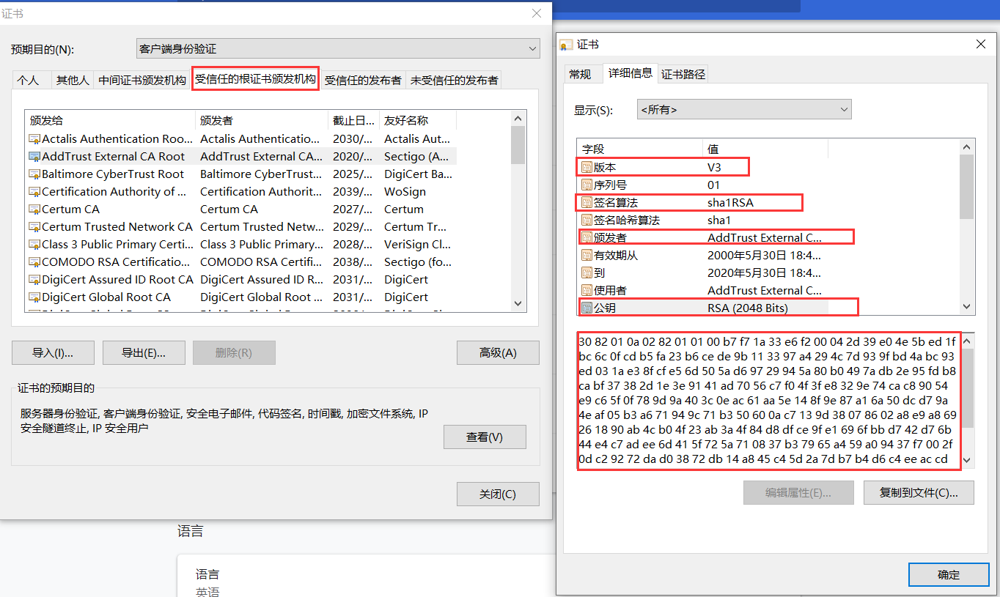

# 4.分布式通信协议-http

## Http协议概述

1. 客户端和服务器端

   


2.	 资源
html/文本、word、avi电影、其他资源
3.	媒体类型
MIME类型。  text/html、 image/jpeg 
4.	URI和URL
URI:web服务器资源的名字。  index.html
    http://www. baidu.com:80/java/index.html[?query-string] #location
    schema: http/https/ftp.
    host: web服务器的ip地址或者域名
    port: 服务端端口， http默认访问的端口是80
    path: 资源访问路径
    query-string: 查询参数
5.	方法
GET/PUT/DELETE/POST/HEAD

## 报文

request参数、 response响应参数

request消息结构包含三部分： （起始行、首部字段、主体）

```
METHOD /path / http/version-number
Header-Name:value
空行
主体 optional request body
```


response

```
http/version-number  status code message
header-name:value
空行
body
```

 

## 状态码

http/1.1版本的协议里面定义了五种类型的状态码

1XX  提示信息

2XX  成功

3XX  重定向

4XX  客户端错误

5XX  服务器端的错误 

## 缓存

## HTTP协议的特点

1. 无状态

   cookie+session

2. 多次请求

3. 基于TCP协议

## HTTPS的工作原理


 客户端直接传消息给服务端

### 第一步， 使用对称加解密

 


### 第二步，密钥是公开的，所有的客户端都可以拿到


### 第三步 针对不同的客户端使用不同的密钥


 

> 问题：协商过程是没有加密的，所以还会出现被截断的问题

 

### 第四步：使用非对称加密

非对称：公钥和私钥的概念 


 

问题： 客户端如何拿到公钥

1. 服务器端把公钥发送给每一个客户端

2. 服务器端把公钥放到远程服务器，客户端可以请求到

3. 让浏览器保存所有的公钥（不现实）

### 第五步 **公钥被调包的问题按照上面的方案，永远存在**。


 

### 第六步：使用第三方机构来解决

通过第三方机构，使用第三方机构的私钥对我们【需要传输的公钥】进行加密


 数字证里面包含的内容：

 公司信息、网站信息、数字证书的算法、公钥

 


连接过程


## RESTful

REST  表述性状态转移   (Representational State Transfer) 

使用WEB标准来做一些准则和约束。

### RESTful的基本概念

1.	在REST中，一切的内容都被认为是一种资源
2.	每个资源都由URI唯一标识
3.	使用统一的接口处理资源请求（POST/GET/PUT/DELETE/HEAD）
4.	无状态(每一个请求的都是独立的请求)

### 资源和URI

1.	[/]表示资源的层级关系
2.	？过滤资源
3.	使用_或者-让URI的可读性更好

 https://developer.github.com/v4/guides/ 

### 统一接口
 GET  获取某个资源。 幂等
 POST 创建一个新的资源
 PUT 替换某个已有的资源（更新操作） ， 幂等
 DELETE 删除某个资源

 PATCH/HEAD

### 资源表述

MIME 类型（）
accept: text/xml   html文件
Content-Type告诉客户端资源的表述形式

### 资源链接
 超媒体即应用状态引擎

### 状态转移
 服务器端不应该保存客户端状态。


应用状态-  >服务器端不保存应用状态

访问订单   根据接口去查询
访问商品   查询

### RESTful的最佳设计

1.	域名
http://api. baidu.com 
http://api.baidu.com/api

2. 版本
   http://api.baidu.com/v1/user/1

   header里面维护版本

3. 路径
   http://api.baidu.com/v1/users_list  //获取用户列表

   http://api.baidu.com/v1/goods-list  //商品列表

   http://api.baidu.com/v1/users/{id}

4. 过滤信息
   https://api.github.com/user/repos?page=2&per_page=100
   https://developer.github.com/v3/#rate-limiting
   
5. 状态码

   业务状态码
   http状态码

## 总结

1.	分布式架构的定义以及分布式架构的演进。
2.	分布式架构和集群的区别
3.	TCP/UDP、全双工、半双工、3次握手协议、4次挥手协议
	1、	FIN标识的报文给到server端
	2、	server端接收到FIN报文以后，表示Client端没有数据要发给Server端了
	3、	server端发送ACK给到Client端，表示Server端的数据已经发完了。准备关闭链接
	4、	client端收到ACK报文以后，知道可以关闭连接了，发送ACK请求到Server端，自己进入TIME-WAIT
	5、	Server端接收到ACK以后，表示可以断开连接了
	6、	Client端等待一定时间后，没有收到回复，表示Client可以关闭连接
4.	TCP的非阻塞IO
5. 序列化

   SerialVersionUID

   静态变量序列化问题、Transient关键字、父子类的序列化问题

   kryo、FST、JSON、XML、protobuf、Hessian、Avro、Thrift
6. http和https协议、RESTful规范

   * 客户端发起一个https请求
     a)	客户端支持的加密方式
     b)	客户端生成的随机数（第一个随机数）

   * 服务端收到请求后，拿到随机数，返回
     a)	证书（颁发机构（CA）、证书内容本身的数字签名（使用第三方机构的私钥加密）、证书持有者的公钥、证书签名用到的hash算法）
     b)	生成一个随机数，返回给客户端（第二个随机数）

   * 客户端拿到证书以后做验证
     a)	根据颁发机构找到本地的跟证书
     b)	根据CA得到根证书的公钥，通过公钥对数字签名解密，得到证书的内容摘要 A
     c)	用证书提供的算法对证书内容进行摘要，得到摘要 B
     d)	通过A和B的对比，也就是验证数字签名

   * 验证通过以后，生成一个随机数（第三个随机数），通过证书内的公钥对这个随机数加密，发送给服务器端

     （随机数1+2+3）通过对称加密得到一个密钥。（会话密钥）

   * 通过会话密钥对内容进行对称加密传输

