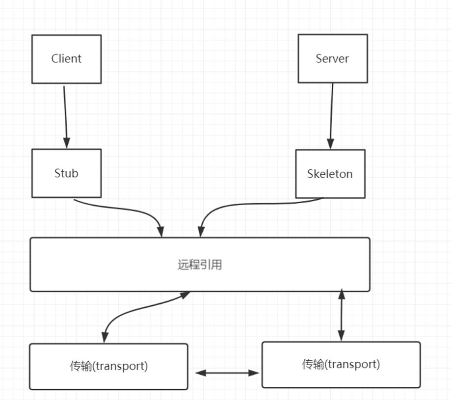
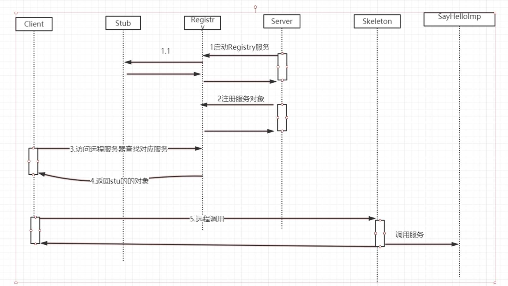

# 5.分布式通信框架-RMI  

## 什么是RPC

Remote procedure call protocal 

RPC协议其实是一个规范。Dubbo、Thrif、RMI、Webservice、Hessain

网络协议和网络IO对于调用端和服务端来说是透明； 

### 一个RPC框架包含的要素


## RMI的概述

RMI(remote method invocation)  , 可以认为是RPC的java版本

RMI使用的是JRMP（Java Remote Messageing Protocol）, JRMP是专门为java定制的通信协议，所以踏实纯java的分布式解决方案

### 如何实现一个RMI程序

1. 创建远程接口， 并且继承java.rmi.Remote接口
2. 实现远程接口，并且继承：UnicastRemoteObject
3. 创建服务器程序： createRegistry方法注册远程对象
4. 创建客户端程序

`IHello.java`

```java
public interface IHello extends Remote {
    String sayHello(String name) throws RemoteException;
}
```

`HelloImpl.java`

```java
public class HelloImpl extends UnicastRemoteObject implements IHello {
    protected HelloImpl() throws RemoteException {
    }

    @Override
    public String sayHello(String name) {
        return "hello," + name;
    }
}
```

`Server.java`

```java
public class Server {
    public static final int PORT = 9000;

    public static void main(String[] args) {
        try {
            IHello hello = new HelloImpl();
            LocateRegistry.createRegistry(PORT);
            Naming.bind(getRmiURL(), hello);
            System.out.println("服务端发布");
        } catch (RemoteException e) {
            e.printStackTrace();
        } catch (AlreadyBoundException e) {
            e.printStackTrace();
        } catch (MalformedURLException e) {
            e.printStackTrace();
        }
    }

    public static String getRmiURL() {
        return String.format("rmi://localhost:%s/hello", PORT);
    }
}
```

`Client.java`

```java
public class Client {
    public static void main(String[] args) {
        try {
            IHello hello = (IHello) Naming.lookup(Server.getRmiURL());
            System.out.println(hello.sayHello("jack"));
        } catch (NotBoundException e) {
            e.printStackTrace();
        } catch (MalformedURLException e) {
            e.printStackTrace();
        } catch (RemoteException e) {
            e.printStackTrace();
        }
    }
}
```

## 如果自己要去实现一个RMI

1. 编写服务器程序，暴露一个监听， 可以使用socket

2. 编写客户端程序，通过ip和端口连接到指定的服务器，并且将数据做封装（序列化）

3. 服务器端收到请求，先反序列化。再进行业务逻辑处理。把返回结果序列化返回

 



 



## 源码分析

```java
public static Registry createRegistry(int port) throws RemoteException {
    return new RegistryImpl(port);
}
```

sun.rmi.registry.RegistryImpl#RegistryImpl(int)

```java
public RegistryImpl(final int var1) throws RemoteException {
    if (var1 == 1099 && System.getSecurityManager() != null) {
        try {
            AccessController.doPrivileged(new PrivilegedExceptionAction<Void>() {
                public Void run() throws RemoteException {
                    LiveRef var1x = new LiveRef(RegistryImpl.id, var1);
                    RegistryImpl.this.setup(new UnicastServerRef(var1x, (var0) -> {
                        return RegistryImpl.registryFilter(var0);
                    }));
                    return null;
                }
            }, (AccessControlContext)null, new SocketPermission("localhost:" + var1, "listen,accept"));
        } catch (PrivilegedActionException var3) {
            throw (RemoteException)var3.getException();
        }
    } else {
        LiveRef var2 = new LiveRef(id, var1);
        this.setup(new UnicastServerRef(var2, RegistryImpl::registryFilter));
    }

}
private void setup(UnicastServerRef var1) throws RemoteException {
    this.ref = var1;
    var1.exportObject(this, (Object)null, true);
}
```

sun.rmi.server.UnicastServerRef#exportObject(java.rmi.Remote, java.lang.Object, boolean)

```java
public Remote exportObject(Remote var1, Object var2, boolean var3) throws RemoteException {
    Class var4 = var1.getClass();

    Remote var5;
    try {
        var5 = Util.createProxy(var4, this.getClientRef(), this.forceStubUse);
    } catch (IllegalArgumentException var7) {
        throw new ExportException("remote object implements illegal remote interface", var7);
    }

    if (var5 instanceof RemoteStub) {
        this.setSkeleton(var1);
    }

    Target var6 = new Target(var1, this, var5, this.ref.getObjID(), var3);
    this.ref.exportObject(var6);
    this.hashToMethod_Map = (Map)hashToMethod_Maps.get(var4);
    return var5;
}
```

### 为什么RMI的缺点

不能重试
不能跨语言
是BIO，不是NIO
是JAVA原生的serializable，性能较低
如果中心如果挂了，整个服务不可用 Map<ObjectEndpoint, Target> objTable = new HashMap()

