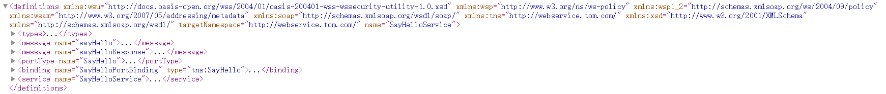
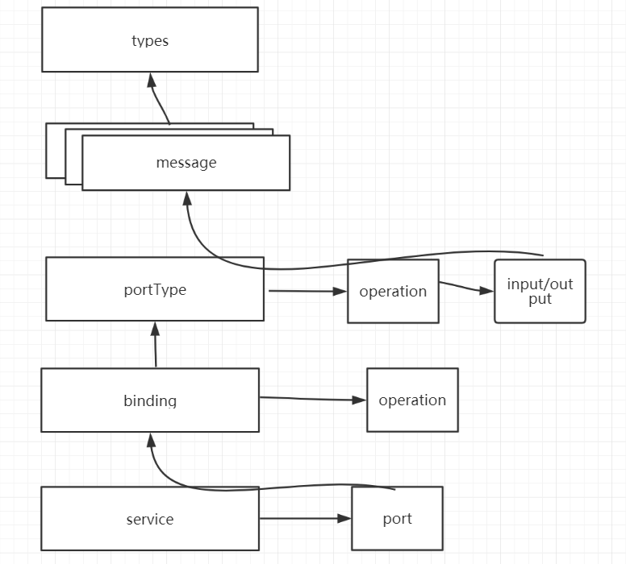
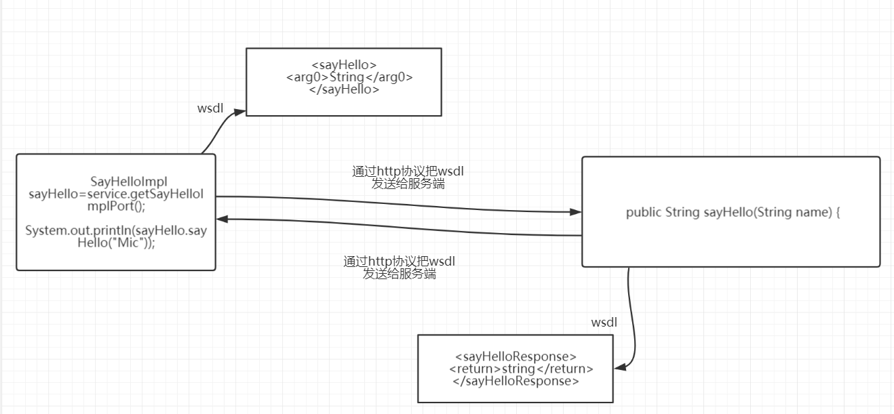

分布式通信框架-webservice分析

## 什么是webservice
webservice也可以叫xml web service webservice, 轻量级的独立的通讯技术

1.	基于web的服务：服务端提供的服务接口让客户端访问
2.	跨平台、跨语言的整合方案
为什么要使用webservice
跨语言调用的解决方案

什么时候要去使用webservice
电商平台，订单的物流状态。 
 .net实现的webservice服务接口

## webservice中的一些概念
### WSDL(web service definition language  webservice 定义语言)
webservice服务需要通过wsdl文件来说明自己有什么服务可以对外调用。并且有哪些方法、方法里面有哪些参数
wsdl基于XML（可扩展标记语言）去定义的

1. 对应一个.wsdl的文件类型

2. 定义了webservice的服务器端和客户端应用进行交互的传递数据和响应数据格式和方式

3. 一个webservice对应唯一一个wsdl文档
### SOAP（simple object access protocal简单对象访问协议）

http+xml
webservice通过http协议发送和接收请求时， 发送的内容（请求报文）和接收的内容（响应报文）都是采用xml格式进行封装
这些特定的HTTP消息头和XML内容格式就是SOAP协议

1. 一种简单、基于HTTP和XML的协议

2. soap消息：请求和响应消息

3. http+xml报文

### SEI（webservice endpoint interface webservice的终端接口）
webservice服务端用来处理请求的接口，也就是发布出去的接口。

## 开发一个webservice的实例

### 服务端

#### `ISayHello.java`

```java
/**
 * SE和SEI的实现类
 *
 * @author TomLuo
 * @date 2019/12/7
 */
@WebService
public interface ISayHello {
    /**
     * SEI中的方法
     * @param hello
     * @return
     */
    @WebMethod
    String sayHello(String hello);
}
```

#### `SayHello.java`

```java
@WebService
public class SayHello implements ISayHello {

    @Override
    public String sayHello(String name) {
        return "hello,"+name;
    }
}
```

#### `Bootstrap.java`

```JAVA
public class Bootstrap {
    public static void main(String[] args) {
        ISayHello sayHello = new SayHello();
        Endpoint.publish("http://localhost:9000/hello",sayHello);
        System.out.println("发布webservice成功了");
    }
}
```

### 客户端

#### 生成客户端代码

`${JAVA_HOME}\bin\wsimport -keep -p com.tom.webserviceclient  http://localhost:9000/hello?wsdl`

#### `Bootstrap.java`

```java
public class Bootstrap {
    public static void main(String[] args) throws MalformedURLException {
       SayHelloService sayHelloService = new SayHelloService();
        SayHello sayHelloPort = sayHelloService.getSayHelloPort();
        System.out.println(sayHelloPort.sayHello("rose"));
    }
}
```

输出

`hello,rose`

## 分析WSDL文档



* Types标签

  定义整服务端的数据报文

  * Schema标签

    ```xml
    <types>
    <xsd:schema>
    <xsd:import namespace="http://webservice.tom.com/" schemaLocation="http://localhost:9000/hello?xsd=1"/>
    </xsd:schema>
    </types>
    ```

* Message

  ```xml
  <message name="sayHello">
  <part name="parameters" element="tns:sayHello"/>
  </message>
  <message name="sayHelloResponse">
  <part name="parameters" element="tns:sayHelloResponse"/>
  </message>
  ```

  定义了在通信中使用的消息的数据结构

*  portType 

  ```xml
  <portType name="SayHello">
  <operation name="sayHello">
  <input wsam:Action="http://webservice.tom.com/SayHello/sayHelloRequest" message="tns:sayHello"/>
  <output wsam:Action="http://webservice.tom.com/SayHello/sayHelloResponse" message="tns:sayHelloResponse"/>
  </operation>
  </portType>
  ```

  定义服务器端的SEI

  input/output表示输入/输出数据

*  binding 

  ```xml
  <binding name="SayHelloPortBinding" type="tns:SayHello">
  <soap:binding transport="http://schemas.xmlsoap.org/soap/http" style="document"/>
  <operation name="sayHello">
  <soap:operation soapAction=""/>
  <input>
  <soap:body use="literal"/>
  </input>
  <output>
  <soap:body use="literal"/>
  </output>
  </operation>
  </binding>
  ```

  1. type属性： 引用portType 

     `<soap:binding style="document"> `

  2. operation : 指定实现方法

  3. input/output 表示输入和输出的数据类型

     literal表示文本

*  service 

  ```xml
  <service name="SayHelloService">
  <port name="SayHelloPort" binding="tns:SayHelloPortBinding">
  <soap:address location="http://localhost:9000/hello"/>
  </port>
  </service>
  ```

  service： 服务器端的一个webservice的容器

  name属性： 指定客户端的容器类

  `soap:address` 当前webservice的请求地址





### SOAP UI的报文

#### 发送的报文

```xml
<soapenv:Envelope xmlns:soapenv="http://schemas.xmlsoap.org/soap/envelope/" xmlns:web="http://webservice.tom.com/">
   <soapenv:Header/>
   <soapenv:Body>
      <web:sayHello>
         <!--Optional:-->
         <arg0>阿婆</arg0>
      </web:sayHello>
   </soapenv:Body>
</soapenv:Envelope>
```

#### 接收的报文

```xml
<S:Envelope xmlns:S="http://schemas.xmlsoap.org/soap/envelope/">
   <S:Body>
      <ns2:sayHelloResponse xmlns:ns2="http://webservice.tom.com/">
         <return>hello,阿婆</return>
      </ns2:sayHelloResponse>
   </S:Body>
</S:Envelope>
```

## 其它的web service

### Axis/Axis2

apache开源的webservice工具

### CXF

Celtix+Xfire 。 用的很广泛，因为集成到了spring

### Xfire

高性能的Webservice

HTTP+JSON (新的webservice)

HTTP+XML

## spring cxf+REST实现一个webservice服务

springmvc+REST实现的新webservice 

### `pom.xml`引入相关的包

```xml
<dependency>
    <groupId>org.projectlombok</groupId>
    <artifactId>lombok</artifactId>
</dependency>
<dependency>
    <groupId>org.springframework</groupId>
    <artifactId>spring-beans</artifactId>
</dependency>
<dependency>
    <groupId>org.springframework</groupId>
    <artifactId>spring-context</artifactId>
</dependency>
<dependency>
    <groupId>org.springframework</groupId>
    <artifactId>spring-webmvc</artifactId>
</dependency>
<!--CXF相关包-->
<dependency>
    <groupId>org.apache.cxf</groupId>
    <artifactId>cxf-rt-frontend-jaxws</artifactId>
    <version>3.3.4</version>
</dependency>
<dependency>
    <groupId>org.apache.cxf</groupId>
    <artifactId>cxf-rt-frontend-jaxrs</artifactId>
    <version>3.3.4</version>
</dependency>
<dependency>
    <groupId>javax.ws.rs</groupId>
    <artifactId>javax.ws.rs-api</artifactId>
    <version>2.1.1</version>
</dependency>
<!-- web service -->
<dependency>
    <groupId>javax.ws.rs</groupId>
    <artifactId>jsr311-api</artifactId>
    <version>1.1.1</version>
</dependency>
<dependency>
    <groupId>com.fasterxml.jackson.jaxrs</groupId>
    <artifactId>jackson-jaxrs-json-provider</artifactId>
    <version>2.10.1</version>
</dependency>
```

### `web.xml`加上spring和cfx配置

```xml
<!--加载spring容器-->
<context-param>
    <param-name>contextConfigLocation</param-name>
    <param-value>classpath*:ws-servlet-context.xml</param-value>
</context-param>

<listener>
    <listener-class>org.springframework.web.context.ContextLoaderListener</listener-class>
</listener>
<!--cfx的servlet-->
<servlet>
    <servlet-name>cfx</servlet-name>
    <servlet-class>org.apache.cxf.transport.servlet.CXFServlet</servlet-class>
    <load-on-startup>1</load-on-startup>
</servlet>

<servlet-mapping>
    <servlet-name>cfx</servlet-name>
    <url-pattern>/ws/*</url-pattern>
</servlet-mapping>
```

### `ws-servlet-context.xml`spring配置文件

```xml
<?xml version="1.0" encoding="UTF-8"?>
<beans xmlns="http://www.springframework.org/schema/beans"
       xmlns:xsi="http://www.w3.org/2001/XMLSchema-instance"
       xmlns:jaxws="http://cxf.apache.org/jaxws"
       xmlns:jaxrs="http://cxf.apache.org/jaxrs"
       xmlns:context="http://www.springframework.org/schema/context"
       xsi:schemaLocation="http://www.springframework.org/schema/beans
    http://www.springframework.org/schema/beans/spring-beans.xsd
    http://cxf.apache.org/jaxws http://cxf.apache.org/schemas/jaxws.xsd
    http://cxf.apache.org/jaxrs http://cxf.apache.org/schemas/jaxrs.xsd
    http://www.springframework.org/schema/context
    http://www.springframework.org/schema/context/spring-context.xsd">

    <context:component-scan base-package="com.tom"/>

    <jaxrs:server id="restServiceContainer" address="/">
        <jaxrs:serviceBeans>
            <ref bean="userServiceImpl"/>
        </jaxrs:serviceBeans>
        <jaxrs:extensionMappings>
            <entry key="json" value="application/json"/>
            <entry key="xml" value="application/xml"/>
        </jaxrs:extensionMappings>
        <jaxrs:providers>
            <bean class="com.fasterxml.jackson.jaxrs.json.JacksonJaxbJsonProvider"/>
        </jaxrs:providers>
    </jaxrs:server>

</beans>
```

### 实体类

`Response.java`用于给前端返回响应码

```java
@XmlRootElement
@Getter
@Setter
@AllArgsConstructor
@NoArgsConstructor
public class Response {
    public final static int SUCCESS_CODE=0;
    public final static String SUCCESS_DESC="SUCCESS";
    public final static int FAIL_CODE=1;
    public final static String FAIL_DESC="FAILED";
    private int code;
    private String desc;
}
```

`User.java`

```java
@XmlRootElement
@Getter
@Setter
@AllArgsConstructor
@NoArgsConstructor
public class User {
    private int id;
    private String name;
    private int age;
}
```

### 数据存储类`Storage.java`

```java
public class Storage {

    private static List<User> users = new ArrayList<>(Arrays.asList(
            new User(1, "tom", 18),
            new User(2, "jack", 18),
            new User(3, "lisa", 25),
            new User(4, "green", 26),
            new User(6, "polly", 17),
            new User(7, "rose", 18)
    ));

    public static List<User> getUsers() {
        return users;
    }

    public static User getUser(int id) {
        User tempUser = users.stream().filter(vo -> vo.getId() == id).findFirst().get();
        return tempUser;
    }

    public static void add(User user) {
        users.add(user);
    }

    public static void update(User user) {
        User tempUser = users.stream().filter(vo -> vo.getId() == user.getId()).findFirst().get();
        if (tempUser != null) {
            BeanUtils.copyProperties(tempUser, user);
        }
    }

    public static void delete(int id) {
        Predicate<User> predicate = (s) -> s.getId() == id;
        users.removeIf(predicate);
    }

}
```

### cfx对外的调用接口`UserService.java`

```java
@WebService
@Path(value = "/users/")
public interface UserService {
    @GET
    @Path("/")
    @Produces({MediaType.APPLICATION_JSON,MediaType.APPLICATION_XML})
    List<User> getUsers();

    @GET
    @Path("{id}")
    @Produces({MediaType.APPLICATION_JSON,MediaType.APPLICATION_XML})
    User getUser(@PathParam("id") int id);

    @DELETE
    @Path("{id}")
    @Produces({MediaType.APPLICATION_JSON,MediaType.APPLICATION_XML})
    Response delete(@PathParam("id") int id);

    @PUT
    @Path("update")
    @Produces({MediaType.APPLICATION_JSON,MediaType.APPLICATION_XML})
    Response update(User user);

    @POST
    @Path("add")
    @Produces({MediaType.APPLICATION_JSON,MediaType.APPLICATION_XML})
    Response add(User user);
}
```

### 实现类`UserServiceImpl.java`

```java
@Service
public class UserServiceImpl implements UserService {
    @Override
    public List<User> getUsers() {
        return Storage.getUsers();
    }

    @Override
    public User getUser(int id) {
        return Storage.getUser(id);
    }

    @Override
    public Response delete(int id) {
        Storage.delete(id);

        return new Response(SUCCESS_CODE,SUCCESS_DESC);
    }

    @Override
    public Response update(User user) {
        Storage.update(user);
        return new Response(SUCCESS_CODE,SUCCESS_DESC);
    }

    @Override
    public Response add(User user) {
        Storage.add(user);
        return new Response(SUCCESS_CODE,SUCCESS_DESC);
    }
}
```


## Issuers

### 两个类具有相同的 XML 类型名称。请使用 @XmlType.name 和 @XmlType.namespace 为类分配不同的名称

说明：

此问题是在webservice服务通过wsimport指令生成客户端之后，编写测试代码测试时的报错。

问题出现原因：

由于生成客户端时，没有指定路径，因此默认生成的路径还是原先服务端提供的路径。

解决办法：

通过wsimport指令指定路径生成客户端，然后重新加载。
`${JAVA_HOME}\bin\wsimport -keep -p com.tom.webserviceclient  http://localhost:9000/hello?wsdl`

