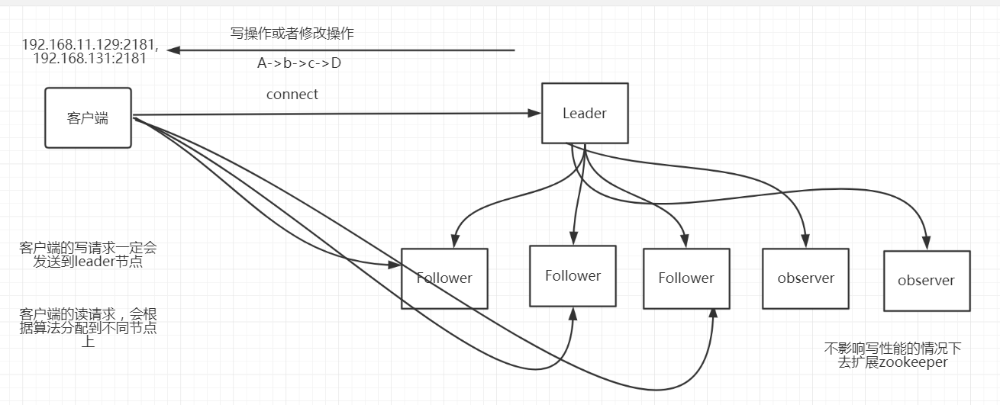

# 7.分布式协调服务-zookeeper初识及安装

 ## 分布式环境的特点

* 分布性

* 并发性

  程序运行过程中，并发性操作是很常见的。比如同一个分布式系统中的多个节点，同时访问一个共享资源。数据库、分布式存储

* 无序性

  进程之间的消息通信，会出现顺序不一致问题

 ## 分布式环境下面临的问题

* 网络通信

  网络本身的不可靠性，因此会涉及到一些网络通信问题

* 网络分区(脑裂)

  当网络发生异常导致分布式系统中部分节点之间的网络延时不断增大，最终导致组成分布式架构的所有节点，只有部分节点能够正常通信

* 三态

  在分布式架构里面，除了成功、失败、超时

* 分布式事务

  ACID(原子性、一致性、隔离性、持久性)

* 中心化和去中心化

  冷备或者热备

  分布式架构里面，很多的架构思想采用的是：当集群发生故障的时候，集群中的人群会自动“选举”出一个新的领导。

  最典型的是： zookeeper / etcd

## 经典的CAP/BASE理论

### CAP

* 一致性（Consistency）

  所有节点上的数据，时刻保持一致

* 可用性（Availability）

  每个请求都能够收到一个响应，无论响应成功或者失败

* 分区容错 （Partition-tolerance）

  表示系统出现脑裂以后，可能导致某些server与集群中的其他机器失去联系**

CP/AP

CAP理论仅适用于原子读写的Nosql场景，不适用于数据库系统

### BASE

基于CAP理论，CAP理论并不适用于数据库事务（因为更新一些错误的数据而导致数据出现紊乱，无论什么样的数据库高可用方案都是徒劳） ，虽然XA事务可以保证数据库在分布式系统下的ACID特性，但是会带来性能方面的影响；

eBay尝试了一种完全不同的套路，放宽了对事务ACID的要求。提出了BASE理论

* Basically available  

  数据库采用分片模式， 把100W的用户数据分布在5个实例上。如果破坏了其中一个实例，仍然可以保证

  80%的用户可用

* soft-state

  在基于client-server模式的系统中，server端是否有状态，决定了系统是否具备良好的水平扩展、负载均衡、故障恢复等特性。

  Server端承诺会维护client端状态数据，这个状态仅仅维持一小段时间, 这段时间以后，server端就会丢弃这个状态，恢复正常状态

* Eventually consistent

  数据的最终一致性

 

## 初步认识zookeeper

zookeeper是一个开源的分布式协调服务，是由雅虎创建的，基于google chubby。

### zookeeper是什么

分布式数据一致性的解决方案

### zookeeper能做什么

数据的发布/订阅（配置中心:disconf）

负载均衡（dubbo利用了zookeeper机制实现负载均衡） 

命名服务

master选举(kafka、hadoop、hbase)

分布式队列

分布式锁

### zookeeper的特性

* 顺序一致性

  从同一个客户端发起的事务请求，最终会严格按照顺序被应用到zookeeper中

* 原子性

  所有的事务请求的处理结果在整个集群中的所有机器上的应用情况是一致的，也就是说，要么整个集群中的所有机器都成功应用了某一事务、要么全都不应用

* 可靠性

  一旦服务器成功应用了某一个事务数据，并且对客户端做了响应，那么这个数据在整个集群中一定是同步并且保留下来的

* 实时性

  一旦一个事务被成功应用，客户端就能够立即从服务器端读取到事务变更后的最新数据状态；（zookeeper仅仅保证在一定时间内，近实时）

# zookeeper安装

## 单机环境安装

1. 下载zookeeper的安装包

   http://apache.fayea.com/zookeeper/stable/zookeeper-3.4.10.tar.gz

2. 解压zookeeper 

   `tar -zxvf zookeeper-3.4.10.tar.gz`

3. cd 到 `${ZK_HOME}/conf` , copy一份zoo.cfg

   `cp zoo_sample.cfg zoo.cfg`

4. `sh zkServer.sh`

   `{start|start-foreground|stop|restart|status|upgrade|print-cmd}`

5. `sh zkCli.sh -server ip:port`

## 集群环境

### 集群角色 leader / follower / observer

* observer

  observer 是一种特殊的zookeeper节点。可以帮助解决zookeeper的扩展性（如果大量客户端访问我们zookeeper集群，需要增加zookeeper集群机器数量。从而增加zookeeper集群的性能。 导致zookeeper写性能下降， zookeeper的数据变更需要半数以上服务器投票通过。造成网络消耗增加投票成本）

1. observer不参与投票。 只接收投票结果。

2. 不属于zookeeper的关键部位。

 

### 集群配置

#### 配置zoo.cfg

server.id=host:port:port

id的取值范围： 1~255； 用id来标识该机器在集群中的机器序号

2181是zookeeper的端口； //3306

3181表示leader选举的端口

```cfg
peerType=observer
server.1=192.168.11.129:2181:3181:observer
server.2=192.168.11.131:2181:3181
server.3=192.168.11.135:2181:3181
```

#### 创建myid

在每一个服务器的dataDir目录下创建一个myid的文件，文件就一行数据，数据内容是每台机器对应的server ID的数字

#### 启动zookeeper

 `sh /opt/zookeeper-3.4.10/bin/zkServer.sh start`

## 总结：

1. 分布式系统里面的特点

2. 分布式系统架构存在的问题

3. 中心化和去中心化

4. CAP和BASE

5. zookeeper的安装 单机环境安装/集群环境安装

6. zookeeper的特性

 

 

 

 

 

 

 

 

 

 

 

 

 

 

 

 

 

 

 

 

 

 

 

 

 

 

 

 

 

 

 

 

 

 

 

 

 

 

 

 

 

 

 

 

 

 

 

 

 

 

 

 

 

 

 

 

 

 

 

 

 

 

 

 

 

 

 

 

 

 

 

 

 

 

 

 

 

 

 

 

 

 

 

 

 

 

 

 

 

 

 

 

 

 

 

 

 