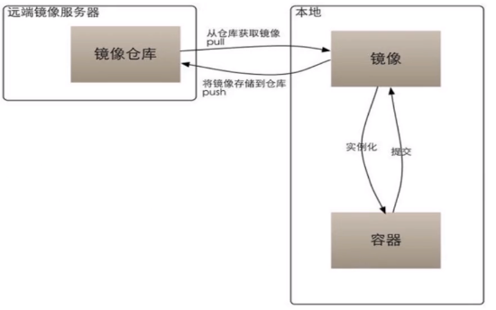

## Docker 简介
Docker 是一个开源的应用容器引擎，基于Go语言并遵从 Apache2 . 0 协议开源。  
Docker 可以让开发者打包他们的应用以及依赖包到一个轻量级、可移植的容器中，然后发布到任何流行的 Unux 机器上，也可以实现虚拟化。
容器是完全使用沙箱机制，相互之间不会有任何接口，更重要的是容器性能开销极低。

## Docker 与虚拟机区别

|对比项 |Docker|虚拟机|
| --- | --- |--- |
|启动速度|分钟|分钟级|
|性能|接近原生|较弱|
|内存代价|很小 线程|较多|
|硬盘使用|一般为MB|一般为 GB|
|运行密度|单机支持上千docker容器|一般几十个|
|隔离性|安全隔离|安全隔离|
|迁移性|优秀|一般|

Docker 启动速度秒级．基于操作系统内核技术，对现有基础设施的侵入较少，所有实现在内核中完成，所以性能几乎与原生一致．依赖简单，与进程无本质区别

## Docker 基础玩法

三个部件：

镜像（ Image ) 

容器（ Container ) 

仓库（ Repository ) 



### 安装

#### 安装docker 

`yum -y install docker`

#### 开机启动

`systemctl enable docker`

#### 启动docker

`systemctl start docker`

`service docker restart`

#### 查看版本

`docker version`

### docker常用操作

#### 查找 docker serach

`docker search mysql`

#### 拉取

`docker pull redis`

> 阿里云容器镜像服务
>
> ```shell
> sudo mkdir -p /etc/docker
> sudo tee /etc/docker/daemon.json <<-'EOF'
> {
>   "registry-mirrors": ["https://{{you_id}}.mirror.aliyuncs.com"]
> }
> EOF
> sudo systemctl daemon-reload
> sudo systemctl restart docker
> ```

#### 查看本地所有镜像

`docker images`

### Docker 容器

#### `docker run` 启动容器

命令输出一个 “Hello World”，之后终止容器

`docker run mysql /bin/echo "hello world"`

`docker run -t -i mysql /bin/bash`

- -t 选项让Docker分配一个伪终端（pseudo-tty）并绑定到容器的标准输入上。
- -i 则让容器的标准输入保持打开。

当利用`docker run` 来创建容器时，Docker在后台运行的标准操作包括：

- 检查本地是否存在指定的镜像，不存在就从公有仓库下载
- 利用镜像创建并启动一个容器
- 分配一个文件系统，并在只读的镜像层外面挂载一层可读写层
- 从宿主主机配置的网桥接口中桥接一个虚拟接口到容器中去
- 从地址池配置一个IP地址给容器
- 执行用户指定的应用程序
- 执行完毕后容器被终止

退出容器，可以使用exit命令。

拉镜象并创建运行镜象

`docker run -d --name redis redis`

>**说明：**
>
>`docker run -d --name mysql -p 3306:3306 -e MYSQL_ROOT_PASSWORD=root mysql:5.7`
>
>* -d 表示容器以守护态（Daemonized）形式运行,让 Docker容器在后台以守护态（Daemonized）形式运行。
>
>* `--name redis` 是我为容器取的名字
>
>* ` -p 3306:3307` 表示定义数据库为默认端口，并绑定到当前系统的端口为3307

#### 查看容器

通过 `docker ps` 命令查看当前运行的所有容器

#### `docker logs`获取容器的输出信息

`docker logs mvc`

#### 停止、运行容器

`docker start/stop redis`

`ip addr`

#### 删除指定容器

`docker rm -fv /tomcat`

`docker rmi ${imgage_id}`

## Docker 仓库

### docker 设置国内镜像源

国内加速地址有：

Docker中国区官方镜像 https://registry.docker-cn.com 

网易 http://hub-mirror.c.163.com

ustc  https://docker.mirrors.ustc.edu.cn

中国科技大学 https://docker.mirrors.ustc.edu.cn

阿里云容器 服务 https://cr.console.aliyun.com/ 首页点击“创建我的容器镜像” 得到一个专属的镜像加速地址，类似于`https://1234abcd.mirror.aliyuncs.com`

```json
# vi /etc/docker/daemon.json
{    
"registry-mirrors": ["http://hub-mirror.c.163.com"]
}
systemctl restart docker.servic
```

 docker inspect mysql

docker run -d --name tomcat -p 8080:8080 tomcat

curl 192.168.238.165:8080


docker run -d --name tomcat -p 8080:8080 -v /docker-data/tomcatapps:/usr/local/tomcat/webapps tomcat

docker exec -it tomcat /bin/bash

### 以镜象的形式发布


cat Dockerfile

```
FROM tomcat
ADD ["mvc.war","/usr/local/tomcat/webapps"]
```

`docker build -t mvc .`

`docker run -d --name mvc -p 8080:8080  mvc`


## References:

1. Docker 教程 https://www.runoob.com/docker/docker-tutorial.html

2. Docker 基础 https://www.cnblogs.com/keme/p/10232471.html