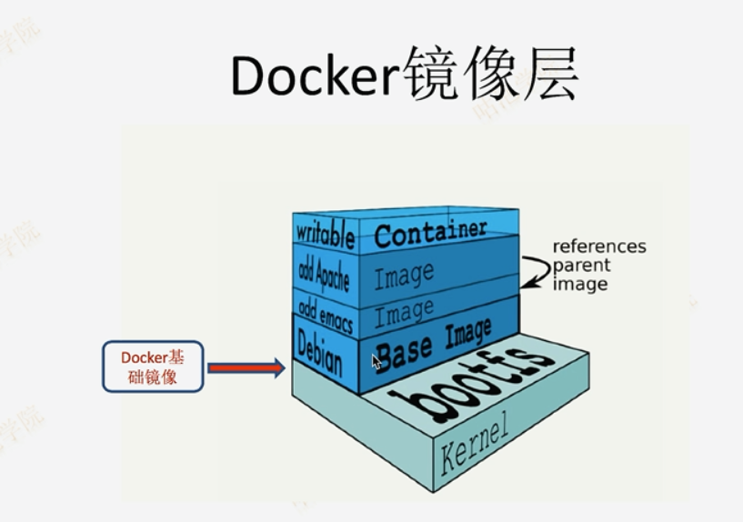

删除已安装的旧版本
wget -O /etc/yum.repos.d/CentOS-Base.repo http://mirrors.aliyun.com/repo/Centos-7.repo
yum remove -y docker docker-common docker-selinux docker-engine
安装device mapper驱动和yum工具
yum install -y yum-utils device-mapper-persistent-data lvm2

配置repo
yum-config-manager --add-repo https://download.docker.com/linux/centos/docker-ce.repo
yum-config-manager --add-repo http://mirrors.aliyun.com/docker-ce/linux/centos/docker-ce.repo
yum makecache fast
yum -y install docker

查看版本
docker version
启动docker
systemctl start docker
docker version  
开机自动启docker
systemctl enable docker

ps -ef | grep docker
查看Docker版本
docker version
查看目前的镜象
docker images
docker run centos:7 sleep 1000
docker ps 
交互式docker并执行创建文件
docker run -t -i centos:7 ls
docker run -t -i centos:7 bash
echo "hello">text.txt
cat text.txt 
exit
docker ps -a
docker run -t -i centos:7 bash
ls
看到文件没有了 

查看当前的层
docker ps -a
docker inspect id
docker inspect bec151428673
后台运行
docker run -d centos:7 sleep 1000
docker stop id
docker run -d centos:7 sleep 1000
docker stop bec151428673
docker start id
docker start bec151428673

删除层
docker rm -f id
docker rm -f bec151428673

后层运行并指定名字
docker run -d --name=centos7 centos:7 sleep 1000
docker端口映射和日志
docker pull tomcat
docker run -d -p 9000:8080 tomcat:latest
docker ps
curl localhost:9000
docker logs id
docker logs c9da2d35272a

docker logs --help

创建镜象
docker run -ti centos:7 bash
yum install -y git 
yum install -y nginx
两种提交的方式
docker commit 7724e36cf3eb tom/centos:1.0
docker run -ti tom/centos:1.0 bash

vi Dockerfile 
FROM centos:7
LABEL maintainer "tomluo(72719046@qq.com)"
COPY test1.txt /demo/
COPY test2.txt /demo/
# RUN yum install -y git

docker build -t tom/demo:1.0 .
docker run -ti tom/demo:1.0 bash
ll demo/

查看某个镜象的层
docker history tom/demo:1.0
docker history tomcat:8.5

多层变一层
链式输入命令
FROM centos:7
RUN yum update -y && yum install -y git curl

命令可以被覆盖
docker run -ti centos:7
docker run -ti centos:7 echo "hello world"

Docker 容器镜像删除
1.停止所有的container，这样才能够删除其中的images：
docker stop $(docker ps -a -q)
如果想要删除所有container的话再加一个指令：
docker rm $(docker ps -a -q)
2.查看当前有些什么images
docker images
3.删除images，通过image的id来指定删除谁
docker rmi <image id>
想要删除untagged images，也就是那些id为<None>的image的话可以用
docker rmi $(docker images | grep "^<none>" | awk "{print $3}")
要删除全部image的话
docker rmi $(docker images -q)

cat Dockerfile
FROM centos:7
LABEL maintainer "tomluo(72719046@qq.com)"
COPY test1.txt /demo/
COPY test2.txt /demo/
CMD echo "hello"

docker build -t tom/demo:1.1 .  --no-cache=true
docker run -ti tom/demo:1.1

https://hub.docker.com
docker push --help

https://github.com/yangzhares/mysql-spring-boot-todo.git

阿里云加速
首先注册开通阿里云开发者帐号 
https://promotion.aliyun.com/ntms/act/kubernetes.html
跳转阿里官方 注册开通阿里云开发者
登录后在个人中心点击加速器，同时会给出加速器地址。
选择对应的系统并根据自己的docker版本执行相应的步骤；
Docker客户端版本大于1.10的用户 可以通过修改daemon配置文件/etc/docker/daemon.json来使用加速器：

sudo mkdir -p /etc/docker
sudo tee /etc/docker/daemon.json <<-'EOF'
{
  "registry-mirrors": ["https://你的专有码.mirror.aliyuncs.com"]
}
EOF
sudo systemctl daemon-reload
sudo systemctl restart docker
网易加速(个人感觉网易加速比较稳定)
sudo mkdir -p /etc/docker
sudo tee /etc/docker/daemon.json <<-'EOF'
{
  "registry-mirrors": ["http://hub-mirror.c.163.com"]
}
EOF
sudo systemctl daemon-reload
sudo systemctl restart docker

/usr/bin/docker-current: Error response from daemon: error creating overlay mount to /var/lib/docker/overlay2/7fe8ca12815379e17fae76332d55895cd7d2d9f6c686d28d9131f9c1602c018b/merged: invalid argument.
原因
这个是因为用的overlay2文件系统，而系统默认只能识别overlay文件系统
解决

停掉docker服务

#systemctl stop docker

修改配置文件，将文件里的overlay2改成overlay

vi /etc/sysconfig/docker-storage
DOCKER_STORAGE_OPTIONS="--storage-driver overlay "

启动 docker

systemctl start docker

