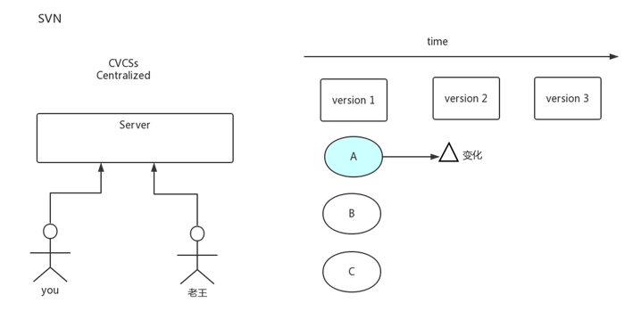
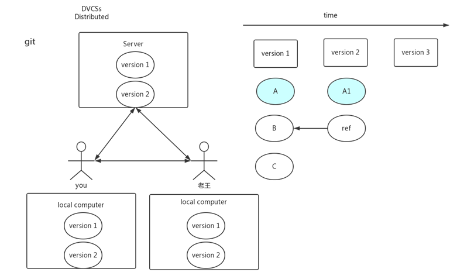

# 3.工程化专题之Git

[TOC]

## 什么是git

## 概念

3w who when why

linux 开源代码管理

### 开源协议

`Apache 2.0 License)`: https://github.com/dianping/cat   


## 世纪难题：git和svn的区别



缺点：

1. 需要联网
2. 磁盘环了数据就丢失了



分布式账本

去中心化

### GIT保证完整性

Commit ID

`git log --graph`

https://www.centos.org/download/

```shell
sha256sum CentOS-6.5-x86_64-minimal.iso
f9d84907d77df62017944cb23cab66305e94ee6ae6c1126415b81cc5e999bdd0  CentOS-6.5-x86_64-minimal.iso
```

## 安装 ssh

#### 安装

https://git-scm.com/book/en/v2/Getting-Started-Installing-Git 

[http://windows.github.com](http://windows.github.com/)

[http://mac.github.com](http://mac.github.com/)

http://git-scm.com/download/linux  

`sudo yum install git-all -y`

#### 设置全局变量

```shell
git config --global user.name tomluo
git config --global user.email ${your_email}
```

#### 生成SSH KEY

`ssh-keygen -t rsa -C ${your_email}`

生成以后copy public key到`setting`-> `SSH keys`, 如`https://github.com/settings/keys`

```shell
cat /root/.ssh/id_rsa.pub
```

新建文件 `~/.ssh/config `

```
Host github.com
HostName github.com
User tomlxq
IdentifyFile /root/.ssh/id_rsa 

Host git.oschina.com
HostName git.oschina.com
User tomlxq
IdentifyFile /root/.ssh/id_oschina
```

## 基本命令

### `git config `配置文件

​	Git有一个工具被称为git config，它允许你获得和设置配置变量；这些变量可以控制Git的外观和操作的各个方面。

1. 设置你的用户名称和e-mail地址

    ```cmd
    git config --global user.name ${username}
    git config --global user.email ${password}
    git config --global push.default simple
    ```

1. 编辑器(Your Editor)
   `git config --global core.editor emacs`
2. 检查你的设置(Checking Your Settings)
   `git config --list`
   `git config user.name`

### git status ` 查看文件状态

#### 文件的工作区


#### 文件的状态


```shell
git init
touch README.md   # untracked
git add README.md # staged
git commit -m "add README.md" # unmodified
```

### `git clone`

将远端的项目下载下来

`git clone https://github.com/tomlxq/git-demo.git`

`git clone git@github.com:tomlxq/git-demo.git`

### git add

增加所有文件
`git add -a`

`git add .`　

### `git remote`

查看远程仓库的地址
`git remote -v `

将本地的代码推到服务器上

```cmd
git init #受GIT管理
git add .　
git commit -m "init"
```

在github上建一个git

```shell
git remote add origin git@github.com:tomlxq/tomluo-springmvc.git
git config --list
remote.origin.url=git@github.com:tomlxq/tomluo-springmvc.git
git push -u origin master
```

>发现如下的错误 
>
>```cmd
>git push -u origin master
>git@github.com: Permission denied (publickey).
>fatal: Could not read from remote repository.
>```
>
>解决方案：
>
>```cmd
>git config --list #查看你的email
>ssh-keygen -t rsa -C ${your_email}
>#copy C:\Users\${user}/.ssh/id_rsa.pub 到 git.hub
>ssh -vT git@github.com
>git push -u origin master
>```

### `git fetch`

将远端与本地同步一次，但不会更新本地的代码

`git remote -v`

### `git pull`、`git push`

将本地代码更新到服务器
`git push -u origin master`
`git push`

如果本地代码push的一个错误的版本，想回退，怎么办

```cmd
git log --graph
git reset --hard ${old commitId}
git push -f origin master
```

### `git checkout`

* 切换分支
  * 切换一个新分支

     `git checkout -b ${your_new_branch}`

  * 切到一个存在的分支

     `git checkout ${your_new_branch}`

* 放弃修改

  `git checkout .`

### `git log`

查看日志`git log --graph`

`git log --pretty=oneline`

### `git stash`

事件做一半，需要切到别的分支去

不建议用，用`git commit -amend`

### `merge `、`rebase`

本地修改代码后

git pull origin master

发现文件冲突

编辑后

git add .

git commit -a -m ""

git push origin master


### `tag`

创建tag

`git tag -a ${tag_name} -m ${comment}`

如：`git tag -a v1.0.0 -m "tag-0816"`

git push origin --tags

将tag推到远程分支

`git push origin --tags`

`git show v1.0.0`

### `alias`

命令组合，取别名

`git config --global alias.ac "!git add -A && git commit -m"`

`git ac "this is the demo"`


## git-flow

团队管理


## gitlab

https://bitnami.com/stack/gitlab/virtual-machine 

https://github.com/gitlabhq/gitlabhq 

[https://about.gitlab.com/downloads/#centos7](https://about.gitlab.com/downloads/) 


## git hooks


三、常见安装
1. 如果输入$ ssh -T git@github.com
出现错误提示：Permission denied (publickey).因为新生成的key不能加入ssh就会导致连接不上github。
要客户端生成密钥
ssh-keygen -t rsa -C 727190460@qq.com
将密码添加到远程github
cat id_rsa.pub

2. 如果输入$ git push origin master
提示出错信息：error:failed to push som refs to .......
解决办法如下：
git pull origin master 
git push origin master
git remote add origin git@github.com:tomlxq/mysql-spring-boot-todo

3. 使用git在本地创建一个项目的过程
makdir ~/hello-world   
cd ~/hello-world      
git init            
touch README
git add README       
git commit -m 'first commit'    
git remote add origin git@github.com:tomlxq/hello-world.git     
git push -u origin master    

4. 解决git下载出现：Failed to connect to 127.0.0.1 port 1080: Connection refused拒绝连接错误（20190226）
查看Linux当前有没有使用代理
git config --global http.proxy
通过查询系统环境有没有使用代理（成功）
env|grep -I proxy
通过git取消代理设置
git config --global --unset http.proxy
git config --global --unset https.proxy


