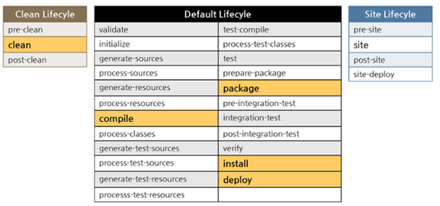

# 4.工程化专题回顾

## 安装 参考之前文档

### 配置

* git config –list
* git config –-global user.name ‘james’
* git config –-global user.email ‘james@gupaoedu.com’
* ssh-keygen -t rsa -C ‘james@gupaoedu.com’
* 把本地的 ~/.ssh/xxx.pub 

### 常用命令

* 下载远端的代码

  git clone [git@git.oschina.net:gupao-v/statics.git](mailto:git@git.oschina.net:gupao-v/statics.git)

* 创建自己远端项目 

​      去gitlab

* 修改
  * git add .
  * git commit -m ‘why modify’
  * git push origin master

* 拉取远程修改
  
* git pull origin master
  
* 获取远程分支状态
  
* git fetch 
  
* 对分支操作
  * git branch 查看本地有哪些分支
  * git branch -D 删除本地分支
  * git branch -a 查看包含远程的分支

*  git checkout 
  * 可以切换要去  git checkout branchName
  * 可以还原更改  git checkout fileName

* 合并分支

  * git merge

  * git rebase

* git diff

  * `git diff --stat`
  
  

## 提升、经验

### git flow

### git tag 每次合master之前一定要打个tag

### `.gitignore`

​	将已经提交的文件，放在忽略的文件里。

​	`git rm --cached ${ignore_file_name}`

​	`**/${file_name}` 表示所有子目录文件

## Maven

### 约定优于配置

### 下载

### 安装

### MVN_HOME

###  MVN_OPTS  -Xms

### `dependencyManagement` 

​	依赖管理，版本控制，建议只出现在父pom中

### dependency scope

​	https://maven.apache.org/guides/introduction/introduction-to-dependency-mechanism.html

```xml
<dependency>
    <groupId>org.springframework.boot</groupId>
    <artifactId>spring-boot-starter-test</artifactId>
    <scope>test</scope>
</dependency>
```

### 依赖传递

| compile  | provided   | runtime | test     |      |
| -------- | ---------- | ------- | -------- | ---- |
| compile  | compile(*) | -       | runtime  | -    |
| provided | provided   | -       | provided | -    |
| runtime  | runtime    | -       | runtime  | -    |
| test     | test       | -       | test     | -    |

### `mvn dependency:tree` 

### lifecycle phase goal



### profile

​	mvn package -P dev

### archetype