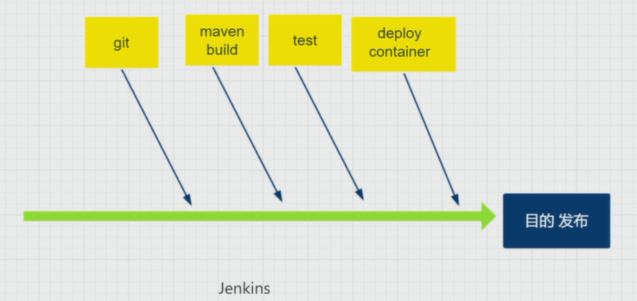

# 4.工程化专题之Jenkins

[TOC]

## 认识Jenkins

* Continuous integration 持续集成

* Continuous Delivery     持续交付

* Java写的



## 安装

https://jenkins.io

### 增加 Jenkins 仓储

```shell
wget -O /etc/yum.repos.d/jenkins.repo http://pkg.jenkins.io/redhat-stable/jenkins.repo
rpm --import http://pkg.jenkins.io/redhat-stable/jenkins.io.key
```

### 安装Jenkins和JDK

Run the below  yum command to install Jenkins and java.

`yum install jenkins –y`

JDK安装见

### 修改默认端口号

`vi /etc/sysconfig/jenkins`

找到  JENKINS_PORT="8080" ，JENKINS_AJP_PORT="8009",分别修改成你需要的端口号。

启动jenkins和jenkins服务

`service jenkins start`或 `systemctl start jenkins`

`systemctl enable jenkins`

### 开启端口设置防火墙

```cmd
firewall-cmd --zone=public --add-port=${jenkins_port}/tcp --permanent
firewall-cmd --zone=public --add-service=http --permanent
firewall-cmd --reload
```

###  访问 Jenkins Web portal

`http://192.168.238.150:${jenkins_port}/`

使用`grep -A 5 password /var/log/jenkins/jenkins.log`获取初始密码

选择`Install suggested plugins`安装插件

## 配置

### 手动安装插件

`Maven Integration`

`GitLab`

`Gitlab Hook`

`Deploy to container`

### 配置一个项目


 Java -jar xxx.jar  --port 8089


tomcat 安装

wget http://mirror.bit.edu.cn/apache/tomcat/tomcat-9/v9.0.22/bin/apache-tomcat-9.0.22.tar.gz
tar zxvf apache-tomcat-9.0.22.tar.gz 

`${TOMCAT_HOME}/conf/tomcat-users.xml`

```xml
<role rolename="manager-gui"/>
<role rolename="manager-script"/>
<role rolename="manager-jmx"/>
<role rolename="manager-status"/>
<user username="tomcat" password="tomcat" roles="manager-gui,manager-script,manager-jmx,manager-status"/>
```

`${TOMCAT_HOME}/webapps/manager/META-INF/context.xml `

```xml
<Context antiResourceLocking="false" privileged="true" >
<!--  <Valve className="org.apache.catalina.valves.RemoteAddrValve"
         allow="127\.\d+\.\d+\.\d+|::1|0:0:0:0:0:0:0:1" />
  <Manager sessionAttributeValueClassNameFilter="java\.lang\.(?:Boolean|Integer|Long|Number|String)|org\.apache\.catalina\.filters\.CsrfPreventionFilter\$LruCache(?:\$1)?|java\.util\.(?:Linked)?HashMap"/> -->
</Context>
```

修改默认端口号

`${TOMCAT_HOME}/conf/server.xml`

```xml
<Connector port="30000" protocol="HTTP/1.1"
               connectionTimeout="20000"
               redirectPort="8443" />
```


Maven安装

`wget http://mirrors.tuna.tsinghua.edu.cn/apache/maven/maven-3/3.6.1/binaries/apache-maven-3.6.1-bin.tar.gz`

`tar xzvf apache-maven-3.6.1-bin.tar.gz`

`export PATH=$PATH:/opt/jdk1.8.0_191/bin:/opt/jdk1.8.0_191/jre/bin:/opt/apache-maven-3.6.1/bin`

修改`${MVN_HOME}/conf/settings.xml`

```xml
<mirror>
<id>alimaven</id>
<name>aliyun maven</name>
<url>http://maven.aliyun.com/nexus/content/groups/public/</url>
<mirrorOf>central</mirrorOf>
</mirror>
<mirror>
<id>central</id>
<name>Maven Repository Switchboard</name>
<url>http://repo1.maven.org/maven2/</url>
<mirrorOf>central</mirrorOf>
</mirror>
<mirror>
<id>repo2</id>
<mirrorOf>central</mirrorOf>
<name>Human Readable Name for this Mirror.</name>
<url>http://repo2.maven.org/maven2/</url>
</mirror>
<mirror>
<id>ibiblio</id>
<mirrorOf>central</mirrorOf>
<name>Human Readable Name for this Mirror.</name>
<url>http://mirrors.ibiblio.org/pub/mirrors/maven2/</url>
</mirror>
<mirror>
<id>jboss-public-repository-group</id>
<mirrorOf>central</mirrorOf>
<name>JBoss Public Repository Group</name>
<url>http://repository.jboss.org/nexus/content/groups/public</url>
</mirror>
<!-- 中央仓库在中国的镜像 -->
<mirror>
<id>maven.net.cn</id>
<name>oneof the central mirrors in china</name>
<url>http://maven.net.cn/content/groups/public/</url>
<mirrorOf>central</mirrorOf>
</mirror>

```


