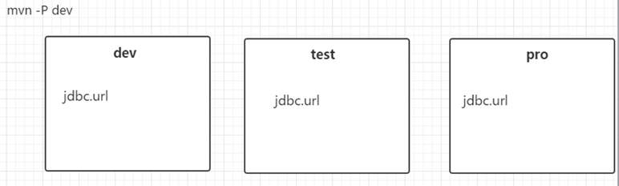

# 1.工程专题之maven

[TOC]

## What is Maven?

> Ant

### 超级pom

convention over configuration 约定优于配置

`${MAVEN_HOME}\lib\maven-model-builder-${version}.jar\org\apache\maven\model \pom-4.0.0.xml`

要使用maven就要遵守这样的约定。

### 优势

1. 约定优于配置
2. 简单
3. 测试支持
4. 构建简单
5. CI
6. 插件丰富

## 安装、使用


maven-model-builder-3.3.9.jar/org/apache/maven/model 

1. 下载apache-maven文件，选择自己需要的版本

   地址： https://maven.apache.org/download.cgi

​       解压所下载文件，本人解压到：`${path}\apache-maven-${version}`

3. 配置Maven环境变量
   * MAVEN_HOME : ${MAVEN_HOME}
   * PATH : %MAVEN_HOME%\bin;
   * MAVEN_OPTS : -Xms128m -Xmx512m -Duser.language=zh -Dfile.encoding=UTF-8

4. 在CMD中输入`mvn -v`,如出现下列信息，表示配置成功。

​        其中会显示Java 配置环境以及Maven配置环境

### 配置  MVM_HOME

#### Windows  path 

`${user}\.m2\settings.xml`

`${MAVEN_HOME}\conf\settings.xml`

#### Linux  .bash_profile

### MAVEN_OPTS

### 配置setting.xml

‪修改`{MAVEN_HOME}\conf\settings.xml`

修改Maven仓库路径

 `<localRepository>${lib_path}</localRepository>`

配置镜象

```xml
<mirror>  
    <id>alimaven</id>  
    <name>aliyun maven</name>  
    <url>http://maven.aliyun.com/nexus/content/groups/public/</url>  
    <mirrorOf>central</mirrorOf>          
</mirror> 
<mirror>
    <id>ui</id>
    <mirrorOf>central</mirrorOf>
    <name>Human Readable Name for this Mirror.</name>
    <url>http://uk.maven.org/maven2/</url>
</mirror>
<mirror>
    <id>osc</id>
    <mirrorOf>central</mirrorOf>
    <url>http://maven.oschina.net/content/groups/public/</url>
</mirror>
<mirror>
    <id>osc_thirdparty</id>
    <mirrorOf>thirdparty</mirrorOf>
    <url>http://maven.oschina.net/content/repositories/thirdparty/</url>
</mirror>
```

## 认识maven结构

## setting.xml元素解读

| 元素                                                         | 说明                                          |
| ------------------------------------------------------------ | --------------------------------------------- |
| <localRepository>E:\server\repository</localRepository>      | 设置本地仓库路径                              |
| <interactiveMode>true</interactiveMode>                      | 交互式model，输入时是否有提示，很少用         |
| <offline>false</offline>                                     | 当maven构建时，是否联接网络，会影响下载，部署 |
| <pluginGroups><br/><pluginGroup>com.your.plugins</pluginGroup><br/></pluginGroups> | 自定义插件                                    |
|                                                              |                                               |

指定代理

```xml
  <proxies>
    <proxy>
      <id>optional</id>
      <active>true</active>
      <protocol>http</protocol>
      <username>proxyuser</username>
      <password>proxypass</password>
      <host>proxy.host.net</host>
      <port>80</port>
      <nonProxyHosts>local.net|some.host.com</nonProxyHosts>
    </proxy>
  </proxies>
```

指特定服务的授权信息

```xml
<servers>
    <server>
      <id>deploymentRepo</id>
      <username>repouser</username>
      <password>repopwd</password>
    </server>
    -->

    <!-- Another sample, using keys to authenticate.
    <server>
      <id>siteServer</id>
      <privateKey>/path/to/private/key</privateKey>
      <passphrase>optional; leave empty if not used.</passphrase>
    </server>
    -->
  </servers>
```

指定镜象信息

```   xml
<mirror>
    <id>alimaven</id>
    <mirrorOf>central</mirrorOf>
    <name>aliyun maven</name>
    <url>http://maven.aliyun.com/nexus/content/repositories/central/</url>
</mirror>
```

配置profile,一般在pom里指定

```xml
<profiles>
</profiles>
```



## pom.xml元素解读

## 坐标、依赖

## 生命周期、插件

## Inherit、module

