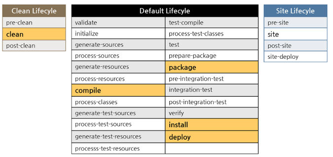

# 1.工程专题之maven

[TOC]

## What is Maven?

> Ant

### 超级pom

convention over configuration 约定优于配置

`${MAVEN_HOME}\lib\maven-model-builder-${version}.jar\org\apache\maven\model\pom-4.0.0.xml`

要使用maven就要遵守这样的约定。

### 优势

1. 约定优于配置
2. 简单
3. 测试支持
4. 构建简单
5. CI
6. 插件丰富

## 安装、使用

1. 下载apache-maven文件，选择自己需要的版本

   地址： https://maven.apache.org/download.cgi
   
   下载： `wget http://mirrors.tuna.tsinghua.edu.cn/apache/maven/maven-3/3.6.2/binaries/apache-maven-3.6.2-bin.tar.gz`

​       解压所下载文件，本人解压到：`${path}\apache-maven-${version}`

3. 配置Maven环境变量
   * MAVEN_HOME : ${MAVEN_HOME}
   * PATH : %MAVEN_HOME%\bin;
   * MAVEN_OPTS : `-Xms128m -Xmx512m -Duser.language=zh -Dfile.encoding=UTF-8`

4. 在CMD中输入`mvn -v`,如出现下列信息，表示配置成功。

​        其中会显示Java 配置环境以及Maven配置环境

### 配置  MVM_HOME

#### Windows  path 

`${user}\.m2\settings.xml`

`${MAVEN_HOME}\conf\settings.xml`

#### Linux  .bash_profile

```
vi ~/.bash_profile #修改环境配置文件
export M2_HOME=${MAVEN_HOME} #增加变理
source ~/.bash_profile #使用文件生效
ln -s $M2_HOME/bin/mvn /usr/local/bin/mvn #关联mvn命令
```

### MAVEN_OPTS

### 配置setting.xml

‪修改`{MAVEN_HOME}\conf\settings.xml`

修改Maven仓库路径

 `<localRepository>${lib_path}</localRepository>`

配置镜象

```xml
<mirror>  
    <id>alimaven</id>  
    <name>aliyun maven</name>  
    <url>http://maven.aliyun.com/nexus/content/groups/public/</url>  
    <mirrorOf>central</mirrorOf>          
</mirror> 
<mirror>
    <id>ui</id>
    <mirrorOf>central</mirrorOf>
    <name>Human Readable Name for this Mirror.</name>
    <url>http://uk.maven.org/maven2/</url>
</mirror>
<mirror>
    <id>osc</id>
    <mirrorOf>central</mirrorOf>
    <url>http://maven.oschina.net/content/groups/public/</url>
</mirror>
<mirror>
    <id>osc_thirdparty</id>
    <mirrorOf>thirdparty</mirrorOf>
    <url>http://maven.oschina.net/content/repositories/thirdparty/</url>
</mirror>
```

## 认识maven结构

```
├─bin
├─boot
├─conf
│  └─logging
└─lib
    ├─ext
    └─jansi-native
        ├─freebsd32
        ├─freebsd64
        ├─linux32
        ├─linux64
        ├─osx
        ├─windows32
        └─windows64
```


## setting.xml元素解读

### `localRepository`设置本地仓库路径

`<localRepository>E:\server\repository</localRepository>`

### `interactiveMode`交互式model

输入时是否有提示，很少用

`<interactiveMode>true</interactiveMode>`

### `offline` 

当maven构建时，是否联接网络，会影响下载，部署

`<offline>false</offline>`

### `pluginGroups`自定义插件

```xml
<pluginGroups>
    <pluginGroup>com.your.plugins</pluginGroup>
</pluginGroups>
```


### `proxies`指定代理

```xml
  <proxies>
    <proxy>
      <id>optional</id>
      <active>true</active>
      <protocol>http</protocol>
      <username>proxyuser</username>
      <password>proxypass</password>
      <host>proxy.host.net</host>
      <port>80</port>
      <nonProxyHosts>local.net|some.host.com</nonProxyHosts>
    </proxy>
  </proxies>
```

### `servers`指特定服务的授权信息

```xml
<servers>
    <server>
      <id>deploymentRepo</id>
      <username>repouser</username>
      <password>repopwd</password>
    </server>
    -->

    <!-- Another sample, using keys to authenticate.
    <server>
      <id>siteServer</id>
      <privateKey>/path/to/private/key</privateKey>
      <passphrase>optional; leave empty if not used.</passphrase>
    </server>
    -->
  </servers>
```

### `mirror`指定镜象信息

```   xml
<mirror>
    <id>alimaven</id>
    <mirrorOf>central</mirrorOf>
    <name>aliyun maven</name>
    <url>http://maven.aliyun.com/nexus/content/repositories/central/</url>
</mirror>
```

### `profiles`配置profile,一般在pom里指定

```xml
<profiles>
</profiles>
```


## pom.xml元素解读

### `modelVersion`指定超级pom的版本

``` xml
<modelVersion>4.0.0</modelVersion>
```
### `groupId`公司组织的域名

```xml
<groupId>com.example</groupId>
```

### `artfactId` 功能命名

```xml
<artifactId>tomcat-spring-boot-web</artifactId>
```

### `version`版本号

``` xml
<version>0.0.1-SNAPSHOT</version>
```

### `packaging` 打包方式 

默认是`jar`, 还有`pom`,`war`,`maven-plugin`

```xml
<packaging>maven-plugin</packaging>
```

### `description`项目信息描述

```xml
<description>Demo project for Spring Boot</description>
```

### `properties`定义一些变量

``` xml
<properties><java.version>1.8</java.version></properties>
```

### `dependencyManagement`依赖管理

* 只能出现在父pom
* 统一版本号
* 声明 (子POM里用到再引用)

### `dependency`

#### Type 默认jar

#### `scope`

`compile`  编译   例如`spring-core`
`test` 测试 例如`spring-boot-starter-test`
`provided` 编译  例如 servlet
`runtime` 运行时 例如`mysql-connector-java`驱动实现
`system` 本地一些jar  例如短信jar

#### 依赖传递
第一列表示直接依赖的scope(本包)，第一行表示间接依赖的scope（依赖包）

|          | compile  | test | provided | runtime  |
| -------- | -------- | ---- | -------- | -------- |
| compile  | compile  | -    | -        | runtime  |
| test     | test     | -    | -        | test     |
| provided | provided | -    | provided | provided |
| runtime  | runtime  | -    | -        | runtime  |

> 总结： 
>
> * compile和runtime,依赖会往下走
> * test,则不会往下传递
> * provide仅传递provide的
>
> 
>
> tomluo-dal依赖tomluo-common-lib，将其改为scope=test
>
> ```xml
> [INFO] com.gp.springmvc:tomluo-dal:jar:1.1-SNAPSHOT
> [INFO] +- com.gp.springmvc:tomluo-common-lib:jar:1.1-SNAPSHOT:test
> ```
>
> tomluo-web依赖tomluo-dal 则看不到tomluo-common-lib
>
> ```
> com.gp.springmvc:tomluo-web:war:1.1-SNAPSHOT
> [INFO] +- com.gp.springmvc:tomluo-dal:jar:1.1-SNAPSHOT:compile
> [INFO] |  +- org.springframework:spring-context:jar:5.1.9.RELEASE:compile
> [INFO] |  +- org.springframework:spring-tx:jar:5.1.9.RELEASE:compile
> [INFO] |  +- org.springframework:spring-jdbc:jar:5.1.9.RELEASE:compile
> [INFO] |  +- com.alibaba:druid:jar:1.1.17:compile
> [INFO] |  +- org.mybatis:mybatis:jar:3.5.1:compile
> [INFO] |  +- org.mybatis:mybatis-spring:jar:1.3.0:compile
> [INFO] |  +- mysql:mysql-connector-java:jar:5.1.8:runtime
> [INFO] |  +- com.github.pagehelper:pagehelper:jar:5.1.4:compile
> [INFO] |  |  \- com.github.jsqlparser:jsqlparser:jar:1.0:compile
> [INFO] |  \- cglib:cglib:jar:3.2.9:compile
> [INFO] |     +- org.ow2.asm:asm:jar:7.0:compile
> [INFO] |     \- org.apache.ant:ant:jar:1.10.3:compile
> [INFO] |        \- org.apache.ant:ant-launcher:jar:1.10.3:compile
> ```
>
> 将其改回后，tomluo-web又可以看到tomluo-common-lib
>
> ```
> [INFO] com.gp.springmvc:tomluo-web:war:1.1-SNAPSHOT
> [INFO] +- com.gp.springmvc:tomluo-dal:jar:1.1-SNAPSHOT:compile
> [INFO] |  +- com.gp.springmvc:tomluo-common-lib:jar:1.1-SNAPSHOT:compile
> ```
>
> 改成 tomluo-dal改成provided，可以看到仅provided传递下来了
>
>  ```xml
> [INFO] com.gp.springmvc:tomluo-web:war:1.1-SNAPSHOT
> [INFO] +- com.gp.springmvc:tomluo-dal:jar:1.1-SNAPSHOT:provided
> [INFO] |  +- com.gp.springmvc:tomluo-common-lib:jar:1.1-SNAPSHOT:provided
> [INFO] |  |  +- ch.qos.logback:logback-core:jar:1.2.3:provided
> [INFO] |  |  +- ch.qos.logback:logback-classic:jar:1.2.3:provided
> [INFO] |  |  +- com.alibaba:fastjson:jar:1.2.47:provided
> [INFO] |  |  \- org.projectlombok:lombok:jar:1.18.8:provided
>  ```

#### 依赖仲裁

* 最短路径原则

* 加载先后原则

#### `exclusions`
排除包，主要是解决包冲突

```xml
<dependency>
    <groupId>javax.servlet.jsp.jstl</groupId>
    <artifactId>jstl-api</artifactId>
    <version>1.2</version>
    <exclusions>
        <exclusion>
            <groupId>javax.servlet</groupId>
            <artifactId>servlet-api</artifactId>
        </exclusion>
    </exclusions>
</dependency>
```

## 生命周期 lifecycle/phase/goal
A Build Lifecycle is Made Up of Phases
A Build Phase is Made Up of Plugin Goals



  

## 坐标、依赖


## 生命周期、插件

## Inherit、module


## 常用指令

### 查看依赖树

`mvn dependency:tree`

### 安装jar到本地仓库

`mvn install -X -Dmaven.test.skip` 

### 对整个工程升级版本

增加插件

```xml
<plugin>
    <groupId>org.codehaus.mojo</groupId>
    <artifactId>versions-maven-plugin</artifactId>
    <version>2.3</version>
</plugin>
```

用`mvn`升级到新版本

`mvn versions:set -DnewVersion=${newVersion}-SNAPSHOT`