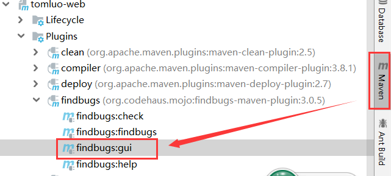

# 2.工程专题之maven

[TOC]

## 自定义plugin

https://maven.apache.org/guides/plugin/guide-java-plugin-development.html

`pom.xml`

```xml
<?xml version="1.0" encoding="UTF-8"?>
<project xmlns="http://maven.apache.org/POM/4.0.0"
         xmlns:xsi="http://www.w3.org/2001/XMLSchema-instance"
         xsi:schemaLocation="http://maven.apache.org/POM/4.0.0 http://maven.apache.org/xsd/maven-4.0.0.xsd">

    <modelVersion>4.0.0</modelVersion>
    <groupId>com.tomluo.plugin</groupId>
    <version>1.0-SNAPSHOT</version>
    <artifactId>tomluo-plugin</artifactId>
    <packaging>maven-plugin</packaging>
    <properties>
        <project-version>${project.version}</project-version>
        <project.build.sourceEncoding>UTF-8</project.build.sourceEncoding>
        <project.reporting.outputEncoding>UTF-8</project.reporting.outputEncoding>
        <maven.compiler.encoding>UTF-8</maven.compiler.encoding>
        <java.version>1.8</java.version>
        <java.encoding>UTF-8</java.encoding>
    </properties>
    <dependencies>
        <dependency>
            <groupId>org.apache.maven</groupId>
            <artifactId>maven-plugin-api</artifactId>
            <version>3.5.0</version>
        </dependency>
        <dependency>
            <groupId>org.apache.maven.plugin-tools</groupId>
            <artifactId>maven-plugin-annotations</artifactId>
            <version>3.5.2</version>
            <scope>provided</scope>
        </dependency>
    </dependencies>
    <build>
        <plugins>
            <plugin>
                <groupId>org.apache.maven.plugins</groupId>
                <artifactId>maven-compiler-plugin</artifactId>
                <version>3.8.1</version>
                <configuration>
                    <source>${java.version}</source>
                    <target>${java.version}</target>
                    <encoding>${java.encoding}</encoding>
                    <compilerArguments>
                        <extdirs>lib</extdirs>
                    </compilerArguments>
                </configuration>
            </plugin>
        </plugins>
    </build>

</project>
```

编写插件功能`TomMojo.java`

```java
import org.apache.maven.plugin.AbstractMojo;
import org.apache.maven.plugin.MojoExecutionException;
import org.apache.maven.plugin.MojoFailureException;
import org.apache.maven.plugins.annotations.LifecyclePhase;
import org.apache.maven.plugins.annotations.Mojo;
import org.apache.maven.plugins.annotations.Parameter;

import java.util.Date;
import java.util.List;

/**
 * 在打包时执行插件功能
 *
 * @author TomLuo
 * @date 2019/8/13
 */
@Mojo(name = "tom-plugin", defaultPhase = LifecyclePhase.PACKAGE)
public class TomMojo extends AbstractMojo {
    @Parameter(property = "greeting", defaultValue = "Hello World!")
    private String basedir;
    @Parameter
    private String buildDirectory;

    @Parameter(property = "args")
    private String args;
    @Parameter
    private List<Integer> myIntegers;
    @Parameter
    private Double myDouble;
    @Parameter
    private Date myDate;


    @Override
    public void execute() throws MojoExecutionException, MojoFailureException {
        System.out.println(this.getClass().getName() + " plugin");
        System.out.println("basedir :" + basedir);
        System.out.println("buildDirectory :" + buildDirectory);
        System.out.println("args :" + args);
        System.out.println("myIntegers :" + myIntegers);
        System.out.println("myDouble :" + myDouble);
        System.out.println("myDate :" + myDate);
    }
}
```

完成后，安装到本地仓库

`mvn clean install`

如何使用

```xml
<plugin>
    <groupId>com.tomluo.plugin</groupId>
    <artifactId>tomluo-plugin</artifactId>
    <version>1.0-SNAPSHOT</version>
    <configuration>
        <basedir>${project.basedir}</basedir>
        <buildDirectory>${project.build.directory}</buildDirectory>
        <myIntegers>
            <option>10</option>
            <option>5</option>
            <option>15</option>
        </myIntegers>
        <myDouble>1.0</myDouble>
        <myDate>2019-10-06 2:22:55.1 PM</myDate>
    </configuration>
    <executions>
        <execution>
            <phase>compile</phase>
            <goals>
                <goal>tom-plugin</goal>
            </goals>
        </execution>
    </executions>
</plugin>
```

`mvn clean compile -Dargs=123`

输出

```
com.tomluo.plugin.TomMojo plugin
basedir :E:\data\wwwtest\tom-springmvc\tomluo-project-api
buildDirectory :E:\data\wwwtest\tom-springmvc\tomluo-project-api\target
args :123
myIntegers :[10, 5, 15]
myDouble :1.0
myDate :Sun Oct 06 14:22:55 GMT+08:00 2019
```


## 常用插件介绍

https://maven.apache.org/plugins/ 
http://www.mojohaus.org/plugins.html 

### findbugs 静态代码检查

```xml
<plugin>
    <groupId>org.codehaus.mojo</groupId>
    <artifactId>findbugs-maven-plugin</artifactId>
    <version>3.0.5</version>
    <configuration>
        <!-- <configLocation>${basedir}/springside-findbugs.xml</configLocation> -->
        <threshold>High</threshold>
        <effort>Default</effort>
        <findbugsXmlOutput>true</findbugsXmlOutput>
        <!-- findbugs xml输出路径-->
        <findbugsXmlOutputDirectory>target/site</findbugsXmlOutputDirectory>
    </configuration>
</plugin>
```

`mvn findbugs:findbugs`

或maven 

 

### versions 统一升级版本号

`mvn versions:set -DnewVersion=1.1`

### source 打包源代码

```xml
<plugin>
    <artifactId>maven-source-plugin</artifactId>
    <version>3.0.1</version>
    <executions>
        <execution>
            <id>attach-sources</id>
            <phase>install</phase>
            <goals>
                <goal>jar-no-fork</goal>
            </goals>
        </execution>
    </executions>
</plugin>
```

生成的包里可以看到target下在生成了`${artifactId}-${version}-sources.jar`

### assembly 打包zip、war

```cmd
java -jar target/tomluo-project-api-1.2-SNAPSHOT.jar
target/tomluo-project-api-1.2-SNAPSHOT.jar中没有主清单属性
```

增加

```xml
<plugin>
    <artifactId>maven-assembly-plugin</artifactId>
    <version>3.1.1</version>
    <configuration>
        <archive>
            <manifest>
                <mainClass>
                    AppBootstrap <!-- 指定main函数 -->
                </mainClass>
            </manifest>
        </archive>
        <descriptorRefs>
            <descriptorRef>jar-with-dependencies</descriptorRef>
        </descriptorRefs>
    </configuration>
    <executions>
        <execution>
            <id>make-assemble</id>
            <phase>package</phase>
            <goals>
                <goal>single</goal>
            </goals>
        </execution>
    </executions>
</plugin>
```


`java -jar target/tomluo-project-api-jar-with-dependencies.jar`

可以看到成执行了`main`函数

### tomcat7

```xml
<plugin>
    <groupId>org.apache.tomcat.maven</groupId>
    <artifactId>tomcat7-maven-plugin</artifactId>
    <version>2.2</version>
    <configuration>
        <port>8080</port>
        <path>/</path>
    </configuration>
</plugin>
```

`mvn tomcat7:run` 

好处是不是去官方下载一个tomcat，直接用tomcat插件启动。

## 版本管理

### 1.0-SNAPSHOT
repository 删除
`mvn clean package -U` (强制拉一次)

### 1.0.0-RELAESE

主版本号.次版本号.增量版本号-<里程碑版本>


## Profile

### 使用场景 dev/test/pro

#### 根据环境，增加三个配置文件

`${project_app}/src/main/resources/conf/dev/app.properties`

`name=tom-dev`

`${project_app}/src/main/resources/conf/test/app.properties`

`name=tom-test`

`${project_app}/src/main/resources/conf/prod/app.properties`

`name=tom-prod`

#### `pom.xml`增加配置

```xml
<profiles>
    <profile>
        <id>dev</id>
        <properties>
            <profiles.active>dev</profiles.active>
        </properties>
        <activation>
            <activeByDefault>true</activeByDefault> <!-- 默认激活 -->
        </activation>
    </profile>
    <profile>
        <id>test</id>
        <properties>
            <profiles.active>test</profiles.active>
        </properties>
    </profile>
    <profile>
        <id>prod</id>
        <properties>
            <profiles.active>prod</profiles.active>
        </properties>
    </profile>
</profiles>

<build>
    ...
    <resources>
        <resource>
            <directory>${basedir}/src/main/resources</directory>
            <excludes>
                <exclude>conf/**</exclude> <!-- 排除conf -->
            </excludes>
        </resource>
        <resource>
            <directory>src/main/resources/conf/${profiles.active}</directory>
        </resource>
    </resources>
    ...
```

### 使用`mvn clean compile -P ${id}`

生成了配置文件, 如何用`mvn clean compile -P prod`

`${project_app}/target/classes/app.properties`

内容为

`name=tom-prod`

### setting.xml 家和公司两套

在公司用了私服，在家里只能用公有Repository

`${MVN_HOME}\conf\settings.xml`

```xml
<profiles>
    <profile>
        <id>office</id>
        <repositories>
            <repository>
                <id>local-nexus</id>
                <url>http://192.168.238.150:8082/nexus/content/groups/public/</url>
                <releases>
                    <enabled>true</enabled>
                </releases>
                <snapshots>
                    <enabled>true</enabled>
                </snapshots>
            </repository>
        </repositories>
        <pluginRepositories>
            <pluginRepository>
                <id>plugin-local-mirror</id>
                <url>http://192.168.238.150:8082/nexus/content/groups/public/</url>
            </pluginRepository>
        </pluginRepositories>
    </profile>
    <profile>
        <id>external</id>
        <repositories>
            <repository>
                <id>repo-mirror</id>
                <url>http://maven.aliyun.com/nexus/content/groups/public/</url>
            </repository>
        </repositories>
        <pluginRepositories>
            <pluginRepository>
                <id>plugin-mirror</id>
                <url>http://maven.aliyun.com/nexus/content/groups/public/</url>
            </pluginRepository>
        </pluginRepositories>
    </profile>   
</profiles>
```

`${MVN_HOME}\conf\settings.xml`家里则激活`external`

```xml
<activeProfiles>
    <activeProfile>external</activeProfile>
</activeProfiles>
```

## Repository (Nexus)仓库

见配置  [私服Nexus](../maven/3.私服Nexus.md)

## 自定义archetype

### 生成一个archetype

`mvn archetype:create-from-project`

`cd ${app}\target\generated-sources\archetype`

`mvn install`
从archetype创建项目

`mvn archetype:generate -DarchetypeCatalog=local`

## 常用命令

`compile`
`clean`    删除target/
`test`       test case junit/testNG
`package`打包
`install`    把项目install到local repo
`deploy`   发本地jar发布到remote