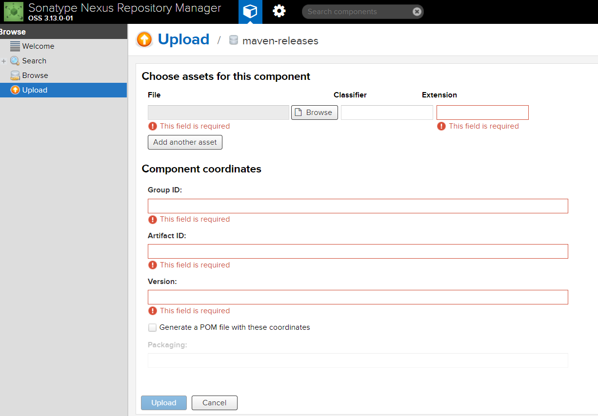

# 3.私服Nexus

[TOC]

## 什么是私服

私服是一种特殊的远程Maven仓库，它是架设在局域网内的仓库服务，私服一般被配置为互联网远程仓库的镜像，供局域网内的Maven用户使用。


当Maven需要下载构件的时候，先向私服请求，如果私服上不存在该构件，则从外部的远程仓库下载，同时缓存在私服之上，然后为Maven下载请求提供下载服务，另外，对于自定义或第三方的jar可以从本地上传到私服，供局域网内其他maven用户使用。

**Maven 仓库的分类：**(maven的仓库只有两大类)

* 本地仓库 

* 远程仓库，在远程仓库中又分成了3种：
  * 中央仓库 
  * 私服 
  * 其它公共库

##  主要优点

* 节省外网宽带
* 加速Maven构建
* 部署第三方构件
* 提高稳定性、增强控制：原因是外网不稳定
* 降低中央仓库的负荷：原因是中央仓库访问量太大


## 安装及配置JDK

见 [安装jdk](../jdk/1. 安装jdk.md)

需要关闭防火墙
centos从7开始默认用的是firewalld，这个是基于iptables的，虽然有iptables的核心，但是iptables的服务是没安装的。

所以你只要停止firewalld服务即可：
`sudo systemctl stop firewalld.service && sudo systemctl disable firewalld.service`

如果你要改用iptables的话，需要安装iptables服务：

```
sudo yum install iptables-services
sudo systemctl enable iptables && sudo systemctl enable ip6tables
sudo systemctl start iptables && sudo systemctl start ip6tables
```

## 安装nexus

### 下载nexus

官方文档

http://books.sonatype.com/nexus-book/reference3/index.html 

下载

https://help.sonatype.com/repomanager3/download

http://119.29.241.56:8080/store/thumbs/2018/0726/nexus-3.13.0-01-unix.tar.gz

### 解压缩至/usr/local目录下

`tar -zxvf nexus-${version}-01-unix.tar.gz -C /usr/local`

### 修改运行用户

 `/usr/local/nexus-${version}/bin/nexus.rc`

```
#run_as_user=""
run_as_user="root"
```

### 添加到系统服务

```cmd
# 在/etc/init.d目录下建立nexus3链接
ln -s /usr/local/nexus-${version}/bin/nexus /etc/init.d/nexus3
# chkconfig工具服务列表中增加nexus3服务
chkconfig --add nexus3
# 设置nexus3自启动
chkconfig nexus3 on
```

### 修改所用jdk

`/usr/local/nexus-${version}/bin/nexus`

```cmd
# 指定jdk安装路径
INSTALL4J_JAVA_HOME_OVERRIDE=${JAVA_HOME}
```

### 修改nexus3监听端口

`/usr/local/nexus-${version}/etc/nexus-default.properties`

```cmd
# 指定nexus3监听端口
application-port=${port}
```

### 修改nexus3仓库位置

`/usr/local/nexus-${version}/bin/nexus.vmoptions`

```properties
# 日志文件路径
-XX:LogFile=/opt/nexus3/log/jvm.log
# 数据目录
-Dkaraf.data=/opt/nexus3
# 临时文件目录
-Djava.io.tmpdir=/opt/nexus3/tmp
```

### nexus 配置内存

是在 `/usr/local/nexus-${version}/bin/nexus.vmoptions`

```properties
-Xms1200M
-Xmx1200M
-XX:MaxDirectMemorySize=2G
-XX:+UnlockDiagnosticVMOptions
-XX:+UnsyncloadClass
-XX:+LogVMOutput
```

### 创建阿里云的代理仓库

`http://maven.aliyun.com/nexus/content/groups/public/`


然后再public组里面将这个aliyun仓库加入，排在maven-central之前即可


### 启动nexus3

`/etc/init.d/nexus3 start`

可以看到nexus3已经正常启动。

现在我们登录到nexus3(`http://${nexus_server_ip}:${port}`)管理后台，管理员用户和密码是:`admin/admin123`。

## 项目配置

### 配置本地maven `settings.xml`

> 提示：两种配置方法
>
> 一种是直接配置maven目录下的conf下的settings.xml文件，
>
> 另外一种是复制该文件到用户目录下的.m2目录，两种方法配置效果是一样的，看个人喜好了
>
> 加载顺序是.m2下的settings.xml目录接着是maven config目录下的`settings.xml`

`${MAVEN_HOME}\conf\settings.xml`

```xml
<servers>
    <server>
        <id>nexus-releases</id>
        <username>admin</username>
        <password>admin123</password>
    </server>
    <server>
        <id>nexus-snapshots</id>
        <username>admin</username>
        <password>admin123</password>
    </server>
</servers>
```

配置镜象下载私服jar包

```xml
<mirrors>  
    <!-- <mirror>
        <id>nexus-aliyun</id>
        <mirrorOf>*</mirrorOf>
        <name>Nexus aliyun</name>
        <url>http://maven.aliyun.com/nexus/content/groups/public</url>
    </mirror> -->
	<mirror>
        <id>central</id>
        <name>central</name>
        <url>http://${nexus_server_ip}:${port}/repository/maven-public/</url>
        <mirrorOf>*</mirrorOf>
    </mirror>
</mirrors>
```

如果只想下载jar包

```xml
<repositories>
    <repository>
        <id>maven-group</id>
        <url>http://${nexus_server_ip}:${port}/repository/maven-public/</url>
    </repository>
</repositories>
```

### 发布项目

配置要上传到nexus项目`pom.xml`文件

修改项目的`pom.xml`

下面的URL来自于`nexus`-> `server administration and configuration`->`Repositories`

分别copy `maven-snapshots`,`maven-releases`

```xml
<distributionManagement>
    <snapshotRepository>
        <id>nexus-snapshots</id> <!-- 要与下面的maven的setting文件里的id保持一致 -->
        <url>http://${nexus_server_ip}:${port}/repository/maven-snapshots/</url>
    </snapshotRepository>
    <repository>
        <id>nexus-releases</id>
        <url>http://${nexus_server_ip}:${port}/repository/maven-releases/</url>
    </repository>
</distributionManagement>
```

编辑并发布jar包
`mvn clean && mvn deploy -DskipTests=true`

### 上传第三方包

**一种是命令**

```cmd
mvn deploy:deploy-file \
    -DgroupId=<group-id> \
    -DartifactId=<artifact-id> \
    -Dversion=<version> \
    -Dpackaging=<type-of-packaging> \
    -Dfile=<path-to-file> \
    -DrepositoryId=<server-id-settings.xml> \
    -Durl=<url-of-the-repository-to-deploy>
```

**使用Nexus上传**



