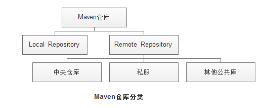
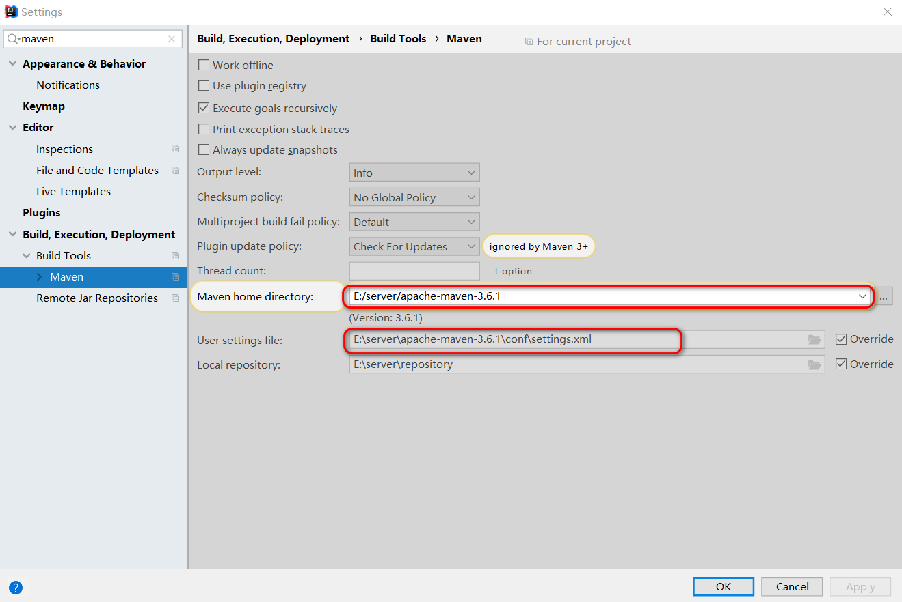

# maven仓库中心mirrors配置

## mirror和repository 区别



Maven仓库主要有2种：
* remote repository：相当于公共的仓库，大家都能访问到，一般可以用URL的形式访问
* local repository：存放在本地磁盘的一个文件夹，例如，windows上默认是C:\Users\｛用户名｝\.m2\repository目录

Remote Repository主要有3种：
* 中央仓库：http://repo1.maven.org/maven2/ 
* 私服：内网自建的maven repository，其URL是一个内部网址 
* 其他公共仓库：其他可以互联网公共访问maven repository，例如 jboss repository等

repository里存放的都是各种jar包和maven插件。当向仓库请求插件或依赖的时候，会先检查local repository，如果local repository有则直接返回，否则会向remote repository请求，并缓存到local repository。也可以把做的东西放到本地仓库，仅供本地使用；或上传到远程仓库，供大家使用。 

## Mirror

mirror相当于一个拦截器，它会拦截maven对remote repository的相关请求，把请求里的remote repository地址，重定向到mirror里配置的地址。

## 1.安装 Maven
 
如果需要使用到 Maven ，必须首先安装 Maven ， Maven 的下载地址在 Apache Maven 中有，您也可以点击这里下载 zip ,tar.gz。

下载好 Maven 后，需要简单安装下。将下载的  zip  或者  tar.gz  包解压到需要安装到的目录。 接下简单配置下环境变量：

* 新建环境变量  M2_HOME  ,输入值为 Maven 的安装目录。
* 将 M2 环境变量加入  Path  的最后，如：  ;%M2_HOME%\bin  ;。

环境变量就这么简单配置下就可以了。打开命令行窗口输入  mvn -version

```bash
mvn -version
Apache Maven 3.5.4 (1edded0938998edf8bf061f1ceb3cfdeccf443fe; 2018-06-18T
Maven home: F:\server\apache-maven-3.5.4\bin\..
Java version: 1.8.0_91, vendor: Oracle Corporation, runtime: F:\server\Ja
Default locale: zh_CN, platform encoding: GBK
OS name: "windows 7", version: "6.1", arch: "amd64", family: "windows"
```

## 1、配置idea指定本地仓库的maven

file-->Other Settings-->default settings-->搜索maven



## 2、配置本地maven(本地maven仓库存放的位置)

```bash
apache-maven-3.5.4\conf\settings.xml
<localRepository>F:\server\repository</localRepository>
```
## 3、核心配置(配置多个中央下载仓库中心)

* mirrorOf

`<mirrorOf></mirrorOf>`
标签里面放置的是要被镜像的Repository ID。为了满足一些复杂的需求，Maven还支持更高级的镜像配置： 
`<mirrorOf>*</mirrorOf>` 
匹配所有远程仓库。 
`<mirrorOf>repo1,repo2</mirrorOf>` 
匹配仓库repo1和repo2，使用逗号分隔多个远程仓库。 
`<mirrorOf>*,!repo1</miiroOf>`
匹配所有远程仓库，repo1除外，使用感叹号将仓库从匹配中排除。

* Repository与Mirror

mirror表示的是两个Repository之间的关系，在maven配置文件（setting.xml)里配置了`<mirrors><mirror>..........</mirror></mirrors>`，即定义了两个Repository之间的镜像关系。
配置两个Repository之间的镜像关系，一般是出于访问速度和下载速度考虑。
如果该镜像仓库需要认证，则配置setting.xml中的<server></server>即可。

>注意: 需要注意的是，由于镜像仓库完全屏蔽了被镜像仓库，当镜像仓库不稳定或者停止服务的时候，Maven仍将无法访问被镜像仓库，因而将无法下载构件。

重要说明：
此处指定多个mirrors镜像，镜像只会执行第一个位置mirror。

官网说明如下:http://maven.apache.org/guides/mini/guide-mirror-settings.html

设置多个镜像只会识别第一个镜像下载jar包。配置的多个mirror可以都放着不影响，选取一个镜像下载比较快的放在第一个就行。

## 使用 Maven 创建项目
mvn archetype:create -DgroupId=oschina -DartifactId=simple -DpackageName=net.oschina.simple  -DarchetypeArtifactId=maven-archetype-webapp -DinteractiveMode=false
其中   -DarchetypeArtifactId=maven-archetype-webapp   代表创建一个简单的 webapp 项目

### 添加包依赖

在 pom.xml 中加入您需要添加的包，如果您需要查找依赖包有哪些版本，可以在 Maven 搜索。
在 Maven 标签下可以看到当前选中的版本的依赖 xml，copy 该依赖 xml 到  pom.xml  的  dependencies  结点下。如果需要其他依赖包，您也继续搜索。当然，有些偏门的 jar 可能没有，这主要可能是它没有提交到 Maven 的中央库中。

### 将项目安装到本地 repository

将项目安装到本地 repository
添加好包的依赖之后，您就可以开始在您的 Maven 项目下开始工作了。如果一切准备就绪，您可能需要将项目安装到本地  repository  。
执行命令： mvn clean & mvn install 就可以把项目安装到您配置的本地镜像地址  .m2/repository  下了。

### 在maven项目pom中使用
打开项目配置文件pom.xml
添加或修改
```xml
<repositories>
    <repository>
        <id>nexus-163</id>
        <name>Nexus 163</name>
        <url>http://mirrors.163.com/maven/repository/maven-public/</url>
        <layout>default</layout>
        <snapshots>
            <enabled>false</enabled>
        </snapshots>
        <releases>
            <enabled>true</enabled>
        </releases>
    </repository>
</repositories>
<pluginRepositories>
	<pluginRepository>
        <id>nexus-163</id>
        <name>Nexus 163</name>
        <url>http://mirrors.163.com/maven/repository/maven-public/</url>
        <snapshots>
            <enabled>false</enabled>
        </snapshots>
        <releases>
            <enabled>true</enabled>
        </releases>
    </pluginRepository>
</pluginRepositories>
```
执行maven update更新一下即可。
首先，先到官网去下载maven。这里是官网的地址：http://maven.apache.org/download.cgi  请选择最新的版本下载
新建系统变量   MAVEN_HOME  变量值：D:\Java\apache-maven-3.1.1
编辑系统变量  Path         添加变量值： ;%MAVEN_HOME%\bin
最后检验配置是否成功：用win键+R，来打开命令行提示符窗口，即Dos界面，输入mvn --version  若出现以下情况说明配置成功