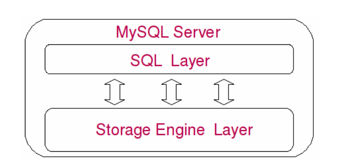
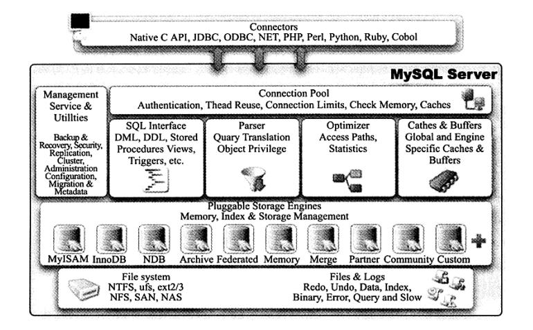
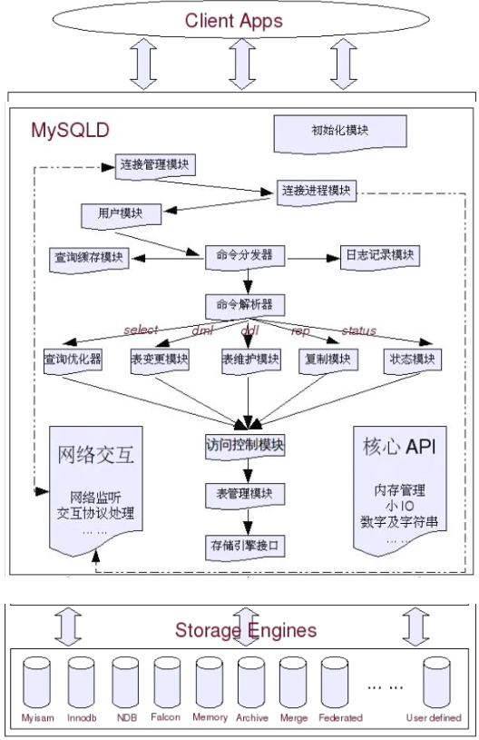
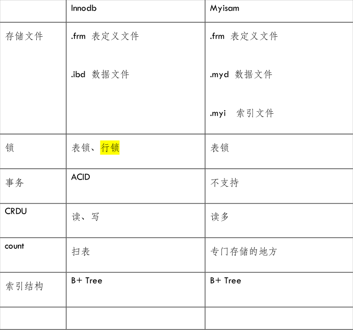
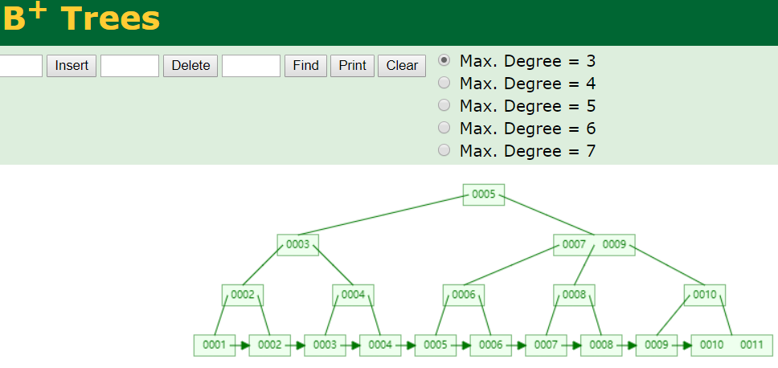
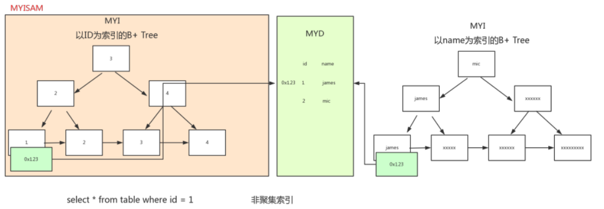
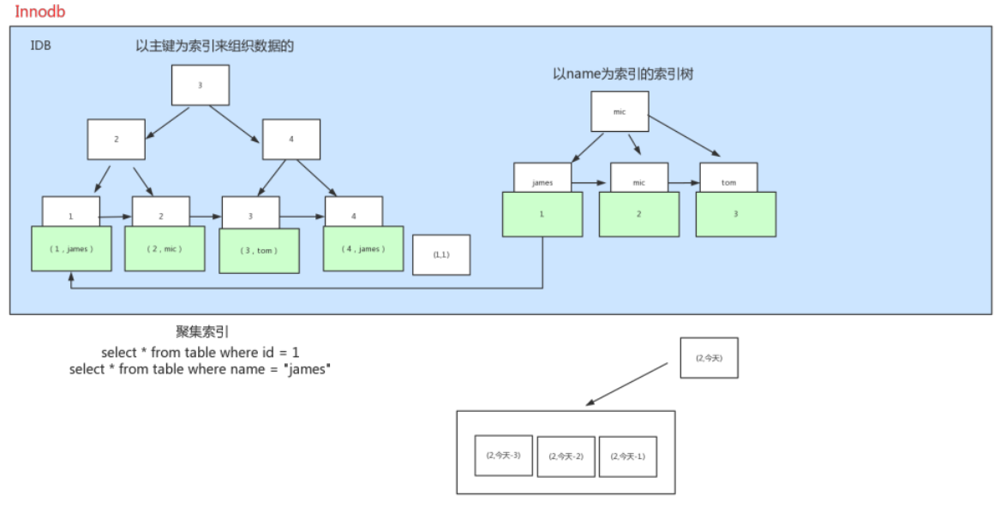

# 一、性能优化之Mysql

## 架构图

详细的架构图

## 引擎介绍

## 影响性能的因素

### 人为因素-需求

### 程序员因素 – 面向对象

### Cache

### 对可扩展过度追求

### 表范式

### 应用场景

#### OLTP online transaction processoning

* 特点
  * 数据量大
  * 每次访问数据量少
  * 数据离散
  * 热点数据占比不大
* 优化
  * 活跃数据不大，扩大内存容量将活跃数据cache住
  * IO频繁 IOPS（IO per second）
  * 并发大，CPU强劲
  * 与客户端交互频繁，网络设备扛流量能力不能差

#### OLAP online analyze processoning

* 特点
  * 数据量大
  * 并发不高
  * 单次检索数据量多
  * 数据访问集中
  * 没有明显的活跃数据
* 优化
  * 磁盘单位容量要大
  * IO吞吐量
  * 并发少，CPU要求不高
  * 计算最大时间长，并行要求高，信群，网络通信要求高

## 索引

### 分类

* B-tree

  https://www.cs.usfca.edu/~galles/visualization/Algorithms.html

  B-Tree

  

  B+Tree

  

  

  

* Hash

* Fulltext

* R-tree

### Pros

提高检索效率

降低排序成本（排序分组主要消耗内存和CPU）

### cons

更新索引的IO量

调整索引所致的计算量

存储空间

### 是否创建索引

较频繁的作为查询条件的字段应创建索引

唯一性太差的字段不适合单独创建索引

更新非常频繁的字段不适合创建索引

不会出现在where子句中的字段不该创建索引

