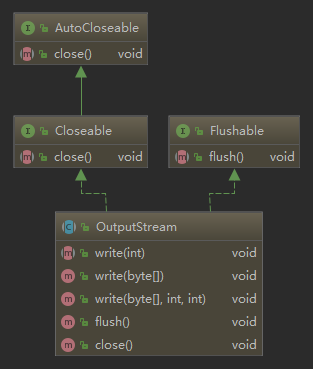

# 1.NIO原理详解


## 同步与异步
同步与异步的概念, 关注的是 **消息通信机制**

同步是指发出一个请求, 在没有得到结果之前该请求就不返回结果, 请求返回时, 也就得到结果了.
比如洗衣服, 把衣服放在洗衣机里, 没有洗好之前我们一直看着, 直到洗好了才拿出来晾晒.

异步是指发出一个请求后, 立刻得到了回应, 但没有返回结果. 这时我们可以再处理别的事情(发送其他请求), 所以这种方式需要我们通过状态主动查看是否有了结果, 或者可以设置一个回调来通知调用者.
比如洗衣服时, 把衣服放到洗衣机里, 我们就可以去做别的事情, 过会儿来看看有没有洗好(通过状态查询); 
或者我们设置洗衣机洗完后响铃来通知我们洗好了(回调通知)

同步就是一个任务的完成需要依赖另外一个任务时，只有等待被依赖的任务完成后，依赖的任务才能算完成，这是一种可靠的任务序列。要么成功都成功，失败都失败，两个任务的状态可以保持一致。而异步是不需要等待被依赖的任务完成，只是通知被依赖的任务要完成什么工作，依赖的任务也立即执行，只要自己完成了整个任务就算完成了。至于被依赖的任务最终是否真正完成，依赖它的任务无法确定，所以它是不可靠的任务序列。我们可以用打电话和发短信来很好的比喻同步与异步操作。


## 阻塞与非阻塞
阻塞与非阻塞很容易和同步与异步混淆, 但两者关注点是不一样的. 阻塞与非阻塞关注的是**程序在等待调用结果时的状态**

阻塞是指请求结果返回之前, 当前线程会被挂起(被阻塞), 这时线程什么也做不了
非阻塞是指请求结果返回之前, 当前线程没有被阻塞, 仍然可以做其他事情.
阻塞有个明显的特征就是线程通常是处于BLOCKED状态(BIO中的read()操作时, 线程阻塞是JVM配合OS完成的, 此时Java获取到线程的状态仍是RUNNABLE但它确实已经被阻塞了)

如果要拿同步来做比较的话, 同步通信方式中的线程在发送请求之后等待结果这个过程中应该处于RUNNABLE状态, 同步必须一步一步来完成, 就像是代码必须执行完一行才能执行下一行, 所以必须等待这个请求返回之后才可进行下一个请求, 即使等待结果的时间长, 也是在执行这个请求的过程中. 而异步则不用等上一条执行完, 可以先执行别的代码, 等请求有了结果再来获取结果.

阻塞与非阻塞主要是从 CPU 的消耗上来说的，阻塞就是 CPU 停下来等待一个慢的操作完成 CPU 才接着完成其它的事。非阻塞就是在这个慢的操作在执行时 CPU 去干其它别的事，等这个慢的操作完成时，CPU 再接着完成后续的操作。虽然表面上看非阻塞的方式可以明显的提高 CPU 的利用率，但是也带了另外一种后果就是系统的线程切换增加。增加的 CPU 使用时间能不能补偿系统的切换成本需要好好评估。

## 同/异、阻/非堵塞 组合

同/异、阻/非堵塞的组合，有四种类型，如下表：

|组合方式|性能分析|
| --- | --- |
|同步阻塞|最常用的一种用法，使用也是最简单的，但是 I/O 性能一般很差，CPU 大部分在空闲状态。|
|同步非阻塞|提升 I/O 性能的常用手段，就是将 I/O 的阻塞改成非阻塞方式，尤其在网络 I/O 是长连接，同时传输数据也不是很多的情况下，提升性能非常有效。 这种方式通常能提升 I/O 性能，但是会增加CPU 消耗，要考虑增加的 I/O 性能能不能补偿 CPU 的消耗，也就是系统的瓶颈是在 I/O 还是在 CPU 上。|
|异步阻塞|这种方式在分布式数据库中经常用到，例如在网一个分布式数据库中写一条记录，通常会有一份是同步阻塞的记录，而还有两至三份是备份记录会写到其它机器上，这些备份记录通常都是采用异步阻塞的方式写 I/O。异步阻塞对网络 I/O 能够提升效率，尤其像上面这种同时写多份相同数据的情况。|
|异步非阻塞|这种组合方式用起来比较复杂，只有在一些非常复杂的分布式情况下使用，像集群之间的消息同步机制一般用这种 I/O 组合方式。如 Cassandra 的 Gossip 通信机制就是采用异步非阻塞的方式。它适合同时要传多份相同的数据到集群中不同的机器，同时数据的传输量虽然不大，但是却非常频繁。这种网络 I/O 用这个方式性能能达到最高。|

#### BIO（Blocking I/O）同步阻塞I/O

这是最基本与简单的I/O操作方式，其根本特性是做完一件事再去做另一件事，一件事一定要等前一件事做完，这很符合程序员传统的顺序来开发思想，因此BIO模型程序开发起来较为简单，易于把握。

但是BIO如果需要同时做很多事情（例如同时读很多文件，处理很多tcp请求等），就需要系统创建很多线程来完成对应的工作，因为BIO模型下一个线程同时只能做一个工作，如果线程在执行过程中依赖于需要等待的资源，那么该线程会长期处于阻塞状态，我们知道在整个操作系统中，线程是系统执行的基本单位，在BIO模型下的线程 阻塞就会导致系统线程的切换，从而对整个系统性能造成一定的影响。当然如果我们只需要创建少量可控的线程，那么采用BIO模型也是很好的选择，但如果在需要考虑高并发的web或者tcp服务器中采用BIO模型就无法应对了，如果系统开辟成千上万的线程，那么CPU的执行时机都会浪费在线程的切换中，使得线程的执行效率大大降低。此外，关于线程这里说一句题外话，在系统开发中线程的生命周期一定要准确控制，在需要一定规模并发的情形下，尽量使用线程池来确保线程创建数目在一个合理的范围之内，切莫编写线程数量创建上限的代码。

#### IO (New I/O) 同步非阻塞I/O

关于NIO，国内有很多技术博客将英文翻译成No-Blocking I/O，非阻塞I/O模型 ，当然这样就与BIO形成了鲜明的特性对比。NIO本身是基于事件驱动的思想来实现的，其目的就是解决BIO的大并发问题，在BIO模型中，如果需要并发处理多个I/O请求，那就需要多线程来支持，NIO使用了多路复用器机制，以socket使用来说，多路复用器通过不断轮询各个连接的状态，只有在socket有流可读或者可写时，应用程序才需要去处理它，在线程的使用上，就不需要一个连接就必须使用一个处理线程了，而是只是有效请求时（确实需要进行I/O处理时），才会使用一个线程去处理，这样就避免了BIO模型下大量线程处于阻塞等待状态的情景。

相对于BIO的流，NIO抽象出了新的通道（Channel）作为输入输出的通道，并且提供了缓存（Buffer）的支持，在进行读操作时，需要使用Buffer分配空间，然后将数据从Channel中读入Buffer中，对于Channel的写操作，也需要现将数据写入Buffer，然后将Buffer写入Channel中。

通过比较New IO的使用方式我们可以发现，新的IO操作不再面向 Stream来进行操作了，改为了通道Channel，并且使用了更加灵活的缓存区类Buffer，Buffer只是缓存区定义接口， 根据需要，我们可以选择对应类型的缓存区实现类。在java NIO编程中，我们需要理解以下3个对象Channel、Buffer和Selector。

##### Channel

首先说一下Channel，国内大多翻译成“通道”。Channel和IO中的Stream(流)是差不多一个等级的。只不过Stream是单向的，譬如：InputStream, OutputStream。而Channel是双向的，既可以用来进行读操作，又可以用来进行写操作，NIO中的Channel的主要实现有：FileChannel、DatagramChannel、SocketChannel、ServerSocketChannel；通过看名字就可以猜出个所以然来：分别可以对应文件IO、UDP和TCP（Server和Client）。

##### Buffer

NIO中的关键Buffer实现有：ByteBuffer、CharBuffer、DoubleBuffer、 FloatBuffer、IntBuffer、 LongBuffer,、ShortBuffer，分别对应基本数据类型: byte、char、double、 float、int、 long、 short。当然NIO中还有MappedByteBuffer, HeapByteBuffer, DirectByteBuffer等这里先不具体陈述其用法细节。

> 说一下 DirectByteBuffer 与 HeapByteBuffer 的区别？
>
> 它们 ByteBuffer 分配内存的两种方式。
>
> HeapByteBuffer 顾名思义其内存空间在 JVM 的 heap（堆）上分配，可以看做是 jdk 对于 byte[] 数组的封装；而 DirectByteBuffer 则直接利用了系统接口进行内存申请，其内存分配在c heap 中，这样就减少了内存之间的拷贝操作，如此一来，在使用 DirectByteBuffer 时，系统就可以直接从内存将数据写入到 Channel 中，而无需进行 Java 堆的内存申请，复制等操作，提高了性能。既然如此，为什么不直接使用 DirectByteBuffer，还要来个 HeapByteBuffer？原因在于， DirectByteBuffer 是通过full gc来回收内存的，DirectByteBuffer会自己检测情况而调用 system.gc()，但是如果参数中使用了 DisableExplicitGC 那么就无法回收该快内存了，-XX:+DisableExplicitGC标志自动将 System.gc() 调用转换成一个空操作，就是应用中调用 System.gc() 会变成一个空操作，那么如果设置了就需要我们手动来回收内存了，所以DirectByteBuffer使用起来相对于完全托管于 java 内存管理的Heap ByteBuffer 来说更复杂一些，如果用不好可能会引起OOM。Direct ByteBuffer 的内存大小受 -XX:MaxDirectMemorySize JVM 参数控制（默认大小64M），在 DirectByteBuffer 申请内存空间达到该设置大小后，会触发 Full GC。

##### Selector

Selector 是NIO相对于BIO实现多路复用的基础，Selector 运行单线程处理多个 Channel，如果你的应用打开了多个通道，但每个连接的流量都很低，使用 Selector 就会很方便。例如在一个聊天服务器中。要使用 Selector , 得向 Selector 注册 Channel，然后调用它的 select() 方法。这个方法会一直阻塞到某个注册的通道有事件就绪。一旦这个方法返回，线程就可以处理这些事件，事件的例子有如新的连接进来、数据接收等。

#### AIO (Asynchronous I/O) 异步非阻塞I/O

Java AIO就是Java作为对异步IO提供支持的NIO.2 ，Java NIO2 (JSR 203)定义了更多的 New I/O APIs， 提案2003提出，直到2011年才发布， 最终在JDK 7中才实现。JSR 203除了提供更多的文件系统操作API(包括可插拔的自定义的文件系统)， 还提供了对socket和文件的异步 I/O操作。 同时实现了JSR-51提案中的socket channel全部功能,包括对绑定， option配置的支持以及多播multicast的实现。

从编程模式上来看AIO相对于NIO的区别在于，NIO需要使用者线程不停的轮询IO对象，来确定是否有数据准备好可以读了，而AIO则是在数据准备好之后，才会通知数据使用者，这样使用者就不需要不停地轮询了。当然AIO的异步特性并不是Java实现的伪异步，而是使用了系统底层API的支持，在Unix系统下，采用了epoll IO模型，而windows便是使用了IOCP模型。关于Java AIO，本篇只做一个抛砖引玉的介绍，如果你在实际工作中用到了，那么可以参考Netty在高并发下使用AIO的相关技术。

## 全面认识 IO

IO的全称其实是：Input/Output的缩写

传统的 IO 大致可以分为4种类型：

- InputStream、OutputStream 基于字节操作的 IO
- Writer、Reader 基于字符操作的 IO
- File 基于磁盘操作的 IO
- Socket 基于网络操作的 IO

java.net 下提供的 Scoket 很多时候人们也把它归为 同步阻塞 IO ,因为网络通讯同样是 IO 行为。

java.io 下的类和接口很多，但大体都是 InputStream、OutputStream、Writer、Reader 的子集，所有掌握这4个类和File的使用，是用好 IO 的关键。

## IO模型

Java中的IO操作是JVM配合操作系统来完成的. 对于一个IO的读操作, 数据会先被拷贝到操作系统内核的缓冲区中, 然后从操作系统内核的缓冲区拷贝到应用程序的地址空间. 所以整个过程可分为两个阶段:

1. 等待I/O数据准备好. 这取决于IO目标返回数据的速度, 如网络IO时看网速和数据本身的大小.
2. 数据从内核缓冲区拷贝到进程内.

根据这两个阶段, 产生了常见的几种不同的IO模型: `BIO`, `NIO`, `IO多路复用`和`AIO`.

### BIO

`BIO`即`Blocking I/O`(阻塞 I/O), BIO整个过程如下图:


程序发送请求给内核, 然后由内核去进行通信, 在内核准备好数据之前这个线程是被挂起的, 所以在两个阶段程序都处于挂起状态.

- BIO的特点就是在IO执行的两个阶段都被block了

在JDK1.4出来之前，我们建立网络连接的时候采用BIO模式，需要先在服务端启动一个ServerSocket，然后在客户端启动Socket来对服务端进行通信，默认情况下服务端需要对每个请求建立一堆线程等待请求，而客户端发送请求后，先咨询服务端是否有线程相应，如果没有则会一直等待或者遭到拒绝请求，如果有的话，客户端会线程会等待请求结束后才继续执行。

### NIO

`NIO`即`Non-Blocking I/O`(非阻塞 I/O), NIO整个过程如下图:


与BIO的明显区别是, 发起第一次请求后, 线程并没有被阻塞, 它反复检查数据是否准备好, 把原来大块不能用的阻塞时间分成了许多”小阻塞”(检查), 所以进程不断有机会被执行. 这个检查有没有准备好数据的过程有点类似于”轮询”.

- NIO的特点就是程序需要不断的主动询问内核数据是否准备好。第一个阶段非阻塞, 第二个阶段阻塞

NIO本身是基于事件驱动思想来完成的，其主要想解决的是BIO的大并发问题： 在使用同步I/O的网络应用中，如果要同时处理多个客户端请求，或是在客户端要同时和多个服务器进行通讯，就必须使用多线程来处理。也就是说，将每一个客户端请求分配给一个线程来单独处理。这样做虽然可以达到我们的要求，但同时又会带来另外一个问题。由于每创建一个线程，就要为这个线程分配一定的内存空间（也叫工作存储器），而且操作系统本身也对线程的总数有一定的限制。如果客户端的请求过多，服务端程序可能会因为不堪重负而拒绝客户端的请求，甚至服务器可能会因此而瘫痪。

NIO基于Reactor，当socket有流可读或可写入socket时，操作系统会相应的通知引用程序进行处理，应用再将流读取到缓冲区或写入操作系统。 也就是说，这个时候，已经不是一个连接就要对应一个处理线程了，而是有效的请求，对应一个线程，当连接没有数据时，是没有工作线程来处理的。

BIO与NIO一个比较重要的不同，是我们使用BIO的时候往往会引入多线程，每个连接一个单独的线程；而NIO则是使用单线程或者只使用少量的多线程，每个连接共用一个线程。


NIO的最重要的地方是当一个连接创建后，不需要对应一个线程，这个连接会被注册到多路复用器上面，所以所有的连接只需要一个线程就可以搞定，当这个线程中的多路复用器进行轮询的时候，发现连接上有请求的话，才开启一个线程进行处理，也就是一个请求一个线程模式。

在NIO的处理方式中，当一个请求来的话，开启线程进行处理，可能会等待后端应用的资源(JDBC连接等)，其实这个线程就被阻塞了，当并发上来的话，还是会有BIO一样的问题。

HTTP/1.1出现后，有了Http长连接，这样除了超时和指明特定关闭的http header外，这个链接是一直打开的状态的，这样在NIO处理中可以进一步的进化，在后端资源中可以实现资源池或者队列，当请求来的话，开启的线程把请求和请求数据传送给后端资源池或者队列里面就返回，并且在全局的地方保持住这个现场(哪个连接的哪个请求等)，这样前面的线程还是可以去接受其他的请求，而后端的应用的处理只需要执行队列里面的就可以了，这样请求处理和后端应用是异步的.当后端处理完，到全局地方得到现场，产生响应，这个就实现了异步处理。

### IO多路复用

IO多路复用(`I/O Multiplexing`)有`select`, `poll`, `epoll`等不同方式, 它的优点在于单个线程可以同时处理多个网络IO.

`NIO`中轮询操作是用户线程进行的, 如果把这个任务交给其他线程, 则用户线程就不用这么费劲的查询状态了. `IO多路复用`调用系统级别的`select`或`poll`模型, 由系统进行监控IO状态. select轮询可以监控许多socket的IO请求, 当有一个socket的数据准备好时就可以返回.

- select: 注册事件由数组管理, 数组是有长度的, 32位机上限1024, 64位机上限2048. 轮询查找时需要遍历数组.
- poll: 把select的数组采用链表实现, 因此没了最大数量的限制
- epoll方式: 基于事件回调机制, 回调时直接通知进程, 无须使用某种方式来查看状态.

多路复用IO过程图:


用户线程有一段时间是阻塞的, 从上图来看, 与`NIO`很像, 但与NIO不一样的是, select不是等到所有数据准备好才返回, 而是只要有一个准备好就返回, 它的优势在于可以同时处理多个连接. 若连接不是很多的话, 它的效率不一定高, 可能还会更差.

`Java 1.4`开始支持`NIO(New IO)`, 就是采用了这种方式, 在套接字上提供`selector`选择机制, 当发起`select()`时会阻塞等待至少一个事件返回.

- 多路复用IO的特点是用户进程能同时等待多个IO请求, 系统来监控IO状态, 其中的任意一个进入读就绪状态, select函数就可以返回.

### AIO

`AIO`即`Asynchronous I/O`(异步 I/O), 这是`Java 1.7`引入的`NIO 2.0`中用到的. 整个过程中, 用户线程发起一个系统调用之后无须等待, 可以处理别的事情. 由操作系统等待接收内容, 接收后把数据拷贝到用户进程中, 最后通知用户程序已经可以使用数据了, 两个阶段都是非阻塞的. AIO整个过程如下图:


`AIO`属于异步模型, 用户线程可以同时处理别的事情, 我们怎么进一步加工处理结果呢? Java在这个模型中提供了两种方法:

1. 一种是基于”回调”, 我们可以实现`CompletionHandler`接口, 在调用时把回调函数传递给对应的API即可
2. 另一种是返回一个`Future`. 处理完别的事情, 可以通过`isDone()`可查看是否已经准备好数据, 通过`get()`方法等待返回数据.

与NIO不同，当进行读写操作时，只须直接调用API的read或write方法即可。这两种方法均为异步的，对于读操作而言，当有流可读取时，操作系统会将可读的流传入read方法的缓冲区，并通知应用程序；对于写操作而言，当操作系统将write方法传递的流写入完毕时，操作系统主动通知应用程序。 即可以理解为，read/write方法都是异步的，完成后会主动调用回调函数。 在JDK1.7中，这部分内容被称作NIO.2，主要在java.nio.channels包下增加了下面四个异步通道：

- AsynchronousSocketChannel
- AsynchronousServerSocketChannel
- AsynchronousFileChannel
- AsynchronousDatagramChannel

其中的read/write方法，会返回一个带回调函数的对象，当执行完读取/写入操作后，直接调用回调函数。

BIO是一个连接一个线程。

NIO是一个请求一个线程。

AIO是一个有效请求一个线程。

## IO 使用

### `InputStream`

```java
InputStream inputStream = new FileInputStream("/tmp/log.txt");
byte[] bytes = new byte[inputStream.available()];
inputStream.read(bytes);
String str = new String(bytes, "utf-8");
System.out.println(str);
inputStream.close();
```


### `OutputStream`

```java
OutputStream outputStream = new FileOutputStream("/tmp/log.txt", true); 
// 参数二，表示是否追加，true=追加
outputStream.write("你好，老王".getBytes("utf-8"));
outputStream.close();
```



### `Writer`

```java
 Writer writer = new FileWriter("/tmp/log1.txt", true); 
// 参数二，是否追加文件，true=追加
writer.append("老王，你好");
writer.close();
```


### `Reader` 

```java
Reader reader = new FileReader("/tmp/log1.txt");
BufferedReader bufferedReader = new BufferedReader(reader);
StringBuffer bf = new StringBuffer();
String str;
while ((str = bufferedReader.readLine()) != null) {
    bf.append(str + "\n");
}
bufferedReader.close();
reader.close();
System.out.println(bf.toString());
```


###  优雅的文件读写

#### Java 7 之前文件的读取

```java
String filePath = "/tmp/test.txt";
String content = "最近有什么好看的电影?";
// Java 7 之前文件的读取是这样的
// 添加文件
FileWriter fileWriter = new FileWriter(filePath, true);
fileWriter.write(content);
fileWriter.close();
// 读取文件
FileReader fileReader = new FileReader(filePath);
BufferedReader bufferedReader = new BufferedReader(fileReader);
StringBuffer bf = new StringBuffer();
String str;
while ((str = bufferedReader.readLine()) != null) {
    bf.append(str + "\n");
}
bufferedReader.close();
fileReader.close();
System.out.println(bf.toString());
```

#### Java 7 引入了Files（java.nio包下）

```java
// Java 7 引入了Files（java.nio包下）的，大大简化了文件的读写
// 写入文件（追加方式：StandardOpenOption.APPEND）
Files.write(Paths.get(filePath), content.getBytes(StandardCharsets.UTF_8), StandardOpenOption.APPEND);
// 读取文件
byte[] data = Files.readAllBytes(Paths.get(filePath));
System.out.println(new String(data, StandardCharsets.UTF_8));

// 创建多（单）层目录（如果不存在创建，存在不会报错）
new File("//tmp//a//b").mkdirs();
```

### Socket 和 NIO 的多路复用

实现最基础的 Socket 的同时，同时会实现 NIO 多路复用，还有 AIO 中 Socket 的实现。

#### 传统的 Socket 实现

在BIO阻塞模式下server端: 
1 new ServerSocket(int port) 监听端口 
2 serverSocket.accept() 阻塞式等待客户端的连接，有连接才返回Socket对象 
3 socket.getInputStream() 获取客户端发过来的信息流 
4 socket.getOutputStream() 获取输出流对象，从而写入数据返回客户端 


client端： 
1 new Socket（String host,int port) 建立与服务器端的连接，如果服务器没启动，报Connection refused异常 
2 socket.getInputStream() 读取服务器端返回的流 
3 socket.getOutputStream() 获取输出流，写入数据发送到服务器端 

实现一个简单的 Socket，服务器端只发给客户端信息，再由客户端打印出来的例子

```java
int port = 4343; // 端口号
// Socket 服务器端（简单的发送信息）
Thread sThread = new Thread(new Runnable() {
    @Override
    public void run() {
        try {
            ServerSocket serverSocket = new ServerSocket(port);
            while (true) {
                // 等待连接
                Socket socket = serverSocket.accept();
                Thread sHandlerThread = new Thread(new Runnable() {
                    @Override
                    public void run() {
                        try (PrintWriter printWriter = new PrintWriter(socket.getOutputStream())) {
                            printWriter.println("hello world！");
                            printWriter.flush();
                        } catch (IOException e) {
                            e.printStackTrace();
                        }
                    }
                });
                sHandlerThread.start();
            }
        } catch (IOException e) {
            e.printStackTrace();
        }
    }
});
sThread.start();
// Socket 客户端（接收信息并打印）
try (Socket cSocket = new Socket(InetAddress.getLocalHost(), port)) {
    BufferedReader bufferedReader = new BufferedReader(new InputStreamReader(cSocket.getInputStream()));
    bufferedReader.lines().forEach(s -> System.out.println("客户端：" + s));
} catch (UnknownHostException e) {
    e.printStackTrace();
} catch (IOException e) {
    e.printStackTrace();
}
```

- 调用 accept 方法，阻塞等待客户端连接；
- 利用 Socket 模拟了一个简单的客户端，只进行连接、读取和打印；

在 Java 中，线程的实现是比较重量级的，所以线程的启动或者销毁是很消耗服务器的资源的，即使使用线程池来实现，使用上述传统的 Socket 方式，当连接数极具上升也会带来性能瓶颈，原因是线程的上线文切换开销会在高并发的时候体现的很明显，并且以上操作方式还是同步阻塞式的编程，性能问题在高并发的时候就会体现的尤为明显。


#### NIO 多路复用

在NIO模式下Server端： 
1 ServerSocketChannel.open() 获取serverScoketChannel实例 
2 serverScoketChannel.configueBlocking(false) 设置channel为非阻塞模式 
3 serverSocketChannel.socket() 获取serverSocket对象 
4 serverSocket.bind(port) 监听端口 
5 Selector.open() 打开Selector，获取selector实例 
6 serverSocketChannel.register(Selector,int) 向selector注册channel和感兴趣的事件 
7 while(true) 循环以保证正常情况下服务器端一直处于运行状态 
8 selector.select() 获取selector实例中需要处理的SelectionKey的数量 
9 for(SelectionKey key:selector.selectedKeys()) 遍历selector.selectedKeys,以对每个SelectionKey的事件进行处理 
10 key.isAcceptable() 判断SelectionKey的类型是否为客户端建立连接的类型 
11 key.channel() 当SelectionKey的类型是acceptabel时，获取绑定的ServerSocketChannel对象 
12 serverSocketChannel.accept() 接受客户端建立连接的请求，并返回SocketChannel对象 
13 socketChannel.regiseter(Selector,int) 向Selector注册感兴趣的事件类型，如read,write 
14 key.isReadable() 判断SelectionKey是否为readable，如是则意味着有消息流在等待处理 
15 socketChannel.read(ByteBuffer) 从SelectionKey中绑定的SocketChannel对象读取消息流 
16 socketChannel.write(ByteBuffer) 从SelectionKey中绑定的SocketChannel对象输出消息流 

client端： 

1 SocketChannel.open() 打开SocketChannel 

2 SocketChannel.configureBlocking(false) 将SocketChannel配置为非阻塞模式 

3 SocketChannel.connect(host,port) 连接到指定的目标地址 

4 Selector.open() 打开Selector 

5 SocketChannel.register(Selector,int) 向Selector注册感兴趣的事件,connected,read,write 

6 while(true) 循环执行保证客户端一直处于运行状态 

7 Selector.select() 从Selector中获取是否有可读的key信息 

8 for(SelectionKey key:selector.selectedKeys()) 遍历selector中所有selectedKeys 

9 SelectionKey.isConnectable() 判断是否为连接建立的类型 

10 SelectionKey.channel() 获取绑定的SocketChannel 

11 SocketChannel.finishConnect() 完成连接的建立（TCP/IP的三次握手） 

12 SelectionKey.isReadable() 判断是否为可读类型 

13 SelectionKey.channel() 获取绑定的SocketChannel 

14 SocketChannel.read(ByteBuffer) 从SocketChannel中读取数到ByteBuffer中 

15 SocketChannel.write(ByteBuffer) 向SocketChannel中写入ByteBuffer对象数据 

介于以上高并发的问题，NIO 的多路复用功能就显得意义非凡了。

NIO 是利用了单线程轮询事件的机制，通过高效地定位就绪的 Channel，来决定做什么，仅仅 select 阶段是阻塞的，可以有效避免大量客户端连接时，频繁线程切换带来的问题，应用的扩展能力有了非常大的提高。

```java
 int port = 4343; // 端口号
// NIO 多路复用
ThreadPoolExecutor threadPool = new ThreadPoolExecutor(4, 4,
                                                       60L, TimeUnit.SECONDS, new LinkedBlockingQueue<Runnable>());
threadPool.execute(new Runnable() {
    @Override
    public void run() {
        try (Selector selector = Selector.open();
             ServerSocketChannel serverSocketChannel = ServerSocketChannel.open();) {
            serverSocketChannel.bind(new InetSocketAddress(InetAddress.getLocalHost(), port));
            serverSocketChannel.configureBlocking(false);
            serverSocketChannel.register(selector, SelectionKey.OP_ACCEPT);
            while (true) {
                selector.select(); // 阻塞等待就绪的Channel
                Set<SelectionKey> selectionKeys = selector.selectedKeys();
                Iterator<SelectionKey> iterator = selectionKeys.iterator();
                while (iterator.hasNext()) {
                    SelectionKey key = iterator.next();
                    try (SocketChannel channel = ((ServerSocketChannel) key.channel()).accept()) {
                        channel.write(Charset.defaultCharset().encode("你好，世界"));
                    }
                    iterator.remove();
                }
            }
        } catch (IOException e) {
            e.printStackTrace();
        }
    }
});
// Socket 客户端（接收信息并打印）
try (Socket cSocket = new Socket(InetAddress.getLocalHost(), port)) {
    BufferedReader bufferedReader = new BufferedReader(new InputStreamReader(cSocket.getInputStream()));
    bufferedReader.lines().forEach(s -> System.out.println("NIO 客户端：" + s));
} catch (IOException e) {
    e.printStackTrace();
}
```

- 首先，通过 Selector.open() 创建一个 Selector，作为类似调度员的角色；
- 然后，创建一个 ServerSocketChannel，并且向 Selector 注册，通过指定 SelectionKey.OP_ACCEPT，告诉调度员，它关注的是新的连接请求；
- 为什么我们要明确配置非阻塞模式呢？这是因为阻塞模式下，注册操作是不允许的，会抛出 IllegalBlockingModeException 异常；
- Selector 阻塞在 select 操作，当有 Channel 发生接入请求，就会被唤醒；

#### AIO 版 Socket 实现

Java 1.7 提供了 AIO 实现的 Socket 是这样的

```java
int port = 4343; // 端口号
// AIO线程复用版
Thread sThread = new Thread(new Runnable() {
    @Override
    public void run() {
        AsynchronousChannelGroup group = null;
        try {
            group = AsynchronousChannelGroup.withThreadPool(Executors.newFixedThreadPool(4));
            AsynchronousServerSocketChannel server = AsynchronousServerSocketChannel.open(group)
                .bind(new InetSocketAddress(InetAddress.getLocalHost(), port));
            server.accept(null,
                          new CompletionHandler<AsynchronousSocketChannel, AsynchronousServerSocketChannel>() {
                              @Override
                              public void completed(AsynchronousSocketChannel result,
                                                    AsynchronousServerSocketChannel attachment) {
                                  server.accept(null, this); // 接收下一个请求
                                  try {
                                      Future<Integer> f = result.write(Charset.defaultCharset().encode("你好，世界"));
                                      f.get();
                                      System.out.println(
                                          "服务端发送时间：" + new SimpleDateFormat("yyyy-MM-dd HH:mm:ss").format(new Date()));
                                      result.close();
                                  } catch (InterruptedException | ExecutionException | IOException e) {
                                      e.printStackTrace();
                                  }
                              }

                              @Override
                              public void failed(Throwable exc, AsynchronousServerSocketChannel attachment) {}
                          });
            group.awaitTermination(Long.MAX_VALUE, TimeUnit.SECONDS);
        } catch (IOException | InterruptedException e) {
            e.printStackTrace();
        }
    }
});
sThread.start();
// Socket 客户端
AsynchronousSocketChannel client = AsynchronousSocketChannel.open();
Future<Void> future = client.connect(new InetSocketAddress(InetAddress.getLocalHost(), port));
future.get();
ByteBuffer buffer = ByteBuffer.allocate(100);
client.read(buffer, null, new CompletionHandler<Integer, Void>() {
    @Override
    public void completed(Integer result, Void attachment) {
        System.out.println("客户端打印：" + new String(buffer.array()));
    }

    @Override
    public void failed(Throwable exc, Void attachment) {
        exc.printStackTrace();
        try {
            client.close();
        } catch (IOException e) {
            e.printStackTrace();
        }
    }
});
Thread.sleep(10 * 1000);
```


## 小结

上面这几种模式, `BIO`整个过程都等待返回, `NIO`和`IO多路复用`在第二个阶段等待返回, 因此从整个过程来看, 这三个模式都属于同步方式. `AIO`在整个过程中没有等待返回, 属于异步方式.

### BIO、NIO、AIO的区别

1. BIO 就是传统的 java.io 包，它是基于流模型实现的，交互的方式是同步、阻塞方式，也就是说在读入输入流或者输出流时，在读写动作完成之前，线程会一直阻塞在那里，它们之间的调用时可靠的线性顺序。它的有点就是代码比较简单、直观；缺点就是 IO 的效率和扩展性很低，容易成为应用性能瓶颈。
2. NIO 是 Java 1.4 引入的 java.nio 包，提供了 Channel、Selector、Buffer 等新的抽象，可以构建多路复用的、同步非阻塞 IO 程序，同时提供了更接近操作系统底层高性能的数据操作方式。
3. AIO 是 Java 1.7 之后引入的包，是 NIO 的升级版本，提供了异步非堵塞的 IO 操作方式，所以人们叫它 AIO（Asynchronous IO），异步 IO 是基于事件和回调机制实现的，也就是应用操作之后会直接返回，不会堵塞在那里，当后台处理完成，操作系统会通知相应的线程进行后续的操作。

| IO的方式               | 处理方式                                                     | 适用场景分析                                                 |
| ---------------------- | ------------------------------------------------------------ | ------------------------------------------------------------ |
| 同步阻塞的BIO          | 同步并阻塞，服务器实现模式为一个连接一个线程，即客户端有连接请求时服务器端就需要启动一个线程进行处理，如果这个连接不做任何事情会造成不必要的线程开销，当然可以通过线程池机制改善 | BIO方式适用于连接数目比较小且固定的架构，这种方式对服务器资源要求比较高，并发局限于应用中，JDK1.4以前的唯一选择，但程序直观简单易理解。 |
| 同步非阻塞的NIO        | 同步非阻塞，服务器实现模式为一个请求一个线程，即客户端发送的连接请求都会注册到多路复用器上，多路复用器轮询到连接有I/O请求时才启动一个线程进行处理 | NIO方式适用于连接数目多且连接比较短（轻操作）的架构，比如聊天服务器，并发局限于应用中，编程比较复杂，JDK1.4开始支持 |
| 异步非阻塞的AIO(NIO.2) | 异步非阻塞，服务器实现模式为一个有效请求一个线程，客户端的I/O请求都是由OS先完成了再通知服务器应用去启动线程进行处理 | AIO方式使用于连接数目多且连接比较长（重操作）的架构，比如相册服务器，充分调用OS参与并发操作，编程比较复杂，JDK7开始支持。 |

## Issuers

### 1. IDEA出现Module `must not contain source root . The root already belongs to module`这类错误的解决方法
出现这个问题的原因是，parant目录不能放src的code,找到你父project的Sourece Folders，看看是不是把子module的加载进来了。删掉就好。

## References

1. Java BIO、NIO、AIO

   https://www.bbsmax.com/A/Vx5MwwqGzN/

2. JAVA BIO与NIO、AIO的区别
   https://www.bbsmax.com/A/kvJ3QZYAdg/
   
3. Java提高班（五）深入理解BIO、NIO、AIO
   
   https://www.bbsmax.com/A/nAJvVVRoJr/
   
4. 深入分析 Java I/O 的工作机制

   https://www.ibm.com/developerworks/cn/java/j-lo-javaio/index.html

​    