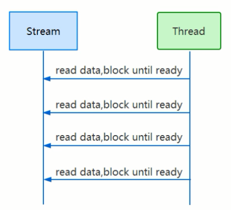
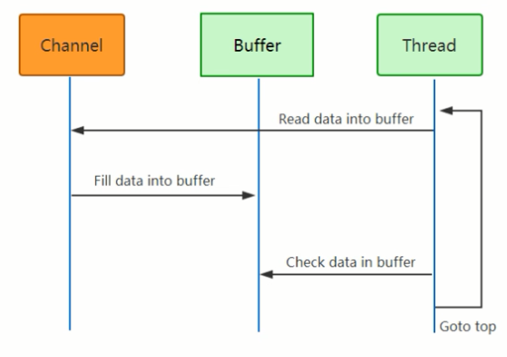
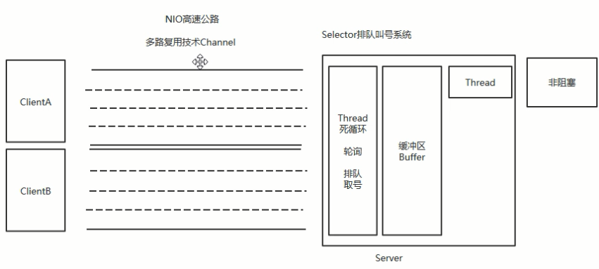
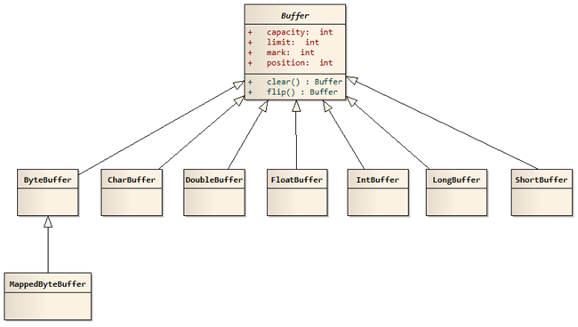
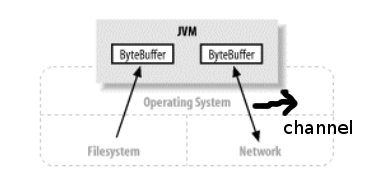
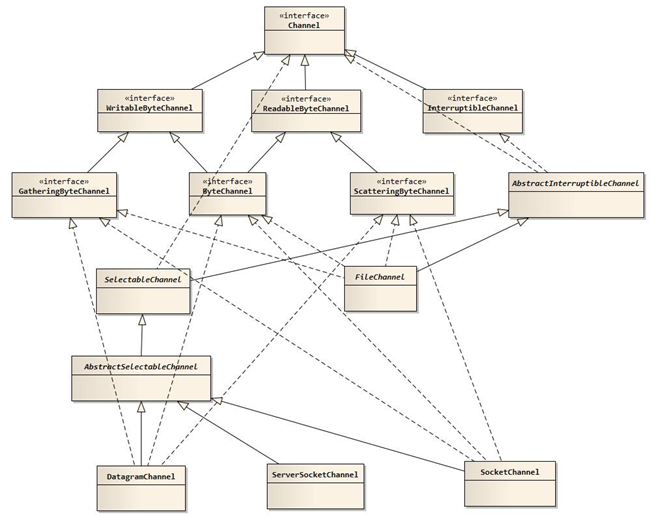
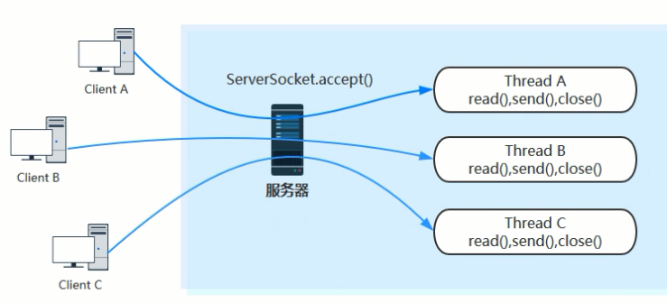
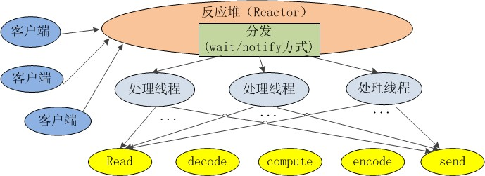
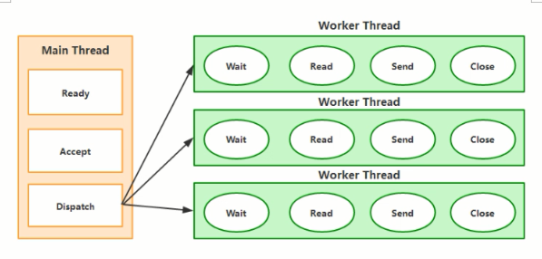
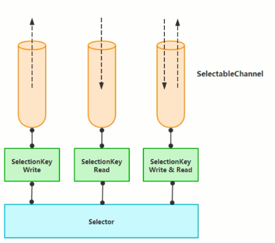

# 深入剖析NIO原理

## 必要的概念

### 阻塞(Block)和非租塞(NonBlock)

阻塞和非阻塞是进程在访问数据的时候，数据是否准备就绪的一种处理方式，当数据没有准备的时候阻塞：往往需要等待缞冲区中的数据准备好过后才处理其他的事情，否則一直等待在那里。

非阻塞：当我们的进程访问我们的数据缓冲区的时候，如果数据没有准备好则直接返回，不会等待。如果数据已经准备好，也直接返回

### 同步(Synchronization)和异步(Async)的方式

同步和异步都是基于应用程序私操作系统处理IO事件所采用的方式，比如同步：是应用程序要直接参与IO读写的操作。异步：所有的IO读写交给搡作系统去处理，应用程序只需要等待通知。

同步方式在处理IO事件的时候，必须阻塞在某个方法上靣等待我们的IO事件完成(阻塞IO事件或者通过轮询IO事件的方式）.对于异步来说，所有的IO读写都交给了搡作系统。这个时候，我们可以去做其他的事情，并不拓要去完成真正的IO搡作，当搡作完成IO后.会给我们的应用程序一个通知

同步：阻塞到IO事件，阻塞到read成则write。这个时候我们就完全不能做自己的事情，让读写方法加入到线程里面，然后阻塞线程来实现，对线程的性能开销比较大
## BIO与NIO对比

block IO与Non-block IO

### 1）区别

| IO模型 | IO   | NIO  |
| ------ | ---- | ---- |
|方式|	从硬盘到内存|	从内存到硬盘|
|通信|	面向流（乡村公路）|	面向缓存（高速公路，多路复用技术）|
|处理|	阻塞IO（多线程）|	非阻塞IO（反应堆Reactor）|
|触发|无|	选择器（轮询机制）|

### 2）面向流与面向缓冲
Java NIO和IO之间第一个最大的区别是，IO是面向流的.NIO是面向缓冲区的。Java IO面向流意味着毎次从流中读一个成多个字节，直至读取所有字节，它们没有被缓存在任何地方，此外，它不能前后移动流中的数据。如果需要前后移动从流中读取的教据，需要先将它缓存到一个缓冲区。Java NIO的缓冲导向方法略有不同。数据读取到一个它稍后处理的缓冲区，霱要时可在缓冲区中前后移动。这就增加了处理过程中的灵活性。但是，还需要检查是否该缓冲区中包含所有您需要处理的数裾。而且，需确保当更多的数据读入缓冲区时，不要覆盖缓冲区里尚未处理的数据。
### 3）阻塞与非阻塞
Java IO的各种流是阻塞的。这意味着，当一个线程调用read() 或 write()时，该线程被阻塞，直到有一些数据被读取，或数据完全写入。该线程在此期间不能再干任何事情了。 Java NIO的非阻塞模式，使一个线程从某通道发送请求读取数据，但是它仅能得到目前可用的数据，如果目前没有数据可用时，就什么都不会获取。而不是保持线程阻塞，所以直至数据变的可以读取之前，该线程可以继续做其他的事情。 非阻塞写也是如此。一个线程请求写入一些数据到某通道，但不需要等待它完全写入，这个线程同时可以去做别的事情。 线程通常将非阻塞IO的空闲时间用于在其它通道上执行IO操作，所以一个单独的线程现在可以管理多个输入和输出通道（channel）。
### 4）选择器（Selector)
Java NIO的选择器允许一个单独的线程来监视多个输入通道，你可以注册多个通道使用一个选择器，然后使用一个单独的线程来“选择"通道：这些通里已经有可以处理的褕入，或者选择已准备写入的通道。这选怿机制，使得一个单独的线程很容易来管理多个通道。

### 5）NIO和BIO读取文件
#### BIO读取文件

```java
public class ReadFile {
    public static void main(String[] args) {
        try {
            FileUtils.writeLines(new File("/tmp/io.txt"),
                Arrays.asList("姓名：张三", "年龄：18", "email：tom@qq.com", "phone：135****7853"));
            FileInputStream input = new FileInputStream("/tmp/io.txt");
            BufferedReader reader = new BufferedReader(new InputStreamReader(input));
            String nameLine = reader.readLine();
            String ageLine = reader.readLine();
            String emailLine = reader.readLine();
            String phoneLine = reader.readLine();
            String lastLine = reader.readLine();
            System.out.println(nameLine);
            System.out.println(ageLine);
            System.out.println(emailLine);
            System.out.println(phoneLine);
            System.out.println(lastLine);

            input.close();
            reader.close();

        } catch (Exception e) {
            e.printStackTrace();
        }
    }
}
```

输出

```cassandra
姓名：张三
年龄：18
email：tom@qq.com
phone：135****7853
null
```

BIO从一个阻塞的流中一行一行的读取数据



#### NIO读取文件

```java
public class BufferProgram {
    public static void main(String args[]) throws Exception {

        // 这用用的是文件IO处理
        FileInputStream fin = new FileInputStream("/tmp/io.txt");
        // 创建文件的操作管道
        FileChannel fc = fin.getChannel();

        // 分配一个10个大小缓冲区，说白了就是分配一个10个大小的byte数组
        ByteBuffer buffer = ByteBuffer.allocate(10);
        output("初始化", buffer);

        // 先读一下
        fc.read(buffer);
        output("调用read()", buffer);

        // 准备操作之前，先锁定操作范围
        buffer.flip();
        output("调用flip()", buffer);

        // 判断有没有可读数据
        while (buffer.remaining() > 0) {
            byte b = buffer.get();
            // String data=new String(new byte[]{b},StandardCharsets.UTF_8);
            System.out.print("data=" + ((char)b));
        }
        output("调用get()", buffer);

        // 可以理解为解锁
        buffer.clear();
        output("调用clear()", buffer);

        // 最后把管道关闭
        fin.close();
    }

    // 把这个缓冲里面实时状态给答应出来
    public static void output(String step, Buffer buffer) {
        System.out.println(step + " : ");
        // 容量，数组大小
        System.out.print("capacity: " + buffer.capacity() + ", ");
        // 当前操作数据所在的位置，也可以叫做游标
        System.out.print("position: " + buffer.position() + ", ");
        // 锁定值，flip，数据操作范围索引只能在position - limit 之间
        System.out.println("limit: " + buffer.limit());
        System.out.println("=============");
    }
}
```


通道是数据的载体，buffer是存储数据的地方，线程每次从buffer检查数据通知给通道




### 6）处理数据的线程数

BIO：一个线程管理一个连接

NIO：一个线程管理多个连接

## NIO简介
在Java1.4之前的I/O系统中，提供的都是面向流的I/O系统，系统一次一个字节地处理数据，一个输入流产生一个字节的数据，一个输出流消费一个字节的数据，面向流的I/O速度非常慢，而在Java 1.4中推出了NIO，这是一个面向块的I/O系统，系统以块的方式处理处理，每一个操作在一步中产生或者消费一个数据库，按块处理要比按字节处理数据快的多。

在NIO中有几个核心对象需要掌握：缓冲区（Buffer）、通道（Channel）、选择器（Selector）。




### 缓冲区Buffer
缓冲区实际上是一个容器对象，更直接的说，其实就是一个数组，在NIO库中，所有数据都是用缓冲区处理的。在读取数据时，它是直接读到缓冲区中的； 在写入数据时，它也是写入到缓冲区中的；任何时候访问 NIO 中的数据，都是将它放到缓冲区中。而在面向流I/O系统中，所有数据都是直接写入或者直接将数据读取到Stream对象中。

在NIO中，所有的缓冲区类型都继承于抽象类Buffer，最常用的就是ByteBuffer，对于Java中的基本类型，基本都有一个具体Buffer类型与之相对应，它们之间的继承关系如下图所示：




1）其中的四个属性的含义分别如下：
容量（Capacity）：缓冲区能够容纳的数据元素的最大数量。这一个容量在缓冲区创建时被设定，并且永远不能改变。
上界(Limit)：缓冲区的第一个不能被读或写的元素。或者说,缓冲区中现存元素的计数。
位置(Position)：下一个要被读或写的元素的索引。位置会自动由相应的 get( )和 put( )函数更新。
标记(Mark)：下一个要被读或写的元素的索引。位置会自动由相应的 get( )和 put( )函数更新。

2）Buffer的常见方法如下所示:
flip(): 写模式转换成读模式
rewind()：将 position 重置为 0 ，一般用于重复读。
clear() ：
compact(): 将未读取的数据拷贝到 buffer 的头部位。
mark(): reset():mark 可以标记一个位置， reset 可以重置到该位置。
Buffer 常见类型： `ByteBuffer` 、 `MappedByteBuffer` 、 `CharBuffer` 、 `DoubleBuffer `、` FloatBuffer` 、 `IntBuffer` 、 `LongBuffer `、 `ShortBuffer` 。

3）基本操作
Buffer基础操作： 

```java
public class IntBufferDemo {
    public static void main(String[] args) {
        // 分配置长度为10的数组
        IntBuffer allocate = IntBuffer.allocate(10);
        // 分别将数组赋值，并且数组位置已移到最后一个数
        IntStream.rangeClosed(1, allocate.capacity()).forEach(idx -> allocate.put(idx));
        // 重置数组到首位
        allocate.flip();
        // 查看当前位置和限制还有没有元素，如果当前位和限制相等，则是最后一个元素
        while (allocate.hasRemaining()) {
            // 取出当前位置的元素值
            System.out.println(allocate.get());
        }
    }
}
```


缓冲区分片，缓冲区分配，直接缓存区，缓存区映射，缓存区只读

* 缓冲区分片

```java
/**
 * 分片
 */
public class BufferSlice {
    static public void main( String args[] ) throws Exception {
        ByteBuffer buffer = ByteBuffer.allocate( 10 );

        // 缓冲区中的数据0-9
        for (int i=0; i<buffer.capacity(); ++i) {
            buffer.put( (byte)i );
        }

        // 创建子缓冲区
        buffer.position( 3 );
        buffer.limit( 7 );
        ByteBuffer slice = buffer.slice();

        // 改变子缓冲区的内容
        for (int i=0; i<slice.capacity(); ++i) {
            byte b = slice.get( i );
            b *= 10;
            slice.put( i, b );
        }

        buffer.position( 0 );
        buffer.limit( buffer.capacity() );

        while (buffer.remaining()>0) {
            System.out.println( buffer.get() );
        }
    }
}
```

output

```
0
1
2
30
40
50
60
7
8
9
```

* 缓冲区分配

```java
/**
 * 缓冲区分配
 */
public class BufferWrap {

    public void myMethod() {
        // 分配指定大小的缓冲区
        ByteBuffer buffer1 = ByteBuffer.allocate(10);

        // 包装一个现有的数组
        byte array[] = new byte[10];
        ByteBuffer buffer2 = ByteBuffer.wrap( array );
    }
}
```


* 直接缓存区

```java
/**
 * 直接缓冲区
 */
public class DirectBuffer {
    static public void main(String args[]) throws Exception {

        // 首先我们从磁盘上读取刚才我们写出的文件内容
        String infile = "/tmp/io.txt";
        FileInputStream fin = new FileInputStream(infile);
        FileChannel fcin = fin.getChannel();

        // 把刚刚读取的内容写入到一个新的文件中
        String outfile = String.format("/tmp/iocopy.txt");
        FileOutputStream fout = new FileOutputStream(outfile);
        FileChannel fcout = fout.getChannel();

        // 使用allocateDirect（方法直接调用底层C语言方法），而不是allocate
        ByteBuffer buffer = ByteBuffer.allocateDirect(1024);

        while (true) {
            buffer.clear();

            int r = fcin.read(buffer);

            if (r == -1) {
                break;
            }

            buffer.flip();

            fcout.write(buffer);
        }
        System.out.println(new String(FileUtils.readFileToByteArray(new File("/tmp/iocopy.txt")), StandardCharsets.UTF_8));
    }
}
```

output

```
姓名：张三
年龄：18
email：tom@qq.com
phone：135****7853
```

* 缓存区映射

```java
public class MappedBuffer {
    static private final int start = 0;
    static private final int size = 1024;

    static public void main(String args[]) throws Exception {
        writeFileContent("/tmp/io.txt", "hello,world");
        RandomAccessFile raf = new RandomAccessFile("/tmp/io.txt", "rw");
        printFileContent("/tmp/io.txt");
        FileChannel fc = raf.getChannel();

        // 把缓冲区跟文件系统进行一个映射关联
        // 只要操作缓冲区里面的内容，文件内容也会跟着改变
        MappedByteBuffer mbb = fc.map(FileChannel.MapMode.READ_WRITE, start, size);

        mbb.put(0, (byte)97);
        mbb.put(1023, (byte)122);

        raf.close();
        printFileContent("/tmp/io.txt");
    }
}
```

```java
 public static void writeFileContent(String pathname, String content) throws IOException {
        FileUtils.write(new File(pathname), content);
    }

    public static void printFileContent(String pathname) throws IOException {
        System.out.println(new String(FileUtils.readFileToByteArray(new File(pathname)), StandardCharsets.UTF_8));
    }
```


output

```
hello,world
aello,world 
```

* 缓存区只读

```java
public class ReadOnlyBuffer {
    static public void main( String args[] ) throws Exception {
        ByteBuffer buffer = ByteBuffer.allocate( 10 );

        // 缓冲区中的数据0-9
        for (int i=0; i<buffer.capacity(); ++i) {
            buffer.put( (byte)i );
        }

        // 创建只读缓冲区
        ByteBuffer readonly = buffer.asReadOnlyBuffer();

        // 改变原缓冲区的内容
        for (int i=0; i<buffer.capacity(); ++i) {
            byte b = buffer.get( i );
            b *= 10;
            buffer.put( i, b );
        }

        readonly.position(0);
        readonly.limit(buffer.capacity());

        // 只读缓冲区的内容也随之改变
        while (readonly.remaining()>0) {
            System.out.println( readonly.get());
        }
    }
}
```

output

```
0
10
20
30
40
50
60
70
80
90
```


4）缓冲区存取数据流程
存数据时position会++，当停止数据读取的时候
调用flip()，此时limit=position，position=0
读取数据时position++，一直读取到limit
clear() 清空 buffer ，准备再次被写入 (position 变成 0 ， limit 变成 capacity) 。

### 通道Channel

通道是一个对象，通过它可以读取和写入数据，当然了所有数据都通过Buffer对象来处理。我们永远不会将字节直接写入通道中，相反是将数据写入包含一个或者多个字节的缓冲区。同样不会直接从通道中读取字节，而是将数据从通道读入缓冲区，再从缓冲区获取这个字节。



在NIO中，提供了多种通道对象，而所有的通道对象都实现了Channel接口。它们之间的继承关系如下图所示：




1）使用NIO读取数据
在前面我们说过，任何时候读取数据，都不是直接从通道读取，而是从通道读取到缓冲区。所以使用NIO读取数据可以分为下面三个步骤：

从FileInputStream获取Channel
创建Buffer
将数据从Channel读取到Buffer中
例子：

```java
public class FileInputProgram {
    static public void main(String args[]) throws Exception {
        writeFileContent("/tmp/test.txt", "Hello,HanMeiMei\r\nHello,Polly");
        FileInputStream fin = new FileInputStream("/tmp/test.txt");

        // 获取通道
        FileChannel fc = fin.getChannel();

        // 创建缓冲区
        ByteBuffer buffer = ByteBuffer.allocate(1024);

        // 读取数据到缓冲区
        fc.read(buffer);

        buffer.flip();

        while (buffer.remaining() > 0) {
            byte b = buffer.get();
            System.out.print(((char)b));
        }

        fin.close();
    }
}
```

output

```
Hello,HanMeiMei
Hello,Polly
```


2）使用NIO写入数据
使用NIO写入数据与读取数据的过程类似，同样数据不是直接写入通道，而是写入缓冲区，可以分为下面三个步骤：

从`FileOutputStream`获取Channel
创建Buffer
将数据从Channel写入到Buffer中
例子：

```java
public class FileOutputProgram {
    static private final byte message[] =
        ("You gotta stay focused on your dream.\n" + "你要坚持自己的梦想。").getBytes(StandardCharsets.UTF_8);

    static public void main(String args[]) throws Exception {
        FileOutputStream fout = new FileOutputStream("/tmp/test.txt");

        FileChannel fc = fout.getChannel();

        ByteBuffer buffer = ByteBuffer.allocate(1024);

        for (int i = 0; i < message.length; ++i) {
            buffer.put(message[i]);
        }

        buffer.flip();

        fc.write(buffer);

        fout.close();
        printFileContent("/tmp/test.txt");
    }
}
```

output

```
You gotta stay focused on your dream.
你要坚持自己的梦想。
```

### 反应堆
1）阻塞IO模型
在老的IO包中，serverSocket和socket都是阻塞式的，因此一旦有大规模的并发行为，而每一个访问都会开启一个新线程。这时会有大规模的线程上下文切换操作（因为都在等待，所以资源全都被已有的线程吃掉了），这时无论是等待的线程还是正在处理的线程，响应率都会下降，并且会影响新的线程。



2）NIO

Java NIO是在jdk1.4开始使用的，它既可以说成“新IO”，也可以说成非阻塞式I/O。下面是java NIO的工作原理：
1.由一个专门的线程来处理所有的IO事件，并负责分发。
2.事件驱动机制：事件到的时候触发，而不是同步的去监视事件。
3.线程通讯：线程之间通过wait,notify等方式通讯。保证每次上下文切换都是有意义的。减少无谓的线程切换。



注：每个线程的处理流程大概都是读取数据，解码，计算处理，编码，发送响应。

## 选择器

传统的 server / client 模式会基于 TPR ( Thread per Request ) ．服务器会为每个客户端请求建立一个线程．由该线程单独负贵处理一个客户请求。这种模式带未的一个问题就是线程数是的剧增．大量的线程会增大服务器的开销，大多数的实现为了避免这个问题，都采用了线程池模型，并设置线程池线程的最大数量，这又带来了新的问题，如果线程池中有 200 个线程，而有 200 个用户都在进行大文件下载，会导致第 201 个用户的请求无法及时处理，即便第 201 个用户只想请求一个几 KB 大小的页面。传统的 Sorvor / Client 模式如下围所示：



NIO 中非阻塞IO采用了基于Reactor模式的工作方式，IO调用不会被阻塞，相反是注册感兴趣的特点IO事件，如可读数据到达，新的套接字等等，在发生持定率件时，系统再通知我们。 NlO中实现非阻塞IO的核心设计Selector，Selector就是注册各种IO事件的地方，而且当那些事件发生时，就是这个对象告诉我们所发生的事件。



当有读或者写等任何注册的事件发生时，可以从Selector中获得相应的SelectionKey，同时从SelectionKey中可以找到发生的事件和该事件所发生的具体的SelectableChannel，以获得客户端发送过来的数据。
使用NIO中非阻塞IO编写服务器处理程序，有三个步骤
1.向Selector对象注册感兴趣的事件
2.从Selector中获取感兴趣的事件
3.根据不同事件进行相应的处理

8.NIO源码分析
Selector是NIO的核心
epool模型

1）Selector
Selector的open()方法：[3.Java NIO 之 Selector](3.Java NIO 之 Selector.md)

2）ServerSocketChannel
ServerSocketChannel.open() 链接

9.AIO
Asynchronous IO
异步非阻塞IO

BIO ServerSocket
NIO ServerSocketChannel
AIO AsynchronousServerSocketChannel

AIO通信例子：链接


