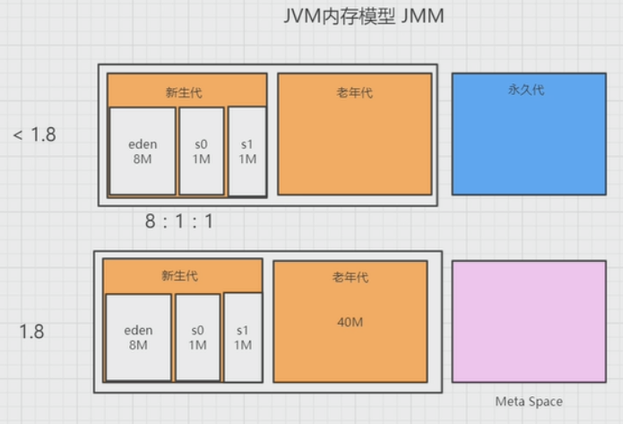

# 性能优化专题之JVM

## 什么是JVM

* 软件层面 机器码翻译

* 内存管理

## 运行时数据区

* 数据

  * 方法区

    类信息、常量(1.7)、静态变量、JIT

  * Heap

    

* 指令

  * 程序计数器

    指向当前线程正在执行的字节码指令的地址、行号

    CPU是按时间片执行的，线程执行时有可能被挂起

  * 虚拟机栈

    存储当前线程运行方法所需要的数据，指令和返回地址

    由栈帧组成

    * 局部变量表

    * 操作数栈

    * 动态链接

      Constant pool 运行时需要运行的东西从哪来，怎么定义的

    * 出口

      方法执行完要出栈

    java demo

    ```java
    
    import java.io.File;
    
    /**
     * 功能描述
     *
     * @author TomLuo
     * @date 2019/7/26
     */
    public class HelloWorldDemo {
        private Object obj = new Object();
    
        public void methodOne(int i) {
            int j = 0;
            int sum = j + i;
            Object acb = obj;
            long start = System.currentTimeMillis();
            methodTwo();
            return;
        }
    
        private void methodTwo() {
            File file = new File("");
        }
    }
    
    ```

    

    ```java
    javap -v -p HelloWorldDemo.class 
    Classfile /opt/test/HelloWorldDemo.class
      Last modified Jul 25, 2019; size 552 bytes
      MD5 checksum 93b3d7c54dd7b3d4eebdf7367aaec0ec
      Compiled from "HelloWorldDemo.java"
    public class HelloWorldDemo
      minor version: 0
      major version: 52
      flags: ACC_PUBLIC, ACC_SUPER
    Constant pool: 动态链接 真正要用的时候，从这里来找到实例 符号引用 命令 自变量
       #1 = Methodref          #2.#21         // java/lang/Object."<init>":()V
       #2 = Class              #22            // java/lang/Object
       #3 = Fieldref           #9.#23         // HelloWorldDemo.obj:Ljava/lang/Object;
       #4 = Methodref          #24.#25        // java/lang/System.currentTimeMillis:()J
       #5 = Methodref          #9.#26         // HelloWorldDemo.methodTwo:()V
       #6 = Class              #27            // java/io/File
       #7 = String             #28            //
       #8 = Methodref          #6.#29         // java/io/File."<init>":(Ljava/lang/String;)V
       #9 = Class              #30            // HelloWorldDemo
      #10 = Utf8               obj
      #11 = Utf8               Ljava/lang/Object;
      #12 = Utf8               <init>
      #13 = Utf8               ()V
      #14 = Utf8               Code
      #15 = Utf8               LineNumberTable
      #16 = Utf8               methodOne
      #17 = Utf8               (I)V
      #18 = Utf8               methodTwo
      #19 = Utf8               SourceFile
      #20 = Utf8               HelloWorldDemo.java
      #21 = NameAndType        #12:#13        // "<init>":()V
      #22 = Utf8               java/lang/Object
      #23 = NameAndType        #10:#11        // obj:Ljava/lang/Object;
      #24 = Class              #31            // java/lang/System
      #25 = NameAndType        #32:#33        // currentTimeMillis:()J
      #26 = NameAndType        #18:#13        // methodTwo:()V
      #27 = Utf8               java/io/File
      #28 = Utf8
      #29 = NameAndType        #12:#34        // "<init>":(Ljava/lang/String;)V
      #30 = Utf8               HelloWorldDemo
      #31 = Utf8               java/lang/System
      #32 = Utf8               currentTimeMillis
      #33 = Utf8               ()J
      #34 = Utf8               (Ljava/lang/String;)V
    {
      private java.lang.Object obj;
        descriptor: Ljava/lang/Object;
        flags: ACC_PRIVATE
    
      public HelloWorldDemo();
        descriptor: ()V
        flags: ACC_PUBLIC
        Code:
          stack=3, locals=1, args_size=1
             0: aload_0
             1: invokespecial #1                  // Method java/lang/Object."<init>":()V
             4: aload_0
             5: new           #2                  // class java/lang/Object
             8: dup
             9: invokespecial #1                  // Method java/lang/Object."<init>":()V
            12: putfield      #3                  // Field obj:Ljava/lang/Object;
            15: return
          LineNumberTable:
            line 10: 0
            line 11: 4
    
      public void methodOne(int);
        descriptor: (I)V
        flags: ACC_PUBLIC
        Code:
          stack=2, locals=7, args_size=2
             0: iconst_0 压栈 int i
             1: istore_2 压栈 int j = 0;
             2: iload_2	 出栈（先入先出）
             3: iload_1  出栈
             4: iadd	 操作数栈 int sum = j + i;
             5: istore_3 压栈 int sum
             6: aload_0  出栈 obj;
             7: getfield  #3 指向引用 Object acb = obj;// Field obj:Ljava/lang/Object;
            10: astore        4
            12: invokestatic  #4  // Method java/lang/System.currentTimeMillis:()J
            15: lstore        5 压栈 long start = System.currentTimeMillis();
            17: aload_0
            18: invokespecial #5                  // Method methodTwo:()V
            21: return
          LineNumberTable:
            line 14: 0
            line 15: 2
            line 16: 6
            line 17: 12
            line 18: 17
            line 19: 21
    
      private void methodTwo();
        descriptor: ()V
        flags: ACC_PRIVATE
        Code:
          stack=3, locals=2, args_size=1
             0: new           #6                  // class java/io/File
             3: dup
             4: ldc           #7                  // String
             6: invokespecial #8                  // Method java/io/File."<init>":(Ljava/lang/String;)V
             9: astore_1
            10: return
          LineNumberTable:
            line 23: 0
            line 24: 10
    }
    SourceFile: "HelloWorldDemo.java"
    ```

    

  * 本地方法栈

    本地方法的入栈和出栈  含有native的方法

## 内存模型



## 垃圾收集器

