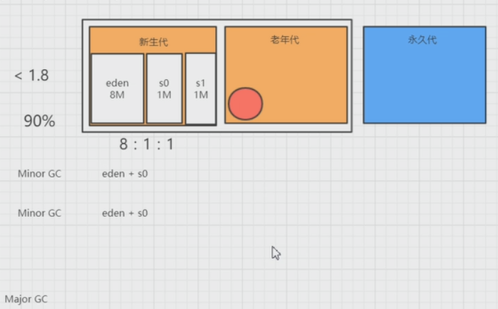

# JVM垃圾回收

官网 ：https://www.oracle.com/technetwork/java/javase/tech/vmoptions-jsp-140102.html

> -Xms starting 堆的起始大小
>
> -Xmx max堆的大小
>
> -Xmn new新生代大小

指针碰撞、内存规整

Free list 带压缩的收集器

> ```
> jmap -J-d64 -heap pid
> ```

## 新生代分配 eden区

对象分配eden
`-XX:SurvivorRatio=8`
8:1:1



## TLAB Thread local allocation buffer

#### 大对象直接进入老年代

`-XX:PretenureSizeThreshold`

#### 长期存活的对象

`-XX:MaxTenuringThreshold=n`

#### 动态对象年龄判定

相同年龄所有对象的大小总和>Servivor空间的一半

#### 分配担保

Minor GC之前检查

老年代最大可用连续空间是否>新生代所有对象总空间

> Minor GC
>
> Major GC
>
> Full GC=Minor GC+Major GC

## 引用: 什么样的对象需要回收？

### 强引用

`Object obj=new Object();`

### 软引用

`public static ConcurrentHashMap<?,?> map=new ConcurrentHashMap<String,SoftReference<?>>();`


GC 就会被回收

### 弱引用

GC 就会被回收

### 虚引用

被回收时会被通知到

## 回收

### 方法论

* 标记-清除算法

  

  空间不连续

* 复制回收算法

  

  浪费空间

* 标记-整理算法

  

### 垃圾收集器


#### STW 

stop the world

#### Serial

#### ParNew

`-XX:ParallelGCThreads=n`

#### Parallel Scavenge（全局）

吞吐量 = 运行用户代码时间 / （运行用户代码时间  + 垃圾收集时间）
`-XX:MaxGCPauseMillis=n`
`-XX:GCTimeRatio=n`
`-XX:UseAdaptiveSizePolicy`   GC  Ergonomics

#### Serial Old
CMS备用预案  Concurrent Mode Failusre时使用
标记-整理算法

#### Parallel Old

标记-整理算法

#### CMS(Concurrent Mark Sweep)

看名字就知道，CMS是一款并发、使用标记-清除算法的gc, 存在着内存碎片化问题
CMS是针对老年代进行回收的GC。 以获取最小停顿时间为目的。
在一些对响应时间有很高要求的应用或网站中，用户程序不能有长时间的停顿，CMS 可以用于此场景。

标记-清除算法
减少回收停顿时间
碎片 `-XX:CMSInitiationgOccupancyFraction` 
Concurrent Mode Failure 启用Serial Old
`-XX:+UseCMSCompactAtFullCollection`
`-XX:CMSFullGCsBeforeCompaction` 执行多少次不压缩FullGC后 来一次带压缩的 0 表示每次都压
`-XX:+UseConcMarkSweep`

##### CMS的执行过程

1. 初始标记 Init-mark (STW 即 stop the world)
   该阶段进行可达性分析，标记GC ROOT能直接关联到的对象. 间接关联的对象在下一阶段标记
2. 并发标记 Concurrent-mark
   该阶段和用户线程并发执行. 该阶段进行GC ROOT TRACING，在第一个阶段被暂停的线程重新开始运行。 由前阶段标记过的对象出发，所有可到达的对象都在本阶段中标记。
3. 并发预处理 concurrent-preclean-start
   与下一步的重标记的工作类似. 但为了GC的最短停顿时间, 因此工作尽可能多的在并发阶段完成来减少STW的时间.
   此阶段标记从新生代晋升的对象、新分配到老年代的对象以及在并发阶段被修改了的对象。
4. 重标记 Remark (STW)
   暂停所有用户线程，重新扫描堆中的对象，进行可达性分析,标记活着的对象。
   有了前面的基础，这个阶段的工作量被大大减轻，停顿时间因此也会减少。
   注意这个阶段是多线程的。
5. 并发清理 concurrent-sweep-start
   用户线程被重新激活，同时清理那些无效的对象。
6. 重置 concurrent-reset-start
   CMS清除内部状态，为下次回收做准备

#### G1

安全点

安全区域

## 如何查看当前的垃圾回收器
### `-XX:+PrintFlagsFinal`、`-XX:+PrintCommandLineFlags`

启动`jvm-demo.jar`,CMS日志

```shell
java -Xms8m -Xmx64m -verbose:gc -Xloggc:./gc.log  -XX:+PrintHeapAtGC -XX:+PrintGCApplicationStoppedTime -XX:+PrintGCTimeStamps -XX:+PrintCommandLineFlags -XX:+PrintFlagsFinal -XX:+PrintGCDetails -XX:+UseConcMarkSweepGC -Dcom.sun.management.jmxremote.authenticate=false -Dcom.sun.management.jmxremote.ssl=false -Dcom.sun.management.jmxremote.port=9004 -Djava.rmi.server.hostname=192.168.238.150 -jar jvm-demo.jar  > catalina.out  2>&1 &
```

在`catalina.out`中可以打印出来

```shell
head catalina.out
-XX:InitialHeapSize=8388608 -XX:+ManagementServer -XX:MaxHeapSize=67108864 -XX:MaxNewSize=22372352 -XX:MaxTenuringThreshold=6 -XX:OldPLABSize=16 -XX:+PrintCommandLineFlags -XX:+PrintFlagsFinal -XX:+PrintGC -XX:+PrintGCApplicationStoppedTime -XX:+PrintGCDetails -XX:+PrintGCTimeStamps -XX:+PrintHeapAtGC -XX:+UseCompressedClassPointers -XX:+UseCompressedOops -XX:+UseConcMarkSweepGC -XX:+UseParNewGC
```

​	可以看到新生代`-XX:+UseParNewGC`

### 运行模式`server client`

在32位机器是server和client共存

在64位只能是server

```shell
java -version
java version "1.8.0_191"
Java(TM) SE Runtime Environment (build 1.8.0_191-b12)
Java HotSpot(TM) 64-Bit Server VM (build 25.191-b12, mixed mode)
```

用的是`ParNew`+CMS(`ConcurentMarkSweep`老年代),`ParNew`优先于吞吐量

> 注意：参数 `-XX:+UseConcMarkSweepGC `表示显示使用CMS

如果不用CMS

用的是`copy MarkSweepCompact`

### `MBean`

## GC日志

### 输出日志

`-XX:+PrintGCTimeStamps `
`-XX:+PrintGCDetails `
`-Xloggc:./gc.log`
`-XX:+PrintHeapAtGC`

```shell
159.839: [GC (Allocation Failure) 159.839: [DefNew: 5612K->428K(6016K), 0.0027859 secs] 18869K->13685K(19288K), 0.0028324 secs] [Times: user=0.00 sys=0.00, real=0.00 secs] 
```


`2040.517: [Full GC (Allocation Failure) 2040.517: [Tenured: 43712K->43712K(43712K), 0.0409926 secs] 63360K->63360K(63360K), [Metaspace: 36253K->36253K(1083392K)], 0.0410433 secs] [Times: user=0.03 sys=0.01, real=0.04 secs]`


### 日志文件控制

​	`-XX:-UseGCLogFileRotation`
​	`-XX:GCLogFileSize=8K`

执行jar,使用CMS（`-XX:+UseConcMarkSweepGC`）

`java -Xms8m -Xmx64m -verbose:gc -Xloggc:./gc.log  -XX:+PrintHeapAtGC -XX:+PrintGCApplicationStoppedTime -XX:+PrintGCTimeStamps -XX:+PrintCommandLineFlags -XX:+PrintFlagsFinal -XX:+PrintGCDetails -XX:+UseConcMarkSweepGC -Dcom.sun.management.jmxremote.authenticate=false -Dcom.sun.management.jmxremote.ssl=false -Dcom.sun.management.jmxremote.port=9004 -Djava.rmi.server.hostname=192.168.238.150 -jar jvm-demo.jar  > catalina.out  2>&1 &`

不使用CMS（`-XX:+UseConcMarkSweepGC`）

`java -Xms8m -Xmx64m -verbose:gc -Xloggc:./gc.log  -XX:+PrintHeapAtGC -XX:+PrintGCApplicationStoppedTime -XX:+PrintGCTimeStamps -XX:+PrintCommandLineFlags -XX:+PrintFlagsFinal -XX:+PrintGCDetails -Dcom.sun.management.jmxremote.authenticate=false -Dcom.sun.management.jmxremote.ssl=false -Dcom.sun.management.jmxremote.port=9004 -Djava.rmi.server.hostname=192.168.238.150 -jar jvm-demo.jar  > catalina.out  2>&1 &`

查看日志

`tail -f catalina.out`

`tail -f gc.log`

jconsole联接查看内存


## JDK自带的 监控工具
https://docs.oracle.com/javase/8/docs/technotes/tools/windows/toc.html

### jmap

`jmap -heap {pid}` 堆使用情况

```shell
jps -- 查看进程号 亦可以用 ps -ef | grep java
jmap -heap 2403
Attaching to process ID 2403, please wait...
Debugger attached successfully.
Server compiler detected.
JVM version is 25.191-b12

using parallel threads in the new generation.
using thread-local object allocation.
Concurrent Mark-Sweep GC

Heap Configuration:
   MinHeapFreeRatio         = 40
   MaxHeapFreeRatio         = 70
   MaxHeapSize              = 67108864 (64.0MB)
   NewSize                  = 2752512 (2.625MB)
   MaxNewSize               = 22347776 (21.3125MB)
   OldSize                  = 5636096 (5.375MB)
   NewRatio                 = 2
   SurvivorRatio            = 8
   MetaspaceSize            = 21807104 (20.796875MB)
   CompressedClassSpaceSize = 1073741824 (1024.0MB)
   MaxMetaspaceSize         = 17592186044415 MB
   G1HeapRegionSize         = 0 (0.0MB)

Heap Usage:
New Generation (Eden + 1 Survivor Space):
   capacity = 2490368 (2.375MB)
   used     = 1794296 (1.7111740112304688MB)
   free     = 696072 (0.6638259887695312MB)
   72.0494320518092% used
Eden Space:
   capacity = 2228224 (2.125MB)
   used     = 1532152 (1.4611740112304688MB)
   free     = 696072 (0.6638259887695312MB)
   68.76112994025735% used
From Space:
   capacity = 262144 (0.25MB)
   used     = 262144 (0.25MB)
   free     = 0 (0.0MB)
   100.0% used
To Space:
   capacity = 262144 (0.25MB)
   used     = 0 (0.0MB)
   free     = 262144 (0.25MB)
   0.0% used
concurrent mark-sweep generation:
   capacity = 17797120 (16.97265625MB)
   used     = 13183376 (12.572647094726562MB)
   free     = 4613744 (4.4000091552734375MB)
   74.07589542577675% used

15044 interned Strings occupying 1412592 bytes.
```

### jstat

`jstat -gcutil {pid} {ms} `  每3秒，查看汇总数据

```shell
jstat  -gcutil 2403 3000
  S0     S1     E      O      M     CCS    YGC     YGCT    FGC    FGCT     GCT   
100.00   0.00  77.71  74.08  94.69  90.83    178    0.231     8    0.020    0.251
100.00   0.00  77.71  74.08  94.69  90.83    178    0.231     8    0.020    0.251
100.00   0.00  77.71  74.08  94.69  90.83    178    0.231     8    0.020    0.25
```
`jstat  -gccause {pid} {ms}`多少毫秒刷一下，查看GC的原因

```shell
jstat  -gccause 2403 3000
  S0     S1     E      O      M     CCS    YGC     YGCT    FGC    FGCT     GCT    LGCC                 GCC                 
100.00   0.00  79.33  74.08  94.69  90.83    178    0.231     8    0.020    0.251 Allocation Failure   No GC               
100.00   0.00  79.33  74.08  94.69  90.83    178    0.231     8    0.020    0.251 Allocation Failure   No GC               
100.00   0.00  79.33  74.08  94.69  90.83    178    0.231     8    0.020    0.251 Allocation Failure   No GC               
100.00   0.00  79.33  74.08  94.69  90.83    178    0.231     8    0.020    0.251 Allocation Failure   No GC               
100.00   0.00  79.87  74.08  94.69  90.83    178    0.231     8    0.020    0.251 Allocation Failure   No GC  
```


分析 GC之前，之后 PSYoungGen 变化，由100%->0%说明有回收

查看ParOldGen，由33%->33%，说明没有变化，内存的对象是必须要用的，回收不了。如果有增加，要看一下有没有内存泄露。

PSPermGen(jdk1.8以前才有永久代)，占用99%，说明没有空间了。

### jstack  线程dump 
### jvisualvm

模拟死锁

```java
 @GetMapping("/jvm-lock")
public void lock() {
    DeadLock dl = new DeadLock();
    new Thread(() -> {
        dl.m1();
    }).start();

    new Thread(() -> {
        dl.m2();
    }).start();
}

static class DeadLock {
    private final static Lock loc1 = new ReentrantLock();
    private final static Lock loc2 = new ReentrantLock();

    public void m1() {
        synchronized (loc1) {
            try {
                TimeUnit.MILLISECONDS.sleep(2000);
            } catch (InterruptedException e) {
                e.printStackTrace();
            }
            System.out.println("m1 start");
            synchronized (loc2) {
                System.out.println("m1 end");
            }
        }
    }

    public void m2() {
        synchronized (loc2) {
            try {
                TimeUnit.MILLISECONDS.sleep(2000);
            } catch (InterruptedException e) {
                e.printStackTrace();
            }
            System.out.println("m2 start");
            synchronized (loc1) {
                System.out.println("m2 end");
            }
        }
    }
}
```

查看死锁


### jconsole


## MAT
​	http://help.eclipse.org/oxygen/index.jsp?topic=/org.eclipse.mat.ui.help/welcome.html
​	-XX:+HeapDumpOnOutOfMemoryError 
​	-XX:HeapDumpPath=./error.hprof

`java -Xms128m -Xmx128m -verbose:gc -Xloggc:./gc.log  -XX:+HeapDumpOnOutOfMemoryError -XX:+PrintHeapAtGC -XX:HeapDumpPath=./error.hprof -XX:+PrintGCApplicationStoppedTime -XX:+PrintGCTimeStamps -XX:+PrintCommandLineFlags -XX:+PrintFlagsFinal -XX:+PrintGCDetails -XX:+UseCMSCompactAtFullCollection -Dcom.sun.management.jmxremote.authenticate=false -Dcom.sun.management.jmxremote.ssl=false -Dcom.sun.management.jmxremote.port=9004 -Djava.rmi.server.hostname=192.168.238.150 -jar jvm-demo.jar  > catalina.out  2>&1 &`

拿到error.hprof，分析内存泄露问题。

> 有GC Root指向，对象一直增大，且不回收

模拟代码

```java
private static List<int[]> bigObj = new ArrayList<>();
private int[] generate1M() {
    return new int[1024 * 512];
}
@GetMapping("/jvm-error")
public void error() {
    for (int i = 0; i < 1000; ++i) {
        if (i == 0) {
            try {
                TimeUnit.MILLISECONDS.sleep(500);
                System.out.println("start = [" + new Date() + "]");
            } catch (InterruptedException e) {
                e.printStackTrace();
            }
        } else {
            try {
                TimeUnit.MILLISECONDS.sleep(4000);
            } catch (InterruptedException e) {
                e.printStackTrace();
            }
        }
        bigObj.add(generate1M());
    }
}
```

怀疑内存泄露：

1. 查看GC日志

   `803.854: [Full GC (Allocation Failure) 803.854: [Tenured: 87423K->85852K(87424K), 0.0235836 secs] 126719K->125147K(126720K), [Metaspace: 36055K->36055K(1083392K)], 0.0236334 secs] [Times: user=0.02 sys=0.00, real=0.02 secs] `

```
java.lang.OutOfMemoryError: Java heap space
	at com.example.controller.DemoController.generate1M(DemoController.java:32)
```

2. 生成dump文件

   使用`-XX:+HeapDumpOnOutOfMemoryError` `-XX:HeapDumpPath=./error.hprof`两个参数生成error.hprof

3. 用Mat来查看

   * 占用Retained Heap
   * 看有没有GC Root指向


