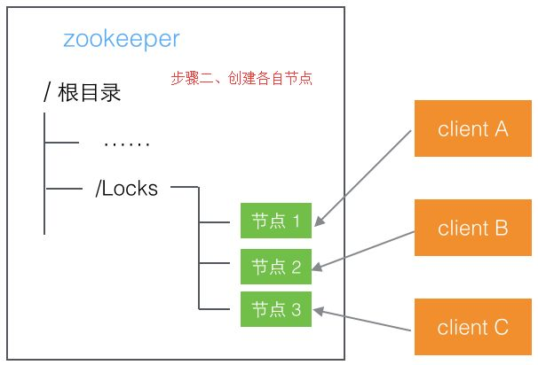

分布式锁的实现
锁是用来解决什么问题的;
1.	一个进程中的多个线程，多个线程并发访问同一个资源的时候，如何解决线程安全问题。
2.	一个分布式架构系统中的两个模块同时去访问一个文件对文件进行读写操作
3.	多个应用对同一条数据做修改的时候，如何保证数据的安全性
在但进程中，我们可以用到synchronized、lock之类的同步操作去解决，但是对于分布式架构下多进程的情况下，如何做到跨进程的锁。就需要借助一些第三方手段来完成
设计一个分布式所需要解决的问题
分布式锁的解决方案
1.	怎么去获取锁
数据库，通过唯一约束
lock(
  id  int(11)
  methodName  varchar(100),
  memo varchar(1000) 
  modifyTime timestamp
 unique key mn (method)  --唯一约束
)
获取锁的伪代码
try{
exec  insert into lock(methodName,memo) values(‘method’,’desc’);    method
return true;
}Catch(DuplicateException e){
return false;
}
释放锁
delete from lock where methodName=’’;
存在的需要思考的问题
1.	锁没有失效时间，一旦解锁操作失败，就会导致锁记录一直在数据库中，其他线程无法再获得到锁
2.	锁是非阻塞的，数据的insert操作，一旦插入失败就会直接报错。没有获得锁的线程并不会进入排队队列，要想再次获得锁就要再次触发获得锁操作
3.	锁是非重入的，同一个线程在没有释放锁之前无法再次获得该锁
zookeeper实现分布式锁
利用zookeeper的唯一节点特性或者有序临时节点特性获得最小节点作为锁. zookeeper 的实现相对简单，通过curator客户端，已经对锁的操作进行了封装，原理如下

 
zookeeper的优势
1.	可靠性高、实现简单
2.	zookeeper因为临时节点的特性，如果因为其他客户端因为异常和zookeeper连接中断了，那么节点会被删除，意味着锁会被自动释放
3.	zookeeper本身提供了一套很好的集群方案，比较稳定
4.	释放锁操作，会有watch通知机制，也就是服务器端会主动发送消息给客户端这个锁已经被释放了
基于缓存的分布式锁实现
redis中有一个setNx命令，这个命令只有在key不存在的情况下为key设置值。所以可以利用这个特性来实现分布式锁的操作
具体实现代码
1.	添加依赖包
 
2.	编写redis连接的代码
  
释放锁的代码

3.	分布式锁的具体实现
 
4.	怎么释放锁
 
redis多路复用机制
linux的内核会把所有外部设备都看作一个文件来操作，对一个文件的读写操作会调用内核提供的系统命令，返回一个 file descriptor（文件描述符）。对于一个socket的读写也会有响应的描述符，称为socketfd(socket 描述符)。而IO多路复用是指内核一旦发现进程指定的一个或者多个文件描述符IO条件准备好以后就通知该进程
IO多路复用又称为事件驱动，操作系统提供了一个功能，当某个socket可读或者可写的时候，它会给一个通知。当配合非阻塞socket使用时，只有当系统通知我哪个描述符可读了，我才去执行read操作，可以保证每次read都能读到有效数据。操作系统的功能通过select/pool/epoll/kqueue之类的系统调用函数来使用，这些函数可以同时监视多个描述符的读写就绪情况，这样多个描述符的I/O操作都能在一个线程内并发交替完成，这就叫I/O多路复用，这里的复用指的是同一个线程
多路复用的优势在于用户可以在一个线程内同时处理多个socket的 io请求。达到同一个线程同时处理多个IO请求的目的。而在同步阻塞模型中，必须通过多线程的方式才能达到目的

redis中使用lua脚本
lua脚本
Lua是一个高效的轻量级脚本语言，用标准C语言编写并以源代码形式开放， 其设计目的是为了嵌入应用程序中，从而为应用程序提供灵活的扩展和定制功能
使用脚本的好处
1.	减少网络开销，在Lua脚本中可以把多个命令放在同一个脚本中运行
2.	原子操作，redis会将整个脚本作为一个整体执行，中间不会被其他命令插入。换句话说，编写脚本的过程中无需担心会出现竞态条件
3.	复用性，客户端发送的脚本会永远存储在redis中，这意味着其他客户端可以复用这一脚本来完成同样的逻辑 
Lua在linux中的安装
到官网下载lua的tar.gz的源码包
tar -zxvf lua-5.3.0.tar.gz
进入解压的目录：
cd lua-5.2.0
make linux  (linux环境下编译)
make install
如果报错，说找不到readline/readline.h, 可以通过yum命令安装
yum -y install readline-devel ncurses-devel
安装完以后再make linux  / make install
最后，直接输入 lua命令即可进入lua的控制台
lua的语法
暂无
Redis与Lua
在Lua脚本中调用Redis命令，可以使用redis.call函数调用。比如我们调用string类型的命令
redis.call(‘set’,’hello’,’world’)
redis.call 函数的返回值就是redis命令的执行结果。前面我们介绍过redis的5中类型的数据返回的值的类型也都不一样。redis.call函数会将这5种类型的返回值转化对应的Lua的数据类型
从Lua脚本中获得返回值
在很多情况下我们都需要脚本可以有返回值，在脚本中可以使用return 语句将值返回给redis客户端，通过return语句来执行，如果没有执行return，默认返回为nil。
如何在redis中执行lua脚本
Redis提供了EVAL命令可以使开发者像调用其他Redis内置命令一样调用脚本。
[EVAL]  [脚本内容] [key参数的数量]  [key …] [arg …]
可以通过key和arg这两个参数向脚本中传递数据，他们的值可以在脚本中分别使用KEYS和ARGV 这两个类型的全局变量访问。比如我们通过脚本实现一个set命令，通过在redis客户端中调用，那么执行的语句是：
lua脚本的内容为： return redis.call(‘set’,KEYS[1],ARGV[1])         //KEYS和ARGV必须大写
eval "return redis.call('set',KEYS[1],ARGV[1])" 1 hello world
EVAL命令是根据 key参数的数量-也就是上面例子中的1来将后面所有参数分别存入脚本中KEYS和ARGV两个表类型的全局变量。当脚本不需要任何参数时也不能省略这个参数。如果没有参数则为0
eval "return redis.call(‘get’,’hello’)" 0
EVALSHA命令
考虑到我们通过eval执行lua脚本，脚本比较长的情况下，每次调用脚本都需要把整个脚本传给redis，比较占用带宽。为了解决这个问题，redis提供了EVALSHA命令允许开发者通过脚本内容的SHA1摘要来执行脚本。该命令的用法和EVAL一样，只不过是将脚本内容替换成脚本内容的SHA1摘要

1.	Redis在执行EVAL命令时会计算脚本的SHA1摘要并记录在脚本缓存中
2.	执行EVALSHA命令时Redis会根据提供的摘要从脚本缓存中查找对应的脚本内容，如果找到了就执行脚本，否则返回“NOSCRIPT No matching script,Please use EVAL”

通过以下案例来演示EVALSHA命令的效果
script load "return redis.call('get','hello')"          将脚本加入缓存并生成sha1命令
evalsha "a5a402e90df3eaeca2ff03d56d99982e05cf6574" 0
我们在调用eval命令之前，先执行evalsha命令，如果提示脚本不存在，则再调用eval命令
lua脚本实战
实现一个针对某个手机号的访问频次， 以下是lua脚本，保存为phone_limit.lua
local num=redis.call('incr',KEYS[1])
if tonumber(num)==1 then
   redis.call('expire',KEYS[1],ARGV[1])
   return 1
elseif tonumber(num)>tonumber(ARGV[2]) then
   return 0
else
   return 1
end
通过如下命令调用
./redis-cli --eval phone_limit.lua rate.limiting:13700000000 , 10 3

语法为 ./redis-cli –eval [lua脚本] [key…]空格,空格[args…]
脚本的原子性
redis的脚本执行是原子的，即脚本执行期间Redis不会执行其他命令。所有的命令必须等待脚本执行完以后才能执行。为了防止某个脚本执行时间过程导致Redis无法提供服务。Redis提供了lua-time-limit参数限制脚本的最长运行时间。默认是5秒钟。
当脚本运行时间超过这个限制后，Redis将开始接受其他命令但不会执行（以确保脚本的原子性），而是返回BUSY的错误
实践操作
打开两个客户端窗口
在第一个窗口中执行lua脚本的死循环
eval “while true do end” 0

在第二个窗口中运行get hello

最后第二个窗口的运行结果是Busy, 可以通过script kill命令终止正在执行的脚本。如果当前执行的lua脚本对redis的数据进行了修改，比如（set）操作，那么script kill命令没办法终止脚本的运行，因为要保证lua脚本的原子性。如果执行一部分终止了，就违背了这一个原则
在这种情况下，只能通过 shutdown nosave命令强行终止

磁盘 - 用户空间 - 应用程序空间

wget https://www.lua.org/ftp/lua-5.3.5.tar.gz
curl -R -O http://www.lua.org/ftp/lua-5.3.5.tar.gz
tar zxf lua-5.3.5.tar.gz
cd lua-5.3.5
make linux test
make install

1. lua.c:82:31: fatal error: readline/readline.h: No such file or directory
yum install readline-devel

lua语法

1. 定义变量
全局变量、局部变量
b=1
print(b)
local b=2

2. 字符串连接
a="hello"
b=" world"
print(a..b)
3. 比较运算符
print(1==1)
true
print(1=='1')
false
print(1~=1)
4. 计算字符串长度
print(#"this is first message")
21

5. 判断语法和循环语法
c=1
if c>0 then 
print(c) 
elseif c==0 then
print(0) 
else 
print(c+1) 
end 
 
for i=1,100 do 
	print(i) 
end

local xx={"a","b","c"}
for i,v in ipairs(xx) do print(v) end

6. 注释
单行注释
--a=c
多行注释
--[[
a=2
b=3
print(b)]]

7. 函数
function add(a,b)
 return a+b
 end
print(add(1,2))

8. redis里执行脚本
eval script numkeys key [key ...] arg [arg ...]

./redis-cli 
eval "redis.call('set','name','tom')" 0
get name
"tom"

eval "redis.call('set',KEYS[1],ARGV[1])" 1 hello world
get hello
"world"

cat ../../lua_script/ip_limits.lua
--限流，对某个IP限流，超过3次，禁止访问
local num=redis.call('incr',KEYS[1])
if tonumber(num)==1 then
        redis.call('expire',KEYS[1],ARGV[1])
        return 1
elseif  tonumber(num)>tonumber(ARGV[2]) then
        return 0
else 
        return 1
end

./redis-cli --eval ../../lua_script/ip_limits.lua "192.168.238.150" , 60000 3  
./redis-cli get "192.168.238.150"

shutdown nosave

"8"

