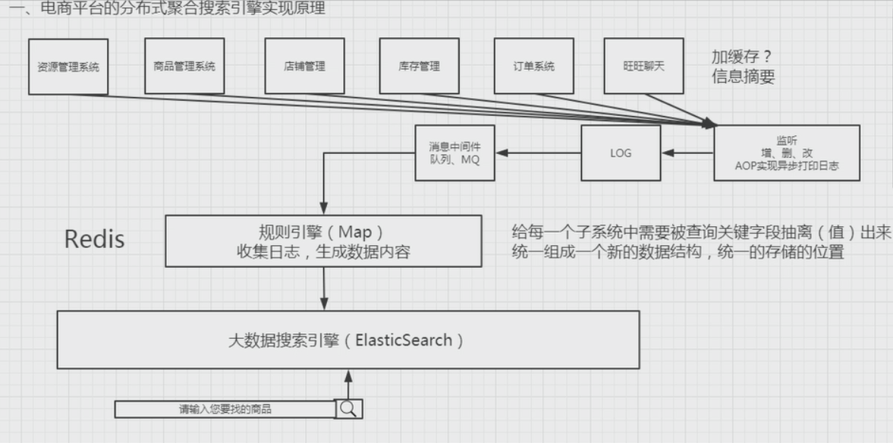

# 大数据前篇之分布式搜索引擎规则

[TOC]

## ElasticSearch介绍

分布式的搜索引擎，基于lucene开发的。同类产品有Solr。

ElasticSearch实时搜索性能更高。

1. Lucene+自研 
2. Solr（不能做实时搜索）
3. ElasticSearch（实时搜索）

Lucene基本架构，基本解决方案

* Document(row)文本

  和No Sql （Redis，MongoDB，Memcache，Hadoop HBase）类似

* Index索引（数据关键值）

  提高查询效率

* Analyzer分词器（打标签）

  搞高精准度，语义化，智能化， 人性化。

  IKAnalyzer，Word分词

| 关系型数据库 |               | ES               |      |
| ------------ | ------------- | ---------------- | ---- |
| 建库（DB)    | 1. 加载驱动类 ，JDBC驱动 2. 建立连接（客户Connection）3. 建立语句集（SQL Statement）4. 执行语句集 execute() 5. 获取结果集ResultSet 6. 关闭结果、语句，连接 | 建库（Index)     | 1. 建立连接（创建客户端TransportClient）2. 查询构造器（构造查询条件SearchRequestBuilder) 3、 执行语句集execute() 4. 获取结果集（SearchResponse) 5. 关闭以上操作 |
| 建表（Table) |              | 建表（IndexType) |      |
| 建约束       |               | 主键（ID)        |      |

