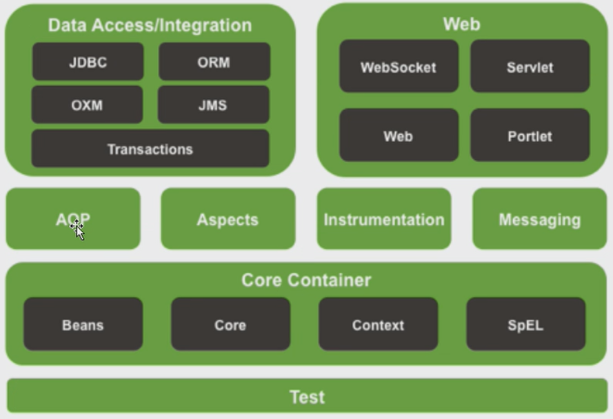
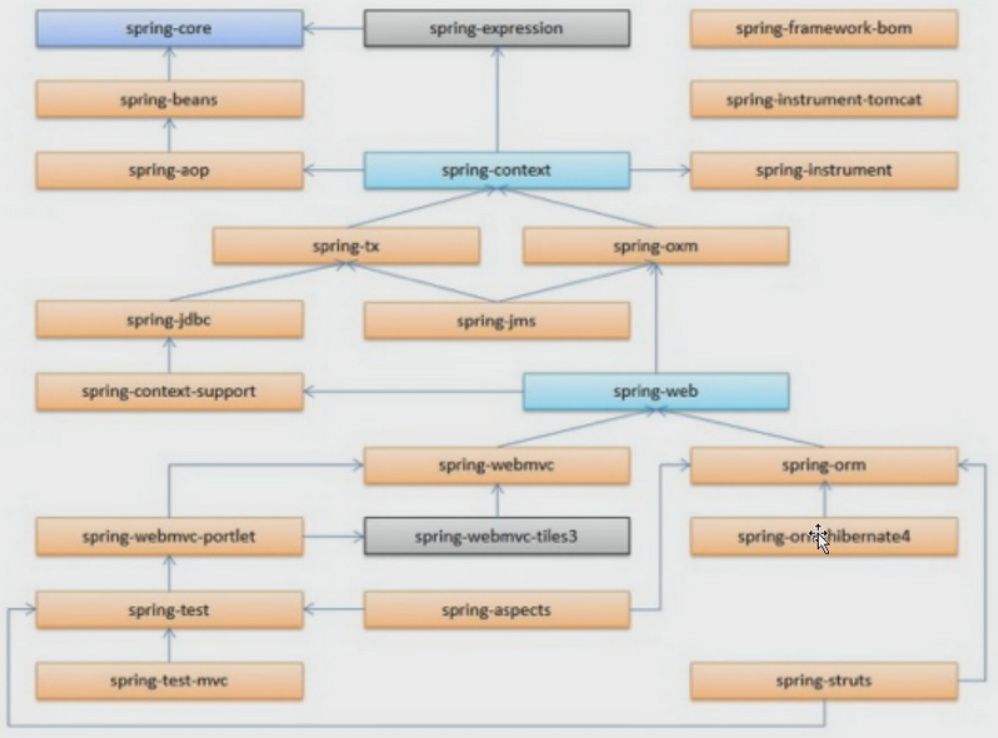
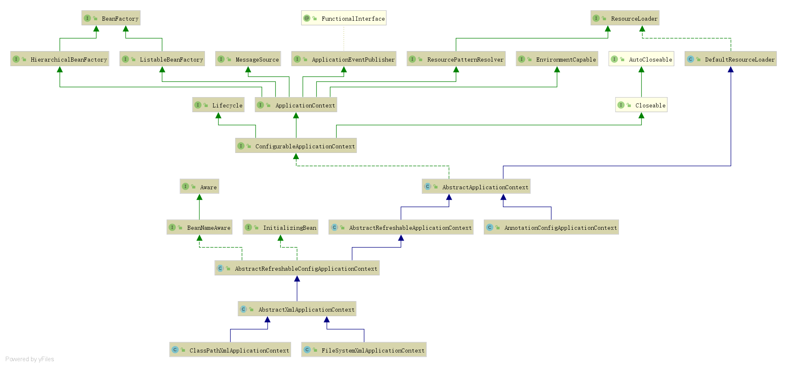
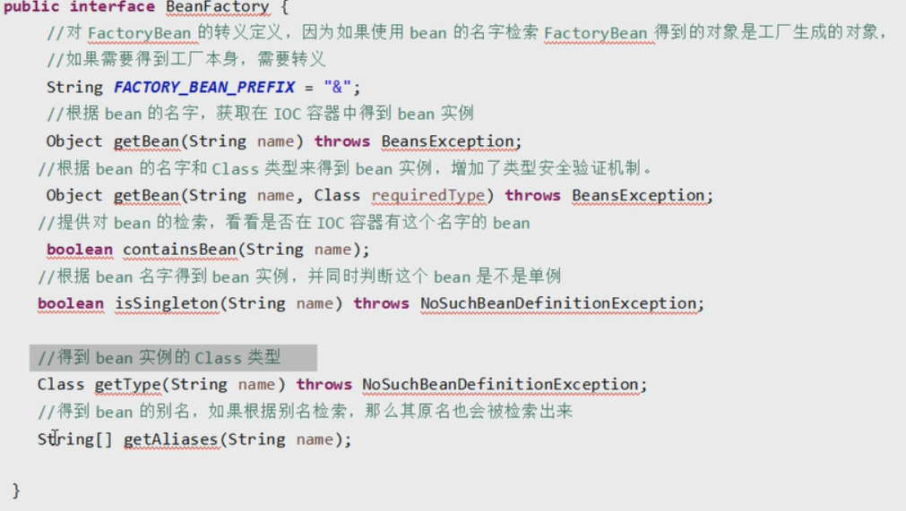
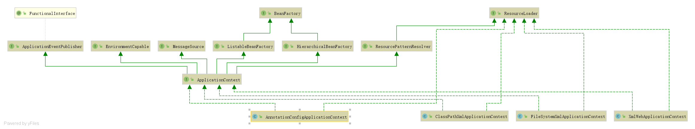
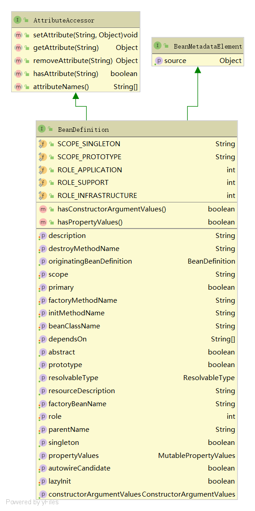
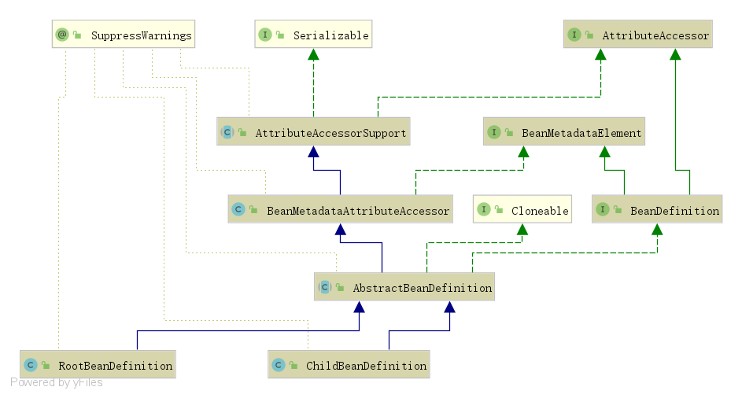
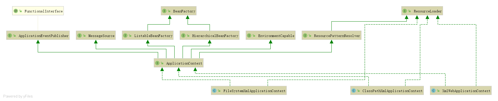

# 2.spring源码分析-IOC容器

[TOC]

## 系统架构图



1. Core container 核心容器

   spring-bean

   spring-core

   spring-context

   spring-expression    SpEL (spring expression language)

2. Web

   spring-web 

   spring-webmvc

   spring-webmvc-portlet

   spring-websocket

3. 数据访问和集成

   spring-jdbc

   spring-orm

   spring-oxm

   spring-tx

   spring-jms

4. aop和设备的支持

   spring-aop

   spring-aspects

   spring-instrumentation

5. aop aspect intrumentation messaging

   spring-messaging

   spring-test

## 依赖关系



## 源码下载

1. 下载源码 https://github.com/spring-projects/spring-framework

## Spring源码解读

### `IOC`/`DI`

IOC(Inversion of control)控制反转，将原来我们在代码里创建对象，依赖的代码，反转给容器帮助实现。那么代码中我们需要创建一个容器存创建的对象，以及创建对象之间的依赖关系。这些对象及对象之间的依赖关系的描述就具体表现在配置文件或注解的代码中。

DI（Dependency Injection）依赖注入：就是指对象是被动接受依赖类而不是自己主动去找，换句话说，对象不是从容器中查找它的依赖类，而是在容器实例化对象的时候主动将它依赖的类注入（赋值）给它。

ClassPathResource

FileUrlResource

FileSystemResource

UrlResource

### `BeanFactory`

Bean工厂，也即IOC容器为开发者管理对象间的依赖关系提供了很多便利和基础服务。在Spring中有很多IOC容器的实现供用户选择和使用。

org.springframework.context.support.ClassPathXmlApplicationContext

org.springframework.context.support.FileSystemXmlApplicationContext



`BeanFactory`的主要方法



### `ApplicationContext `

* `EnvironmentCapable` 接口，指示包含和公开{@link Environment}引用的组件。
* `ListableBeanFactory` {@link BeanFactory}接口的扩展由bean工厂实现，可以枚举所有bean实例，而不是按客户端的请求逐个尝试按名称查找bean。 预加载所有bean定义（例如基于XML的工厂）的BeanFactory实现可以实现此接口。
* `HierarchicalBeanFactory` 由bean工厂实现的子接口，可以是层次结构的一部分。
* `MessageSource`用于解析消息的策略接口，支持参数化以及此类消息的国际化。
* `ApplicationEventPublisher` 封装事件发布功能的接口。
* `ResourcePatternResolver` 用于解析位置模式的策略界面（例如，一个Ant风格的路径模式）到Resource对象。



### `BeanDefinition`

SpringIOC容器管理了定义的各种Bean对象及其相互的关系，Bean对象在Spring实现中是以BeanDefinition来描述的。


BeanDefinition描述了一个bean实例，它具有属性值，构造函数参数值以及具体实现提供的更多信息。



继承关系



### IOC容器的初始化


IOC容器的初始化包括BeanDefinition的Resources定位、载入和注册三个基本过程。



#### ①ClassPathXmlApplicationContext构造函数

完成创建`ApplicationContext`

`org.springframework.context.support.ClassPathXmlApplicationContext#ClassPathXmlApplicationContext(java.lang.String[], boolean, org.springframework.context.ApplicationContext)`

```java
/**
	 * Create a new ClassPathXmlApplicationContext with the given parent,
	 * loading the definitions from the given XML files.
	 * @param configLocations array of resource locations
	 * @param refresh whether to automatically refresh the context,
	 * loading all bean definitions and creating all singletons.
	 * Alternatively, call refresh manually after further configuring the context.
	 * @param parent the parent context
	 * @throws BeansException if context creation failed
	 * @see #refresh()
	 */
	public ClassPathXmlApplicationContext(
			String[] configLocations, boolean refresh, @Nullable ApplicationContext parent)
			throws BeansException {

		super(parent);
		setConfigLocations(configLocations);
		if (refresh) {
			refresh();//①
		}
	}
```

##### 实现模拟定位、载入和注册三个基本过程

`test.xml`

```xml
<?xml version="1.0" encoding="UTF-8" ?>
<beans xmlns="http://www.springframework.org/schema/beans"
       xmlns:xsi="http://www.w3.org/2001/XMLSchema-instance"
       xsi:schemaLocation="http://www.springframework.org/schema/beans http://www.springframework.org/schema/beans/spring-beans-2.0.xsd">
    <bean id="testBean" class="TestBean"/>
</beans>
```


```java
@Data
public class TestBean {
    private String testStr = "test";
}
```


模拟Resources定位、载入和注册

```java
//1. 定位
InputStream resourceAsStream = getClass().getResourceAsStream("test.xml");
//也可以用new ClassPathResource("test.xml").getInputStream();
Resource resource = new InputStreamResource(resourceAsStream);
DefaultListableBeanFactory factory = new DefaultListableBeanFactory();
XmlBeanDefinitionReader xmlBeanDefinitionReader = new XmlBeanDefinitionReader(factory);
xmlBeanDefinitionReader.setValidationMode(0);
//2. 载入 3. 注册
xmlBeanDefinitionReader.loadBeanDefinitions(resource);
TestBean bean = (TestBean) factory.getBean("testBean");
System.out.println(JSON.toJSONString(bean, true));
```

输出

```cmd
{
	"testStr":"test"
}
```

##### `ApplicationContextAware`加载调用

`SubApplicationContext.java`

```java
public class SubApplicationContext implements ApplicationContextAware {
    @Override
    public void setApplicationContext(ApplicationContext applicationContext) throws BeansException {
        System.out.println("hello sub ApplicationContext");
    }
}
```

测试`ApplicationContextAware`

```java
ApplicationContext context = new ClassPathXmlApplicationContext("classpath:test.xml");
GenericApplicationContext context2 = new GenericApplicationContext();
context2.setParent(context);
context2.registerBean(SubApplicationContext.class);
context2.refresh();
TestBean testBean = (TestBean) context.getBean("testBean");
System.out.printf("test bean: %s", testBean.getTestStr());
```

#### ②`refresh()`

ApplicationContext`主流程`org.springframework.context.support.AbstractApplicationContext#refresh`

在创建IOC容器前，如果已经有容器存在，则需要把已有的容器销毁和关闭，以保证在refresh之后使用的是新建立起来的IOC容器。refresh的作用类似于IOC容器的重启，在新建立好的容器中对容器进行初始化，对Bean定义资源进行载入。

```java
@Override
	public void refresh() throws BeansException, IllegalStateException {
		synchronized (this.startupShutdownMonitor) {
			// Prepare this context for refreshing.
			prepareRefresh();

			// Tell the subclass to refresh the internal bean factory.
			ConfigurableListableBeanFactory beanFactory = obtainFreshBeanFactory();//②

			// Prepare the bean factory for use in this context.
			prepareBeanFactory(beanFactory);

			try {
				// Allows post-processing of the bean factory in context subclasses.
				postProcessBeanFactory(beanFactory);

				// Invoke factory processors registered as beans in the context.
				invokeBeanFactoryPostProcessors(beanFactory);

				// Register bean processors that intercept bean creation.
				registerBeanPostProcessors(beanFactory);

				// Initialize message source for this context.
				initMessageSource();

				// Initialize event multicaster for this context.
				initApplicationEventMulticaster();

				// Initialize other special beans in specific context subclasses.
				onRefresh();

				// Check for listener beans and register them.
				registerListeners();

				// Instantiate all remaining (non-lazy-init) singletons.
				finishBeanFactoryInitialization(beanFactory);

				// Last step: publish corresponding event.
				finishRefresh();
			}

			catch (BeansException ex) {
				if (logger.isWarnEnabled()) {
					logger.warn("Exception encountered during context initialization - " +
							"cancelling refresh attempt: " + ex);
				}

				// Destroy already created singletons to avoid dangling resources.
				destroyBeans();

				// Reset 'active' flag.
				cancelRefresh(ex);

				// Propagate exception to caller.
				throw ex;
			}

			finally {
				// Reset common introspection caches in Spring's core, since we
				// might not ever need metadata for singleton beans anymore...
				resetCommonCaches();
			}
		}
	}
```

#### ③`obtainFreshBeanFactory()`获取Bean Factory

org.springframework.context.support.AbstractApplicationContext#obtainFreshBeanFactory`

```java
	/**
	 * Tell the subclass to refresh the internal bean factory.
	 * @return the fresh BeanFactory instance
	 * @see #refreshBeanFactory()
	 * @see #getBeanFactory()
	 */
	protected ConfigurableListableBeanFactory obtainFreshBeanFactory() {
		refreshBeanFactory();//③
		return getBeanFactory();
	}
```

#### ④`refreshBeanFactory()`由实现AbstractApplicationContext的子类刷新内部Bean Factory

`org.springframework.context.support.AbstractRefreshableApplicationContext#refreshBeanFactory`

```java
@Override
	protected final void refreshBeanFactory() throws BeansException {
        //销毁
		if (hasBeanFactory()) {
			destroyBeans();
			closeBeanFactory();
		}
		try {
            //创建BeanFactory DefaultListableBeanFactory或
			DefaultListableBeanFactory beanFactory = createBeanFactory();//⑤
			beanFactory.setSerializationId(getId());
			customizeBeanFactory(beanFactory);
            //载入BeanFactory
			loadBeanDefinitions(beanFactory);//⑤
			synchronized (this.beanFactoryMonitor) {
				this.beanFactory = beanFactory;
			}
		}
		catch (IOException ex) {
			throw new ApplicationContextException("I/O error parsing bean definition source for " + getDisplayName(), ex);
		}
	}
```

#### ⑤`createBeanFactory()`创建内部Bean Factory

```java
/**
	 * Create an internal bean factory for this context.
	 * Called for each {@link #refresh()} attempt.
	 * <p>The default implementation creates a
	 * {@link org.springframework.beans.factory.support.DefaultListableBeanFactory}
	 * with the {@linkplain #getInternalParentBeanFactory() internal bean factory} of this
	 * context's parent as parent bean factory. Can be overridden in subclasses,
	 * for example to customize DefaultListableBeanFactory's settings.
	 * @return the bean factory for this context
	 * @see org.springframework.beans.factory.support.DefaultListableBeanFactory#setAllowBeanDefinitionOverriding
	 * @see org.springframework.beans.factory.support.DefaultListableBeanFactory#setAllowEagerClassLoading
	 * @see org.springframework.beans.factory.support.DefaultListableBeanFactory#setAllowCircularReferences
	 * @see org.springframework.beans.factory.support.DefaultListableBeanFactory#setAllowRawInjectionDespiteWrapping
	 */
protected DefaultListableBeanFactory createBeanFactory() {
    return new DefaultListableBeanFactory(getInternalParentBeanFactory());
}
```

#### ⑥`loadBeanDefinitions(DefaultListableBeanFactory beanFactory)`载入Bean定义

`org.springframework.web.context.support.XmlWebApplicationContext#loadBeanDefinitions(org.springframework.beans.factory.support.DefaultListableBeanFactory)`

```java
/**
	 * Loads the bean definitions via an XmlBeanDefinitionReader.
	 * @see org.springframework.beans.factory.xml.XmlBeanDefinitionReader
	 * @see #initBeanDefinitionReader
	 * @see #loadBeanDefinitions
	 */
@Override
protected void loadBeanDefinitions(DefaultListableBeanFactory beanFactory) throws BeansException, IOException {
    // Create a new XmlBeanDefinitionReader for the given BeanFactory.
    XmlBeanDefinitionReader beanDefinitionReader = new XmlBeanDefinitionReader(beanFactory);

    // Configure the bean definition reader with this context's
    // resource loading environment.
    beanDefinitionReader.setEnvironment(getEnvironment());
    beanDefinitionReader.setResourceLoader(this);//⑨载入Resource
    beanDefinitionReader.setEntityResolver(new ResourceEntityResolver(this));

    // Allow a subclass to provide custom initialization of the reader,
    // then proceed with actually loading the bean definitions.
    initBeanDefinitionReader(beanDefinitionReader);
    loadBeanDefinitions(beanDefinitionReader);//⑦
}
```

#### ⑦`loadBeanDefinitions(beanDefinitionReader)`真正载入Bean定义

```java
/**
	 * Load the bean definitions with the given XmlBeanDefinitionReader.
	 * <p>The lifecycle of the bean factory is handled by the {@link #refreshBeanFactory}
	 * method; hence this method is just supposed to load and/or register bean definitions.
	 * @param reader the XmlBeanDefinitionReader to use
	 * @throws BeansException in case of bean registration errors
	 * @throws IOException if the required XML document isn't found
	 * @see #refreshBeanFactory
	 * @see #getConfigLocations
	 * @see #getResources
	 * @see #getResourcePatternResolver
	 */
protected void loadBeanDefinitions(XmlBeanDefinitionReader reader) throws BeansException, IOException {
    Resource[] configResources = getConfigResources();//完成资源定位并转成Resource
    if (configResources != null) {
        reader.loadBeanDefinitions(configResources);//⑧
    }
    String[] configLocations = getConfigLocations();
    if (configLocations != null) {
        reader.loadBeanDefinitions(configLocations);//⑧
    }
}
@Nullable
	protected String[] getConfigLocations() {
		return (this.configLocations != null ? this.configLocations : getDefaultConfigLocations());
	}
```

`getConfigResources()`是由子类成完的，如`org.springframework.context.support.ClassPathXmlApplicationContext#getConfigResources`

```java
/**
	 * Create a new ClassPathXmlApplicationContext with the given parent,
	 * loading the definitions from the given XML files and automatically
	 * refreshing the context.
	 * @param paths array of relative (or absolute) paths within the class path
	 * @param clazz the class to load resources with (basis for the given paths)
	 * @param parent the parent context
	 * @throws BeansException if context creation failed
	 * @see org.springframework.core.io.ClassPathResource#ClassPathResource(String, Class)
	 * @see org.springframework.context.support.GenericApplicationContext
	 * @see org.springframework.beans.factory.xml.XmlBeanDefinitionReader
	 */
public ClassPathXmlApplicationContext(String[] paths, Class<?> clazz, @Nullable ApplicationContext parent)
    throws BeansException {

    super(parent);
    Assert.notNull(paths, "Path array must not be null");
    Assert.notNull(clazz, "Class argument must not be null");
    this.configResources = new Resource[paths.length];
    for (int i = 0; i < paths.length; i++) {
        this.configResources[i] = new ClassPathResource(paths[i], clazz);
    }
    refresh();
}


@Override
@Nullable
protected Resource[] getConfigResources() {
    return this.configResources;
}
```


#### ⑧`loadBeanDefinitions(configResources)`

```java
@Override
public int loadBeanDefinitions(Resource... resources) throws BeanDefinitionStoreException {
    Assert.notNull(resources, "Resource array must not be null");
    int count = 0;
    for (Resource resource : resources) {
        count += loadBeanDefinitions(resource);
    }
    return count;
}
/**
	 * Load bean definitions from the specified XML file.
	 * @param resource the resource descriptor for the XML file
	 * @return the number of bean definitions found
	 * @throws BeanDefinitionStoreException in case of loading or parsing errors
	 */
@Override
public int loadBeanDefinitions(Resource resource) throws BeanDefinitionStoreException {
    return loadBeanDefinitions(new EncodedResource(resource));
}
/**
	 * Load bean definitions from the specified XML file.
	 * @param encodedResource the resource descriptor for the XML file,
	 * allowing to specify an encoding to use for parsing the file
	 * @return the number of bean definitions found
	 * @throws BeanDefinitionStoreException in case of loading or parsing errors
	 */
public int loadBeanDefinitions(EncodedResource encodedResource) throws BeanDefinitionStoreException {
    Assert.notNull(encodedResource, "EncodedResource must not be null");
    if (logger.isTraceEnabled()) {
        logger.trace("Loading XML bean definitions from " + encodedResource);
    }

    Set<EncodedResource> currentResources = this.resourcesCurrentlyBeingLoaded.get();
    if (currentResources == null) {
        currentResources = new HashSet<>(4);
        this.resourcesCurrentlyBeingLoaded.set(currentResources);
    }
    if (!currentResources.add(encodedResource)) {
        throw new BeanDefinitionStoreException(
            "Detected cyclic loading of " + encodedResource + " - check your import definitions!");
    }
    try {
        InputStream inputStream = encodedResource.getResource().getInputStream();
        try {
            InputSource inputSource = new InputSource(inputStream);
            if (encodedResource.getEncoding() != null) {
                inputSource.setEncoding(encodedResource.getEncoding());
            }
            return doLoadBeanDefinitions(inputSource, encodedResource.getResource());//⑨
        }
        finally {
            inputStream.close();
        }
    }
    catch (IOException ex) {
        throw new BeanDefinitionStoreException(
            "IOException parsing XML document from " + encodedResource.getResource(), ex);
    }
    finally {
        currentResources.remove(encodedResource);
        if (currentResources.isEmpty()) {
            this.resourcesCurrentlyBeingLoaded.remove();
        }
    }
}
```

#### ⑨`doLoadBeanDefinitions(inputSource, encodedResource.getResource())`

org.springframework.beans.factory.xml.XmlBeanDefinitionReader#doLoadBeanDefinitions

```java
/**
	 * Actually load bean definitions from the specified XML file.
	 * @param inputSource the SAX InputSource to read from
	 * @param resource the resource descriptor for the XML file
	 * @return the number of bean definitions found
	 * @throws BeanDefinitionStoreException in case of loading or parsing errors
	 * @see #doLoadDocument
	 * @see #registerBeanDefinitions
	 */
protected int doLoadBeanDefinitions(InputSource inputSource, Resource resource)
    throws BeanDefinitionStoreException {

    try {
        //读取xml成Document对象
        Document doc = doLoadDocument(inputSource, resource);
        //将Document转成BeanDefinition
        int count = registerBeanDefinitions(doc, resource);//⑿
        if (logger.isDebugEnabled()) {
            logger.debug("Loaded " + count + " bean definitions from " + resource);
        }
        return count;
    }
    catch (BeanDefinitionStoreException ex) {
        throw ex;
    }
    catch (SAXParseException ex) {
        throw new XmlBeanDefinitionStoreException(resource.getDescription(),
                                                  "Line " + ex.getLineNumber() + " in XML document from " + resource + " is invalid", ex);
    }
    catch (SAXException ex) {
        throw new XmlBeanDefinitionStoreException(resource.getDescription(),
                                                  "XML document from " + resource + " is invalid", ex);
    }
    catch (ParserConfigurationException ex) {
        throw new BeanDefinitionStoreException(resource.getDescription(),
                                               "Parser configuration exception parsing XML from " + resource, ex);
    }
    catch (IOException ex) {
        throw new BeanDefinitionStoreException(resource.getDescription(),
                                               "IOException parsing XML document from " + resource, ex);
    }
    catch (Throwable ex) {
        throw new BeanDefinitionStoreException(resource.getDescription(),
                                               "Unexpected exception parsing XML document from " + resource, ex);
    }
}
```

#### ⑩`doLoadDocument(inputSource, resource)`

```java
/**
	 * Actually load the specified document using the configured DocumentLoader.
	 * @param inputSource the SAX InputSource to read from
	 * @param resource the resource descriptor for the XML file
	 * @return the DOM Document
	 * @throws Exception when thrown from the DocumentLoader
	 * @see #setDocumentLoader
	 * @see DocumentLoader#loadDocument
	 */
protected Document doLoadDocument(InputSource inputSource, Resource resource) throws Exception {
    return this.documentLoader.loadDocument(inputSource, getEntityResolver(), this.errorHandler,
                                            getValidationModeForResource(resource), isNamespaceAware());//⑾
}
```

#### ⑾`loadDocument(inputSource, getEntityResolver(), this.errorHandler,getValidationModeForResource(resource), isNamespaceAware())`

```java
/**
* Load the {@link Document} at the supplied {@link InputSource} using the standard JAXP-configured
* XML parser.
*/
@Override
public Document loadDocument(InputSource inputSource, EntityResolver entityResolver,
                             ErrorHandler errorHandler, int validationMode, boolean namespaceAware) throws Exception {

    DocumentBuilderFactory factory = createDocumentBuilderFactory(validationMode, namespaceAware);
    if (logger.isTraceEnabled()) {
        logger.trace("Using JAXP provider [" + factory.getClass().getName() + "]");
    }
    DocumentBuilder builder = createDocumentBuilder(factory, entityResolver, errorHandler);
    return builder.parse(inputSource);
}
```

使用建造者模式创建`DocumentBuilderFactory`

`org.springframework.beans.factory.xml.DefaultDocumentLoader#createDocumentBuilderFactory`

```java
/**
	 * Create the {@link DocumentBuilderFactory} instance.
	 * @param validationMode the type of validation: {@link XmlValidationModeDetector#VALIDATION_DTD DTD}
	 * or {@link XmlValidationModeDetector#VALIDATION_XSD XSD})
	 * @param namespaceAware whether the returned factory is to provide support for XML namespaces
	 * @return the JAXP DocumentBuilderFactory
	 * @throws ParserConfigurationException if we failed to build a proper DocumentBuilderFactory
	 */
	protected DocumentBuilderFactory createDocumentBuilderFactory(int validationMode, boolean namespaceAware)
			throws ParserConfigurationException {

		DocumentBuilderFactory factory = DocumentBuilderFactory.newInstance();
		factory.setNamespaceAware(namespaceAware);

		if (validationMode != XmlValidationModeDetector.VALIDATION_NONE) {
			factory.setValidating(true);
			if (validationMode == XmlValidationModeDetector.VALIDATION_XSD) {
				// Enforce namespace aware for XSD...
				factory.setNamespaceAware(true);
				try {
					factory.setAttribute(SCHEMA_LANGUAGE_ATTRIBUTE, XSD_SCHEMA_LANGUAGE);
				}
				catch (IllegalArgumentException ex) {
					ParserConfigurationException pcex = new ParserConfigurationException(
							"Unable to validate using XSD: Your JAXP provider [" + factory +
							"] does not support XML Schema. Are you running on Java 1.4 with Apache Crimson? " +
							"Upgrade to Apache Xerces (or Java 1.5) for full XSD support.");
					pcex.initCause(ex);
					throw pcex;
				}
			}
		}

		return factory;
	}
```

#### ⑿`registerBeanDefinitions(doc, resource)` 将Document转成BeanDefinition

```java
/**
	 * Register the bean definitions contained in the given DOM document.
	 * Called by {@code loadBeanDefinitions}.
	 * <p>Creates a new instance of the parser class and invokes
	 * {@code registerBeanDefinitions} on it.
	 * @param doc the DOM document
	 * @param resource the resource descriptor (for context information)
	 * @return the number of bean definitions found
	 * @throws BeanDefinitionStoreException in case of parsing errors
	 * @see #loadBeanDefinitions
	 * @see #setDocumentReaderClass
	 * @see BeanDefinitionDocumentReader#registerBeanDefinitions
	 */
	public int registerBeanDefinitions(Document doc, Resource resource) throws BeanDefinitionStoreException {
		BeanDefinitionDocumentReader documentReader = createBeanDefinitionDocumentReader();
		int countBefore = getRegistry().getBeanDefinitionCount();
        //委派模式
		documentReader.registerBeanDefinitions(doc, createReaderContext(resource));
		return getRegistry().getBeanDefinitionCount() - countBefore;
	}
```


```java
/**
	 * This implementation parses bean definitions according to the "spring-beans" XSD
	 * (or DTD, historically).
	 * <p>Opens a DOM Document; then initializes the default settings
	 * specified at the {@code <beans/>} level; then parses the contained bean definitions.
	 */
@Override
public void registerBeanDefinitions(Document doc, XmlReaderContext readerContext) {
    this.readerContext = readerContext;
    doRegisterBeanDefinitions(doc.getDocumentElement());
}
/**
	 * Register each bean definition within the given root {@code <beans/>} element.
	 */
@SuppressWarnings("deprecation")  // for Environment.acceptsProfiles(String...)
protected void doRegisterBeanDefinitions(Element root) {
    // Any nested <beans> elements will cause recursion in this method. In
    // order to propagate and preserve <beans> default-* attributes correctly,
    // keep track of the current (parent) delegate, which may be null. Create
    // the new (child) delegate with a reference to the parent for fallback purposes,
    // then ultimately reset this.delegate back to its original (parent) reference.
    // this behavior emulates a stack of delegates without actually necessitating one.
    BeanDefinitionParserDelegate parent = this.delegate;
    this.delegate = createDelegate(getReaderContext(), root, parent);

    if (this.delegate.isDefaultNamespace(root)) {
        String profileSpec = root.getAttribute(PROFILE_ATTRIBUTE);
        if (StringUtils.hasText(profileSpec)) {
            String[] specifiedProfiles = StringUtils.tokenizeToStringArray(
                profileSpec, BeanDefinitionParserDelegate.MULTI_VALUE_ATTRIBUTE_DELIMITERS);
            // We cannot use Profiles.of(...) since profile expressions are not supported
            // in XML config. See SPR-12458 for details.
            if (!getReaderContext().getEnvironment().acceptsProfiles(specifiedProfiles)) {
                if (logger.isDebugEnabled()) {
                    logger.debug("Skipped XML bean definition file due to specified profiles [" + profileSpec +
                                 "] not matching: " + getReaderContext().getResource());
                }
                return;
            }
        }
    }

    preProcessXml(root);
    parseBeanDefinitions(root, this.delegate);
    postProcessXml(root);

    this.delegate = parent;
}
```

#### ⒀`parseBeanDefinitions(root, this.delegate)`

`org.springframework.beans.factory.xml.DefaultBeanDefinitionDocumentReader#parseBeanDefinitions`

```java
/**
	 * Parse the elements at the root level in the document:
	 * "import", "alias", "bean".
	 * @param root the DOM root element of the document
	 */
protected void parseBeanDefinitions(Element root, BeanDefinitionParserDelegate delegate) {
    if (delegate.isDefaultNamespace(root)) {
        NodeList nl = root.getChildNodes();
        for (int i = 0; i < nl.getLength(); i++) {
            Node node = nl.item(i);
            if (node instanceof Element) {
                Element ele = (Element) node;
                if (delegate.isDefaultNamespace(ele)) {
                    parseDefaultElement(ele, delegate);
                }
                else {
                    delegate.parseCustomElement(ele);
                }
            }
        }
    }
    else {
        delegate.parseCustomElement(root);
    }
}
private void parseDefaultElement(Element ele, BeanDefinitionParserDelegate delegate) {
    //处理import
    if (delegate.nodeNameEquals(ele, IMPORT_ELEMENT)) {
        importBeanDefinitionResource(ele);//⒁
    }
    //处理alias
    else if (delegate.nodeNameEquals(ele, ALIAS_ELEMENT)) {
        processAliasRegistration(ele);//⒂
    }
    //处理bean
    else if (delegate.nodeNameEquals(ele, BEAN_ELEMENT)) {
        processBeanDefinition(ele, delegate);//⒃
    }
    //处理beans
    else if (delegate.nodeNameEquals(ele, NESTED_BEANS_ELEMENT)) {
        // recurse
        doRegisterBeanDefinitions(ele);//⒄
    }
}
```

#### ⒁`importBeanDefinitionResource(ele)`解析import  

`ImportDefinition`最终保存在`org.springframework.tests.beans.CollectingReaderEventListener#imports`,实持是一个List对象

`private final List<ImportDefinition> imports = new LinkedList<>();`

```java
/**
	 * Parse an "import" element and load the bean definitions
	 * from the given resource into the bean factory.
	 */
protected void importBeanDefinitionResource(Element ele) {
    String location = ele.getAttribute(RESOURCE_ATTRIBUTE);
    if (!StringUtils.hasText(location)) {
        getReaderContext().error("Resource location must not be empty", ele);
        return;
    }

    // Resolve system properties: e.g. "${user.dir}"
    location = getReaderContext().getEnvironment().resolveRequiredPlaceholders(location);

    Set<Resource> actualResources = new LinkedHashSet<>(4);

    // Discover whether the location is an absolute or relative URI
    boolean absoluteLocation = false;
    try {
        absoluteLocation = ResourcePatternUtils.isUrl(location) || ResourceUtils.toURI(location).isAbsolute();
    }
    catch (URISyntaxException ex) {
        // cannot convert to an URI, considering the location relative
        // unless it is the well-known Spring prefix "classpath*:"
    }

    // Absolute or relative?
    if (absoluteLocation) {
        try {
            int importCount = getReaderContext().getReader().loadBeanDefinitions(location, actualResources);
            if (logger.isTraceEnabled()) {
                logger.trace("Imported " + importCount + " bean definitions from URL location [" + location + "]");
            }
        }
        catch (BeanDefinitionStoreException ex) {
            getReaderContext().error(
                "Failed to import bean definitions from URL location [" + location + "]", ele, ex);
        }
    }
    else {
        // No URL -> considering resource location as relative to the current file.
        try {
            int importCount;
            Resource relativeResource = getReaderContext().getResource().createRelative(location);
            if (relativeResource.exists()) {
                importCount = getReaderContext().getReader().loadBeanDefinitions(relativeResource);
                actualResources.add(relativeResource);
            }
            else {
                String baseLocation = getReaderContext().getResource().getURL().toString();
                importCount = getReaderContext().getReader().loadBeanDefinitions(
                    StringUtils.applyRelativePath(baseLocation, location), actualResources);
            }
            if (logger.isTraceEnabled()) {
                logger.trace("Imported " + importCount + " bean definitions from relative location [" + location + "]");
            }
        }
        catch (IOException ex) {
            getReaderContext().error("Failed to resolve current resource location", ele, ex);
        }
        catch (BeanDefinitionStoreException ex) {
            getReaderContext().error(
                "Failed to import bean definitions from relative location [" + location + "]", ele, ex);
        }
    }
    Resource[] actResArray = actualResources.toArray(new Resource[0]);
    getReaderContext().fireImportProcessed(location, actResArray, extractSource(ele));
}
```

#### ⒂`processAliasRegistration(ele)` 解析alias

别名保存在`org.springframework.core.SimpleAliasRegistry#aliasMap`,本质是一个Map对象，

`private final Map<String, String> aliasMap = new ConcurrentHashMap<>(16);`

存放的是`alias`为键,`name`为值。

`AliasDefinition`存放在`org.springframework.tests.beans.CollectingReaderEventListener#aliasMap`

本质是一个Map对象

`private final Map<String, List<AliasDefinition>> aliasMap = new LinkedHashMap<>(8);`

```java
/**
	 * Process the given alias element, registering the alias with the registry.
	 */
protected void processAliasRegistration(Element ele) {
    String name = ele.getAttribute(NAME_ATTRIBUTE);
    String alias = ele.getAttribute(ALIAS_ATTRIBUTE);
    boolean valid = true;
    if (!StringUtils.hasText(name)) {
        getReaderContext().error("Name must not be empty", ele);
        valid = false;
    }
    if (!StringUtils.hasText(alias)) {
        getReaderContext().error("Alias must not be empty", ele);
        valid = false;
    }
    if (valid) {
        try {
            getReaderContext().getRegistry().registerAlias(name, alias);
        }
        catch (Exception ex) {
            getReaderContext().error("Failed to register alias '" + alias +
                                     "' for bean with name '" + name + "'", ele, ex);
        }
        getReaderContext().fireAliasRegistered(name, alias, extractSource(ele));
    }
}
```

#### ⒃`processBeanDefinition(ele, delegate)` 解析bean

`BeanDefinition`存放在`org.springframework.beans.factory.support.SimpleBeanDefinitionRegistry#beanDefinitionMap`,本质上是一个Map对象

`private final Map<String, BeanDefinition> beanDefinitionMap = new ConcurrentHashMap<>(64);`

`ComponentDefinition`存在在`org.springframework.tests.beans.CollectingReaderEventListener#componentDefinitions`实质上也是一个Map对象`private final Map<String, ComponentDefinition> componentDefinitions = new LinkedHashMap<>(8)`

```java
/**
	 * Process the given bean element, parsing the bean definition
	 * and registering it with the registry.
	 */
protected void processBeanDefinition(Element ele, BeanDefinitionParserDelegate delegate) {
    BeanDefinitionHolder bdHolder = delegate.parseBeanDefinitionElement(ele);
    if (bdHolder != null) {
        bdHolder = delegate.decorateBeanDefinitionIfRequired(ele, bdHolder);
        try {
            // Register the final decorated instance.
            BeanDefinitionReaderUtils.registerBeanDefinition(bdHolder, getReaderContext().getRegistry());
        }
        catch (BeanDefinitionStoreException ex) {
            getReaderContext().error("Failed to register bean definition with name '" +
                                     bdHolder.getBeanName() + "'", ele, ex);
        }
        // Send registration event.
        getReaderContext().fireComponentRegistered(new BeanComponentDefinition(bdHolder));
    }
}
```

解析`parseBeanDefinitionElement(ele)`

```java
/**
 * Parses the supplied {@code <bean>} element. May return {@code null}
 * if there were errors during parse. Errors are reported to the
 * {@link org.springframework.beans.factory.parsing.ProblemReporter}.
 */
@Nullable
public BeanDefinitionHolder parseBeanDefinitionElement(Element ele) {
	return parseBeanDefinitionElement(ele, null);
}

/**
 * Parses the supplied {@code <bean>} element. May return {@code null}
 * if there were errors during parse. Errors are reported to the
 * {@link org.springframework.beans.factory.parsing.ProblemReporter}.
 */
@Nullable
public BeanDefinitionHolder parseBeanDefinitionElement(Element ele, @Nullable BeanDefinition containingBean) {
	String id = ele.getAttribute(ID_ATTRIBUTE);
	String nameAttr = ele.getAttribute(NAME_ATTRIBUTE);

	List<String> aliases = new ArrayList<>();
	if (StringUtils.hasLength(nameAttr)) {
		String[] nameArr = StringUtils.tokenizeToStringArray(nameAttr, MULTI_VALUE_ATTRIBUTE_DELIMITERS);
		aliases.addAll(Arrays.asList(nameArr));
	}

	String beanName = id;
	if (!StringUtils.hasText(beanName) && !aliases.isEmpty()) {
		beanName = aliases.remove(0);
		if (logger.isTraceEnabled()) {
			logger.trace("No XML 'id' specified - using '" + beanName +
					"' as bean name and " + aliases + " as aliases");
		}
	}

	if (containingBean == null) {
		checkNameUniqueness(beanName, aliases, ele);
	}

	AbstractBeanDefinition beanDefinition = parseBeanDefinitionElement(ele, beanName, containingBean);
	if (beanDefinition != null) {
		if (!StringUtils.hasText(beanName)) {
			try {
				if (containingBean != null) {
					beanName = BeanDefinitionReaderUtils.generateBeanName(
							beanDefinition, this.readerContext.getRegistry(), true);
				}
				else {
					beanName = this.readerContext.generateBeanName(beanDefinition);
					// Register an alias for the plain bean class name, if still possible,
					// if the generator returned the class name plus a suffix.
					// This is expected for Spring 1.2/2.0 backwards compatibility.
					String beanClassName = beanDefinition.getBeanClassName();
					if (beanClassName != null &&
							beanName.startsWith(beanClassName) && beanName.length() > beanClassName.length() &&
							!this.readerContext.getRegistry().isBeanNameInUse(beanClassName)) {
						aliases.add(beanClassName);
					}
				}
				if (logger.isTraceEnabled()) {
					logger.trace("Neither XML 'id' nor 'name' specified - " +
							"using generated bean name [" + beanName + "]");
				}
			}
			catch (Exception ex) {
				error(ex.getMessage(), ele);
				return null;
			}
		}
		String[] aliasesArray = StringUtils.toStringArray(aliases);
		return new BeanDefinitionHolder(beanDefinition, beanName, aliasesArray);
	}

	return null;
}

/**
 * Parse the bean definition itself, without regard to name or aliases. May return
 * {@code null} if problems occurred during the parsing of the bean definition.
 */
@Nullable
public AbstractBeanDefinition parseBeanDefinitionElement(
		Element ele, String beanName, @Nullable BeanDefinition containingBean) {

	this.parseState.push(new BeanEntry(beanName));

	String className = null;
	if (ele.hasAttribute(CLASS_ATTRIBUTE)) {
		className = ele.getAttribute(CLASS_ATTRIBUTE).trim();
	}
	String parent = null;
	if (ele.hasAttribute(PARENT_ATTRIBUTE)) {
		parent = ele.getAttribute(PARENT_ATTRIBUTE);
	}

	try {
		AbstractBeanDefinition bd = createBeanDefinition(className, parent);

		parseBeanDefinitionAttributes(ele, beanName, containingBean, bd);
		bd.setDescription(DomUtils.getChildElementValueByTagName(ele, DESCRIPTION_ELEMENT));

		parseMetaElements(ele, bd);
		parseLookupOverrideSubElements(ele, bd.getMethodOverrides());
		parseReplacedMethodSubElements(ele, bd.getMethodOverrides());

		parseConstructorArgElements(ele, bd);
		parsePropertyElements(ele, bd);
		parseQualifierElements(ele, bd);

		bd.setResource(this.readerContext.getResource());
		bd.setSource(extractSource(ele));

		return bd;
	}
	catch (ClassNotFoundException ex) {
		error("Bean class [" + className + "] not found", ele, ex);
	}
	catch (NoClassDefFoundError err) {
		error("Class that bean class [" + className + "] depends on not found", ele, err);
	}
	catch (Throwable ex) {
		error("Unexpected failure during bean definition parsing", ele, ex);
	}
	finally {
		this.parseState.pop();
	}

	return null;
}
```

总结：

定位资源（定位查找配置文件）

加载（已经找到配置文件）

注册（已经记载好配置文件解析出来，并封装成BeanDefinition）

IOC容器初始化基本步骤：

1. 初始化的入口在容器实现中的调`org.springframework.context.support.AbstractApplicationContext#refresh`完成

2. 对Bean定义载入IOC容器使用的方法是AbstractApplicationContext中obtainFreshBeanFactory()，调用AbstractRefreshableApplicationContext的obtainFreshBeanFactory()，里面再调用loadBeanDefinitions(beanFactory)实现对Bean的加载。

   基中大致过程如下：通过ResourceLoader来完成资源文件位置的定位，DefaultResourceLoader是默认实现，同时上下文件本身就给出了ResourceLoader的实现，可以从类路径，文件系统，URL等方式来定位资源位置。如果是XmlBeanFactory作为IOC容器，那么需为为它指定Bean定义的资源，也就是Bean定义文件时通过抽象成Resource来被IOC容器处理的。容器通过XmlBeanDefinitionReader来完成定义信息的解析和Bean信息的注册，往往使用一的是XmlBeanDefinitionReader够解析Bean的xml定义文件，实际的处理过程委托给BeanDefinitionParserDelegate来完成的，从而得到的Bean定义信息。这些信息在Spring中使用BeanDefinition对象来表示，doLoadBeanDefinitions，doRegisterBeanDefinitions，这些相关的方法，都是为了处理BeanDefinition服务的，容器解析得到BeanDefinition IOC以后，需要把它在IOC容器中注册，这由IOC实现BeanDefinitionRegistry接口来实现。注册过程就是在IOC内部维护一个ConcurrentHashMap（private final Map<String, BeanDefinition> beanDefinitionMap = new ConcurrentHashMap<>(256)）来保存得到的BeanDefinition的过程。这个ConcurrentHashMap是IOC容器持有Bean信息的场所，以后对Bean的操作都是围绕这个HashMap来实现的。

   对象的变化过程

   path,url->Resource->Document->(ImportDefinition、AliasDefinition、BeanDefinition、BeanComponentDefinition) 

3. 然后我们就可以通过BeanFactory和ApplicationContext来享受Spring IOC的服务了。
## BeanFactory和FactoryBean的区别

BeanFacotry是spring中比较原始的Factory。如XMLBeanFactory就是一种典型的BeanFactory。原始的BeanFactory无法支持spring的许多插件，如AOP功能、Web应用等。 
ApplicationContext接口,它由BeanFactory接口派生而来，ApplicationContext包含BeanFactory的所有功能，通常建议比BeanFactory优先
区别：BeanFactory是个Factory，也就是IOC容器或对象工厂，FactoryBean是个Bean。在Spring中，所有的Bean都是由BeanFactory(也就是IOC容器)来进行管理的。但对FactoryBean而言，这个Bean不是简单的Bean，而是一个能生产或者修饰对象生成的工厂Bean,它的实现与设计模式中的工厂模式和修饰器模式类似 

1. BeanFactory
   BeanFactory，以Factory结尾，表示它是一个工厂类(接口)， 它负责生产和管理bean的一个工厂。在Spring中，BeanFactory是IOC容器的核心接口，它的职责包括：实例化、定位、配置应用程序中的对象及建立这些对象间的依赖。BeanFactory只是个接口，并不是IOC容器的具体实现，但是Spring容器给出了很多种实现，如 DefaultListableBeanFactory、XmlBeanFactory、ApplicationContext等，其中XmlBeanFactory就是常用的一个，该实现将以XML方式描述组成应用的对象及对象间的依赖关系。XmlBeanFactory类将持有此XML配置元数据，并用它来构建一个完全可配置的系统或应用。   

   都是附加了某种功能的实现。 它为其他具体的IOC容器提供了最基本的规范，例如DefaultListableBeanFactory,XmlBeanFactory,ApplicationContext 等具体的容器都是实现了BeanFactory，再在其基础之上附加了其他的功能。  
   BeanFactory和ApplicationContext就是spring框架的两个IOC容器，现在一般使用ApplicationnContext，其不但包含了BeanFactory的作用，同时还进行更多的扩展。  
   BeanFacotry是spring中比较原始的Factory。如XMLBeanFactory就是一种典型的BeanFactory。
   原始的BeanFactory无法支持spring的许多插件，如AOP功能、Web应用等。ApplicationContext接口,它由BeanFactory接口派生而来， 
   ApplicationContext包含BeanFactory的所有功能，通常建议比BeanFactory优先 
   ApplicationContext以一种更向面向框架的方式工作以及对上下文进行分层和实现继承，ApplicationContext包还提供了以下的功能： 
   • MessageSource, 提供国际化的消息访问 
   • 资源访问，如URL和文件 
   • 事件传播 
   • 载入多个（有继承关系）上下文 ，使得每一个上下文都专注于一个特定的层次，比如应用的web层; 

2. FactoryBean
一般情况下，Spring通过反射机制利用<bean>的class属性指定实现类实例化Bean，在某些情况下，实例化Bean过程比较复杂，如果按照传统的方式，则需要在<bean>中提供大量的配置信息。配置方式的灵活性是受限的，这时采用编码的方式可能会得到一个简单的方案。Spring为此提供了一个org.springframework.bean.factory.FactoryBean的工厂类接口，用户可以通过实现该接口定制实例化Bean的逻辑。FactoryBean接口对于Spring框架来说占用重要的地位，Spring自身就提供了70多个FactoryBean的实现。它们隐藏了实例化一些复杂Bean的细节，给上层应用带来了便利。从Spring3.0开始，FactoryBean开始支持泛型，即接口声明改为FactoryBean<T>的形式
以Bean结尾，表示它是一个Bean，不同于普通Bean的是：它是实现了FactoryBean<T>接口的Bean，根据该Bean的ID从BeanFactory中获取的实际上是FactoryBean的getObject()返回的对象，而不是FactoryBean本身，如果要获取FactoryBean对象，请在id前面加一个&符号来获取。

   

   