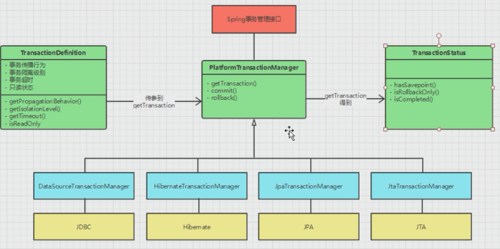
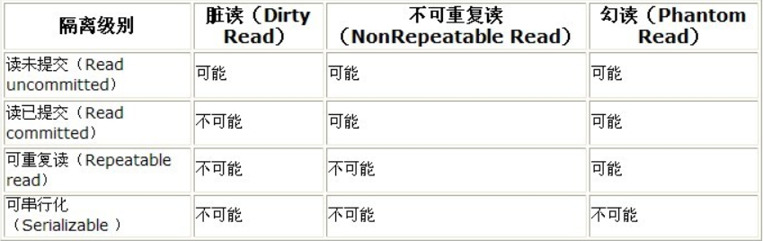

# 事务的概念与原理

## 事务概述
一组要么同时执行成功，要么同时失败的SQL语句。是数据库操作的一个不能分割执行单元。

数据库事务(Database Transaction) ，是指作为单个逻辑工作单元执行的一系列操作，要么完全地执行，要么完全地不执行。 事务处理可以确保除非事务性单元内的所有操作都成功完成，否则不会永久更新面向数据的资源。通过将一组相关操作组合为一个要么全部成功要么全部失败的单元，可以简化错误恢复并使应用程序更加可靠。一个逻辑工作单元要成为事务，必须满足所谓的ACID（原子性、一致性、隔离性和持久性）属性。事务是数据库运行中的逻辑工作单位，由DBMS中的事务管理子系统负责事务的处理

查询没有事务，因为不会影响数据的变化

插入

1. 先把要插入的数据放入临时表
2. 试着将临时表的数据插入实际表中
3. 如果返回错误，则删除临时表中的数据
4. 如果成功，则复制一份数据到实际表中，并返回影响数据库的条数，并删除临时表中的数据

删除

1. 先根据查询条件，去实际表中查询数据
2. 将查询的数据存入一份在临表中
3. 试着执行删除实际表中的数据，如果出现错误，则实际表中的数据不动，删除临时表中的记录
4. 如果执行成功，则真正的删除实际表中的操作，并返回影响数据表的条数

> 提供了后悔的机会，其中临时表是单例的，如果正在操作，会锁行或锁表

## 事务的四大特点
### Atomicity(原子性)
表示一个事务内的所有操作是一个整体，要么全部成功，要么全部失败

### Consistency(一致性)
表示一个事务内有一个操作失败时，所有的更改过的数据都必须回滚到修改前状态

### Isolation(隔离性)
事务查看数据时数据所处的状态，要么是另一并发事务修改它之前的状态，要么是另一事务修改它之后的状态，事务不会查看中间状态的数据。

### Durability(持久性)
持久性事务完成之后，它对于系统的影响是永久性的。

数据库的事务

1. 开启事务（open)
2. 执行事务（execute)
3. 提交事务(commit)或回滚事务（rollback)
4. 关闭事务（close)

## spring中的事务管理

### 主要分为5步

1. 获取数据连接

   `Connection conn= DriverManager.getConnection("jdbc:odbc://localhost:3306/demo","root","");`

2. 开启事务

   `conn.setAutoCommit(false)`

3. 执行事务CRUD 
4. 事务提交`conn.commit()`或事务回滚 `conn.rollback()`
5. 事务关闭`conn.close()`

例如：

```java
public static void main(String[] args) throws ClassNotFoundException, SQLException {
        Class.forName("com.mysql.cj.jdbc.Driver");
        Connection conn = null;
        try {
            conn = DriverManager.getConnection("jdbc:mysql://192.168.238.150:3306/demo?characterEncoding=utf-8&serverTimezone=UTC", "root", "root");
            conn.setAutoCommit(false);
            PreparedStatement ps = conn.prepareStatement("insert into account values(?,?,?)");
            ps.setInt(1, 4);
            ps.setString(2, "林涛");
            ps.setBigDecimal(3, new BigDecimal(1.2f));
            boolean execute = ps.execute();
            System.out.println(execute);
            int i = 0;
            if (i == 0) {
                System.out.println("模拟操作失败");
                throw new SQLException("不能再插入了");
            }
            System.out.println("提交事务开始");
            conn.commit();
            System.out.println("提交事务完成");
        } catch (SQLException e) {
            System.out.println("事务操作异常：" + e.getMessage());
            conn.rollback();
            System.out.println("事务操作回滚");
        }
        conn.close();
    }
```

SQL 文件：

```sql
drop table if exists `account`;
CREATE TABLE account
(
    id    INT PRIMARY KEY,
    NAME  VARCHAR(20) NOT NULL,
    money DOUBLE(10, 2)
) ENGINE = InnoDB
  DEFAULT CHARSET = utf8;
```


### Spring 事务属性分析



`TransactionDefinition` 接口中定义的主要方法

```java
public interface TransactionDefinition {
    default int getPropagationBehavior() {
		return PROPAGATION_REQUIRED;
	}
    default int getIsolationLevel() {
		return ISOLATION_DEFAULT;
	}
    default int getTimeout() {
		return TIMEOUT_DEFAULT;
	}
    default boolean isReadOnly() {
		return false;
	}
}
```

#### 事务传播行为

所谓事务的传播行为是指，如果在开始当前事务之前，一个事务上下文已经存在，此时有若干选项可以指定一个事务性方法的执行行为。在`TransactionDefinition`定义中包括了如下几个表示传播行为的常量：

- `TransactionDefinition.PROPAGATION_REQUIRED`

  如果当前存在事务，则加入该事务；如果当前没有事务，则创建一个新的事务。

- `TransactionDefinition.PROPAGATION_REQUIRES_NEW`

  创建一个新的事务，如果当前存在事务，则把当前事务挂起。

- `TransactionDefinition.PROPAGATION_SUPPORTS`

  如果当前存在事务，则加入该事务；如果当前没有事务，则以非事务的方式继续运行。

- `TransactionDefinition.PROPAGATION_NOT_SUPPORTED`

  以非事务方式运行，如果当前存在事务，则把当前事务挂起。

- `TransactionDefinition.PROPAGATION_NEVER`

  以非事务方式运行，如果当前存在事务，则抛出异常。

- `TransactionDefinition.PROPAGATION_MANDATORY`

  如果当前存在事务，则加入该事务；如果当前没有事务，则抛出异常。

- `TransactionDefinition.PROPAGATION_NESTED`

  如果当前存在事务，则创建一个事务作为当前事务的嵌套事务来运行；如果当前没有事务，则该取值等价于`TransactionDefinition.PROPAGATION_REQUIRED`。

这里需要指出的是，前面的六种事务传播行为是 Spring 从 EJB 中引入的，他们共享相同的概念。而 `PROPAGATION_NESTED`是 Spring 所特有的。以 `PROPAGATION_NESTED` 启动的事务内嵌于外部事务中（如果存在外部事务的话），此时，内嵌事务并不是一个独立的事务，它依赖于外部事务的存在，只有通过外部的事务提交，才能引起内部事务的提交，嵌套的子事务不能单独提交。如果熟悉 JDBC 中的保存点（`SavePoint`）的概念，那嵌套事务就很容易理解了，其实嵌套的子事务就是保存点的一个应用，一个事务中可以包括多个保存点，每一个嵌套子事务。另外，外部事务的回滚也会导致嵌套子事务的回滚。

#### 事务隔离级别

隔离级别是指若干个并发的事务之间的隔离程度。`TransactionDefinition` 接口中定义了五个表示隔离级别的常量：

- `TransactionDefinition.ISOLATION_DEFAULT`：这是默认值，表示使用底层数据库的默认隔离级别。对大部分数据库而言，通常这值就是`TransactionDefinition.ISOLATION_READ_COMMITTED`。
- `TransactionDefinition.ISOLATION_READ_UNCOMMITTED`：该隔离级别表示一个事务可以读取另一个事务修改但还没有提交的数据。该级别不能防止脏读和不可重复读，因此很少使用该隔离级别。
- `TransactionDefinition.ISOLATION_READ_COMMITTED`：该隔离级别表示一个事务只能读取另一个事务已经提交的数据。该级别可以防止脏读，这也是大多数情况下的推荐值。
- `TransactionDefinition.ISOLATION_REPEATABLE_READ`：该隔离级别表示一个事务在整个过程中可以多次重复执行某个查询，并且每次返回的记录都相同。即使在多次查询之间有新增的数据满足该查询，这些新增的记录也会被忽略。该级别可以防止脏读和不可重复读。
- `TransactionDefinition.ISOLATION_SERIALIZABLE`：所有的事务依次逐个执行，这样事务之间就完全不可能产生干扰，也就是说，该级别可以防止脏读、不可重复读以及幻读。但是这将严重影响程序的性能。通常情况下也不会用到该级别。

| 隔离级别        | 隔离级别的值 | 导致的问题                                                   |
| --------------- | ------------ | ------------------------------------------------------------ |
| Read-Uncommited | 0            | 导致脏读                                                     |
| Read-Commited   | 1            | 避免脏读，允许不可重复读和幻读                               |
| Repeatable-Read | 3            | 避免脏读，不可重复读，允许幻读                               |
| Serializable    | 4            | 串行化读，事务只能一个一个执行，避免脏读，不可重复读、幻读。执行效率慢，使用时慎重。 |

 **脏读** ：脏读就是指当一个事务正在访问数据，并且对数据进行了修改，而这种修改还没有提交到数据库中，这时，另外一个事务也访问这个数据，然后使用了这个数据。 

 **不可重复读** ：是指在一个事务内，多次读同一数据。在这个事务还没有结束时，另外一个事务也访问该同一数据。那么，在第一个事务中的两次读数据之间，由于第二个事务的修改，那么第一个事务两次读到的的数据可能是不一样的。这样在一个事务内两次读到的数据是不一样的，因此称为是不可重复读。 

 **幻读** : 是指当事务不是独立执行时发生的一种现象，例如第一个事务对一个表中的数据进行了修改，这种修改涉及到表中的全部数据行。同时，第二个事务也修改这个表中的数据，这种修改是向表中插入一行新数据。那么，以后就会发生操作第一个事务的用户发现表中还有没有修改的数据行，就好象发生了幻觉一样。 



#### 事务超时

`int getTimeout()`

所谓事务超时，就是指一个事务所允许执行的最长时间，如果超过该时间限制但事务还没有完成，则自动回滚事务。在 `TransactionDefinition` 中以 int 的值来表示超时时间，其单位是秒。

#### 事务的只读属性

`boolean isReadOnly()`

事务的只读属性是指，对事务性资源进行只读操作或者是读写操作。所谓事务性资源就是指那些被事务管理的资源，比如数据源、 JMS 资源，以及自定义的事务性资源等等。如果确定只对事务性资源进行只读操作，那么我们可以将事务标志为只读的，以提高事务处理的性能。在 `TransactionDefinition` 中以 boolean 类型来表示该事务是否只读

#### 事务的回滚规则

通常情况下，如果在事务中抛出了未检查异常（继承自 `RuntimeException` 的异常），则默认将回滚事务。如果没有抛出任何异常，或者抛出了已检查异常，则仍然提交事务。这通常也是大多数开发者希望的处理方式，也是 EJB 中的默认处理方式。但是，我们可以根据需要人为控制事务在抛出某些未检查异常时任然提交事务，或者在抛出某些已检查异常时回滚事务。

### Spring 事务管理 API 分析

Spring 框架中，涉及到事务管理的 API 大约有100个左右，其中最重要的有三个：TransactionDefinition、PlatformTransactionManager、TransactionStatus。所谓事务管理，其实就是“按照给定的事务规则来执行提交或者回滚操作”。“给定的事务规则”就是用 TransactionDefinition 表示的，“按照……来执行提交或者回滚操作”便是用 PlatformTransactionManager 来表示，而 TransactionStatus 用于表示一个运行着的事务的状态。

## spring事务配置

 Spring 事务管理分为

* 编码式

  编程式事务指的是通过编码方式实现事务

* 声明式

  声明式事务基于 AOP,将具体业务逻辑与事务处理解耦。声明式事务管理使业务代码逻辑不受污染, 因此在实际使用中声明式事务用的比较多。

  声明式事务有两种方式：

  * 一种是在配置文件（xml）中做相关的事务规则声明
  * 另一种是基于@Transactional 注解的方式

### 基于配置文件（xml）的方式

    1. 配置数据源,不管哪个厂商都要实现DataSource接口，拿到包含Connection对象
    2. 利用Spring提供给我们的事务管理器，管理所有的事务操作
    3. 利用切面编程来实现对某一类方法进行事务统一管理（声明式事务）
    4. 配置通知操作

```xml
<bean id="dataSource" class="com.alibaba.druid.pool.DruidDataSource" init-method="init" destroy-method="close">
        <property name="url"
                  value="jdbc:mysql://192.168.238.150:3306/demo?useUnicode=true&amp;characterEncoding=utf-8&amp;zeroDateTimeBehavior=convertToNull&amp;transformedBitIsBoolean=true&amp;useJDBCCompliantTimezoneShift=true&amp;useLegacyDatetimeCode=false&amp;serverTimezone=UTC"/>
        <property name="username" value="root"/>
        <property name="password" value="root"/>
        <!-- 配置初始化大小、最小、最大 -->
        <property name="initialSize" value="1"/>
        <property name="minIdle" value="1"/>
        <property name="maxActive" value="20"/>

        <!-- 配置获取连接等待超时的时间 -->
        <property name="maxWait" value="60000"/>

        <!-- 配置间隔多久才进行一次检测，检测需要关闭的空闲连接，单位是毫秒 -->
        <property name="timeBetweenEvictionRunsMillis" value="60000"/>

        <!-- 配置一个连接在池中最小生存的时间，单位是毫秒 -->
        <property name="minEvictableIdleTimeMillis" value="300000"/>

        <property name="validationQuery" value="SELECT 'x'"/>
        <property name="testWhileIdle" value="true"/>
        <property name="testOnBorrow" value="false"/>
        <property name="testOnReturn" value="false"/>

        <!-- 打开PSCache，并且指定每个连接上PSCache的大小 -->
        <property name="poolPreparedStatements" value="false"/>
        <property name="maxPoolPreparedStatementPerConnectionSize" value="20"/>

        <!-- 配置监控统计拦截的filters -->
        <property name="filters" value="stat"/>
    </bean>
    <bean id="transactionManager" class="org.springframework.jdbc.datasource.DataSourceTransactionManager">
        <property name="dataSource" ref="dataSource"/>
    </bean>

    <aop:config>
        <aop:pointcut id="transactionPointcut" expression="execution(public * com.tom..*.service.*Service.*(..))"/>
        <aop:advisor pointcut-ref="transactionPointcut" advice-ref="transactionAdvice"/>
    </aop:config>
    <tx:advice id="transactionAdvice" transaction-manager="transactionManager">
        <tx:attributes>
            <tx:method name="add*" propagation="REQUIRED" rollback-for="Exception,RuntimeException,SQLException"/>
            <tx:method name="remove*" propagation="REQUIRED" rollback-for="Exception,RuntimeException,SQLException"/>
            <tx:method name="modify*" propagation="REQUIRED" rollback-for="Exception,RuntimeException,SQLException"/>
            <tx:method name="login*" propagation="NEVER"/>
            <!-- <tx:method name="login" propagation="REQUIRED"/>-->
            <tx:method name="query*" read-only="true"/>
        </tx:attributes>
    </tx:advice>
```

### 基于`@Transactional` 注解的方式


## 事务的源代码

### `org.springframework.transaction.config.TxNamespaceHandler`

```java
@Override
	public void init() {
		registerBeanDefinitionParser("advice", new TxAdviceBeanDefinitionParser());
		registerBeanDefinitionParser("annotation-driven", new AnnotationDrivenBeanDefinitionParser());
		registerBeanDefinitionParser("jta-transaction-manager", new JtaTransactionManagerBeanDefinitionParser());
	}
```

### `doParse`

`org.springframework.transaction.config.TxAdviceBeanDefinitionParser#doParse`

```java
@Override
	protected void doParse(Element element, ParserContext parserContext, BeanDefinitionBuilder builder) {
		builder.addPropertyReference("transactionManager", TxNamespaceHandler.getTransactionManagerName(element));

		List<Element> txAttributes = DomUtils.getChildElementsByTagName(element, ATTRIBUTES_ELEMENT);
		if (txAttributes.size() > 1) {
			parserContext.getReaderContext().error(
					"Element <attributes> is allowed at most once inside element <advice>", element);
		}
		else if (txAttributes.size() == 1) {
			// Using attributes source.
			Element attributeSourceElement = txAttributes.get(0);
			RootBeanDefinition attributeSourceDefinition = parseAttributeSource(attributeSourceElement, parserContext);
			builder.addPropertyValue("transactionAttributeSource", attributeSourceDefinition);
		}
		else {
			// Assume annotations source.
			builder.addPropertyValue("transactionAttributeSource",
					new RootBeanDefinition("org.springframework.transaction.annotation.AnnotationTransactionAttributeSource"));
		}
	}
```

### `org.springframework.beans.factory.xml.AbstractBeanDefinitionParser#parse`

```java
@Override
public final BeanDefinition parse(Element element, ParserContext parserContext) {
    AbstractBeanDefinition definition = parseInternal(element, parserContext);
    if (definition != null && !parserContext.isNested()) {
        try {
            String id = resolveId(element, definition, parserContext);
            if (!StringUtils.hasText(id)) {
                parserContext.getReaderContext().error(
                    "Id is required for element '" + parserContext.getDelegate().getLocalName(element)
                    + "' when used as a top-level tag", element);
            }
            String[] aliases = new String[0];
            String name = element.getAttribute(NAME_ATTRIBUTE);
            if (StringUtils.hasLength(name)) {
                aliases = StringUtils.trimArrayElements(StringUtils.commaDelimitedListToStringArray(name));
            }
            BeanDefinitionHolder holder = new BeanDefinitionHolder(definition, id, aliases);
            registerBeanDefinition(holder, parserContext.getRegistry());
            if (shouldFireEvents()) {
                BeanComponentDefinition componentDefinition = new BeanComponentDefinition(holder);
                postProcessComponentDefinition(componentDefinition);
                parserContext.registerComponent(componentDefinition);
            }
        }
        catch (BeanDefinitionStoreException ex) {
            parserContext.getReaderContext().error(ex.getMessage(), element);
            return null;
        }
    }
    return definition;
}
```

### `org.springframework.beans.factory.xml.AbstractSingleBeanDefinitionParser#parseInternal`

```java
@Override
protected final AbstractBeanDefinition parseInternal(Element element, ParserContext parserContext) {
    BeanDefinitionBuilder builder = BeanDefinitionBuilder.genericBeanDefinition();
    String parentName = getParentName(element);
    if (parentName != null) {
        builder.getRawBeanDefinition().setParentName(parentName);
    }
    Class<?> beanClass = getBeanClass(element);
    if (beanClass != null) {
        builder.getRawBeanDefinition().setBeanClass(beanClass);
    }
    else {
        String beanClassName = getBeanClassName(element);
        if (beanClassName != null) {
            builder.getRawBeanDefinition().setBeanClassName(beanClassName);
        }
    }
    builder.getRawBeanDefinition().setSource(parserContext.extractSource(element));
    if (parserContext.isNested()) {
        // Inner bean definition must receive same scope as containing bean.
        builder.setScope(parserContext.getContainingBeanDefinition().getScope());
    }
    if (parserContext.isDefaultLazyInit()) {
        // Default-lazy-init applies to custom bean definitions as well.
        builder.setLazyInit(true);
    }
    doParse(element, parserContext, builder);
    return builder.getBeanDefinition();
}
```


### private RootBeanDefinition parseAttributeSource(Element attrEle, ParserContext parserContext)`

对`tx:advice `进行解析。

`org.springframework.transaction.config.TxAdviceBeanDefinitionParser#parseAttributeSource`

```java
private RootBeanDefinition parseAttributeSource(Element attrEle, ParserContext parserContext) {
    List<Element> methods = DomUtils.getChildElementsByTagName(attrEle, METHOD_ELEMENT);
    ManagedMap<TypedStringValue, RuleBasedTransactionAttribute> transactionAttributeMap =
        new ManagedMap<>(methods.size());
    transactionAttributeMap.setSource(parserContext.extractSource(attrEle));

    for (Element methodEle : methods) {
        String name = methodEle.getAttribute(METHOD_NAME_ATTRIBUTE);
        TypedStringValue nameHolder = new TypedStringValue(name);
        nameHolder.setSource(parserContext.extractSource(methodEle));

        RuleBasedTransactionAttribute attribute = new RuleBasedTransactionAttribute();
        String propagation = methodEle.getAttribute(PROPAGATION_ATTRIBUTE);
        String isolation = methodEle.getAttribute(ISOLATION_ATTRIBUTE);
        String timeout = methodEle.getAttribute(TIMEOUT_ATTRIBUTE);
        String readOnly = methodEle.getAttribute(READ_ONLY_ATTRIBUTE);
        if (StringUtils.hasText(propagation)) {
            attribute.setPropagationBehaviorName(RuleBasedTransactionAttribute.PREFIX_PROPAGATION + propagation);
        }
        if (StringUtils.hasText(isolation)) {
            attribute.setIsolationLevelName(RuleBasedTransactionAttribute.PREFIX_ISOLATION + isolation);
        }
        if (StringUtils.hasText(timeout)) {
            try {
                attribute.setTimeout(Integer.parseInt(timeout));
            }
            catch (NumberFormatException ex) {
                parserContext.getReaderContext().error("Timeout must be an integer value: [" + timeout + "]", methodEle);
            }
        }
        if (StringUtils.hasText(readOnly)) {
            attribute.setReadOnly(Boolean.valueOf(methodEle.getAttribute(READ_ONLY_ATTRIBUTE)));
        }

        List<RollbackRuleAttribute> rollbackRules = new LinkedList<>();
        if (methodEle.hasAttribute(ROLLBACK_FOR_ATTRIBUTE)) {
            String rollbackForValue = methodEle.getAttribute(ROLLBACK_FOR_ATTRIBUTE);
            addRollbackRuleAttributesTo(rollbackRules,rollbackForValue);
        }
        if (methodEle.hasAttribute(NO_ROLLBACK_FOR_ATTRIBUTE)) {
            String noRollbackForValue = methodEle.getAttribute(NO_ROLLBACK_FOR_ATTRIBUTE);
            addNoRollbackRuleAttributesTo(rollbackRules,noRollbackForValue);
        }
        attribute.setRollbackRules(rollbackRules);

        transactionAttributeMap.put(nameHolder, attribute);
    }

    RootBeanDefinition attributeSourceDefinition = new RootBeanDefinition(NameMatchTransactionAttributeSource.class);
    attributeSourceDefinition.setSource(parserContext.extractSource(attrEle));
    attributeSourceDefinition.getPropertyValues().add("nameMap", transactionAttributeMap);
    return attributeSourceDefinition;
}
```

### `org.springframework.transaction.config.TxAdviceBeanDefinitionParser#getBeanClass`

```java
@Override
protected Class<?> getBeanClass(Element element) {
    return TransactionInterceptor.class;
}
```

### `MethodInterceptor`

```java
public class TransactionInterceptor extends TransactionAspectSupport implements MethodInterceptor, Serializable {

    @Override
	@Nullable
	public Object invoke(MethodInvocation invocation) throws Throwable {
		// Work out the target class: may be {@code null}.
		// The TransactionAttributeSource should be passed the target class
		// as well as the method, which may be from an interface.
		Class<?> targetClass = (invocation.getThis() != null ? AopUtils.getTargetClass(invocation.getThis()) : null);

		// Adapt to TransactionAspectSupport's invokeWithinTransaction...
		return invokeWithinTransaction(invocation.getMethod(), targetClass, invocation::proceed);
	}
}
```

### `PlatformTransactionManager`

通过MethodInterceptor实现提交或回滚

```java
public class DataSourceTransactionManager extends AbstractPlatformTransactionManager
		implements ResourceTransactionManager, InitializingBean {
}
```


```java
public interface PlatformTransactionManager {
    TransactionStatus getTransaction(@Nullable TransactionDefinition definition)
			throws TransactionException;
    void commit(TransactionStatus status) throws TransactionException;
    void rollback(TransactionStatus status) throws TransactionException;
}
```


`org.springframework.transaction.support.TransactionSynchronizationManager#resources`

```java
private static final ThreadLocal<Map<Object, Object>> resources =
			new NamedThreadLocal<>("Transactional resources");
private static Object doGetResource(Object actualKey) {
		Map<Object, Object> map = resources.get();
		if (map == null) {
			return null;
		}
		Object value = map.get(actualKey);
		// Transparently remove ResourceHolder that was marked as void...
		if (value instanceof ResourceHolder && ((ResourceHolder) value).isVoid()) {
			map.remove(actualKey);
			// Remove entire ThreadLocal if empty...
			if (map.isEmpty()) {
				resources.remove();
			}
			value = null;
		}
		return value;
	}
```


org.springframework.transaction.support.AbstractPlatformTransactionManager#getTransaction

## 总结

1. 什么叫事务

   一个整体的执行逻辑单元，要么全部成功，要么全部失败。

2. 事务的特性

   原子性、一致性、隔离性、持久性

3. 事务的基本原理

   从数据库的角度来说，提供了一种后悔机制（代码写错了，可以用git,svn)

   用临时表（瞬时缓存）来实现后悔

   将执行增删改，先将满足条件的数据查出来放入到临时表中

   将数据操作在临时表中执行

   如果没有问题，就同步到实际的表中，并将临时表中的记录删除，并返回影响行数

   如果有问题，并将临时表中的记录删除，返回错误信息

   如果想对一个表进行清空，千万不要用delete from,这种情况，一定会造成锁表

   如果加了where条件，就是一行锁

4. Spring的事务配置

   AOP配置，配置那些方法需要加事务

   声明式事务配置，要配置事务的传播属性，隔离级别，回滚条件

   传播属性：required(默认), unique_new, nest,never,supports,not_support,mandatory

   隔离级别：default(repeatable_read), read_commited,read_uncommited,repeatable_read,serializable

5. 源码

   通过解析配置文件，得到TransactionDefinition,实际就是AOP中的MethodInterceptor

   就可以在满足条件的方法调用之前或之后加一些东西

   `PlatformTransactionManager`的方法

   * `getTransaction()`由`org.springframework.transaction.support.AbstractPlatformTransactionManager#getTransaction`实现，通过`doGetTransaction()`,调用了`DataSourceTransactionManager.doGetTransaction()`，`TransactionSynchronizationManager.getResource(this.dataSource)从 `ThreadLocal<Map<Object, Object>>`中取值，为key为`DataSource`,Object为`ConnectionHolder`(相当于获取`Connection`)`

     `在调用之前手动将`conn.setAutoCommit(false)`

   * `commit()`  实现上调用`conn.commit();`

   * `rollback()`实现上调用`conn.rollback();`

   