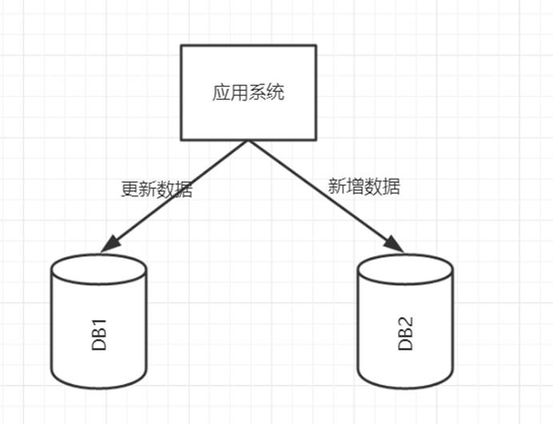
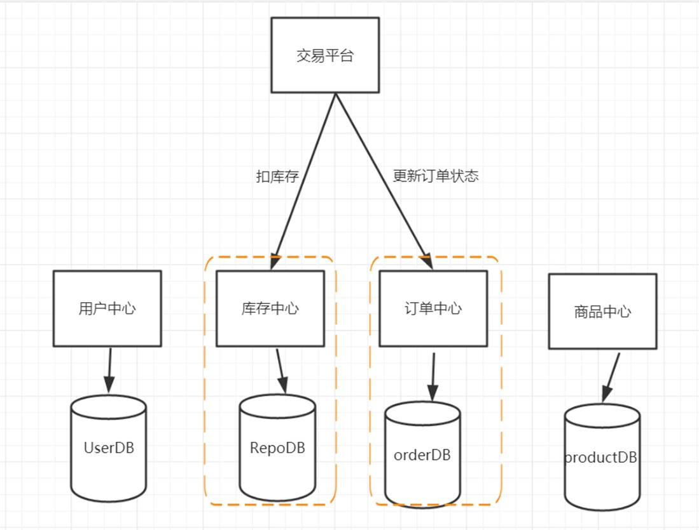
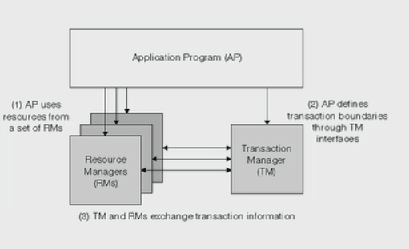
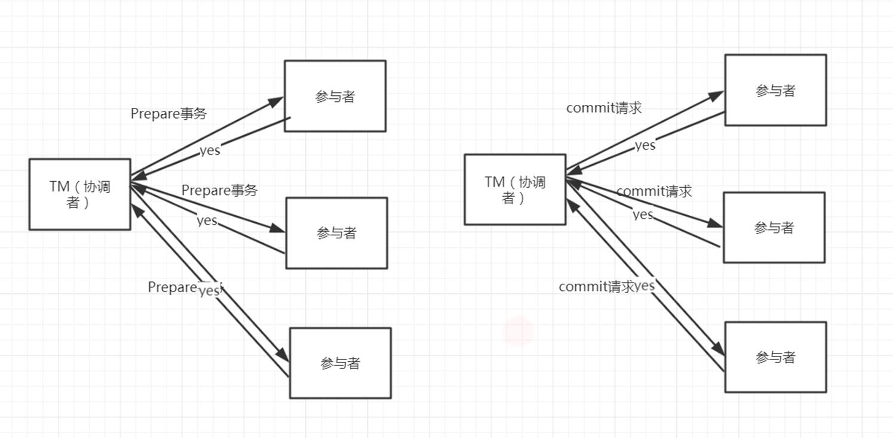
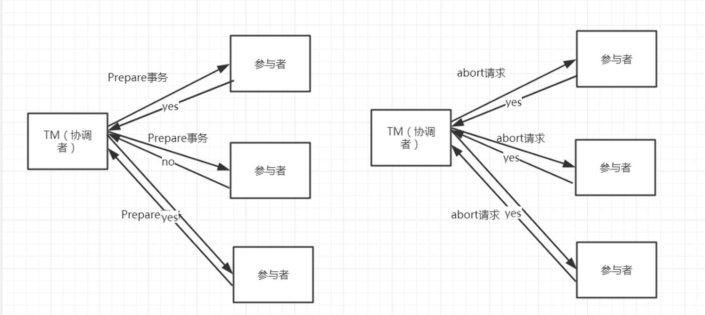

# 分布式事务管理

## 分布式事务产生背景

[database transaction]

数据库事务要满足几个要求：ACID

Atomic(原子性)   事务必须是原子的工作单元

Consistent(一致性)  事务完成时，必须使所有数据都保持一致状态

Isolation(隔离性)   并发事务所做的修改必须和其他事务所做的修改是隔离的

Duration（持久性） 事务完成之后，对系统的影响是永久性的

Mysql里的事务处理过程

1. 记录redo和undo log文件，确保日志在磁盘上的持久化

2. 更新数据记录

3. 提交事务 ，redo 写入commit记录

## 分布式事务

### 数据库分库分表

 

### SOA化

 

## X/OpenDTP事务模型

X/Open Distributed Transaction Processing Reference Model 

X/Open是一个组织机构，定义出的一套分布式事务标准， 定义了规范的API接口

2PC（two -phase-commit）, 用来保证分布式事务的完整性

J2EE 遵循了X/open DTP规范，设计并实现了java里面的分布式事务编程接口规范-JTA

XA是X/Open DTP定义的中间件与数据库之间的接口规范。 XA接口函数由数据库厂商提供

### X/OpenDTP 角色

* AP application      

* RM resources manager  资源管理器。一般指数据库或文件系统

* TM transaction manager 事务管理器，事务协调者。

### 2PC（two -phase-commit）

(CAP)

#### 阶段一：提交事务请求（投票）

1. TM向所有的AP发送事务内容，询问是否可以执行事务的提交操作，并等待各个AP的响应

2. 执行事务

   各个AP节点执行事务操作，将undo和redo信息记录到事务日志中，尽量把提交过程中所消耗时间的操作和准备都提前完成后确保后续

   事务提交的成功率

3. 各个AP向TM反馈事务询问的响应

   各个AP成功执行了事务操作，那么反馈给TM yes的response；如果AP没有成功执行事务，就反馈TM no的response

#### 阶段二：执行事务提交

##### 执行提交事务

假设一个事务的提交过程总共需要30s， 其中prepare操作需要28（事务日志落地磁盘及各种io操作），而真正commit只需要2s

那么，commit阶段发生错误的概率和prepare相比， 2/28 (<10%) .只要第一个阶段成功，那么commit阶段出现失败的概率就非常小

大大增加了分布式事务的成功概率

##### 中断事务提交

 

2pc存在的问题

1. 数据一致性问题

2. 同步阻塞

