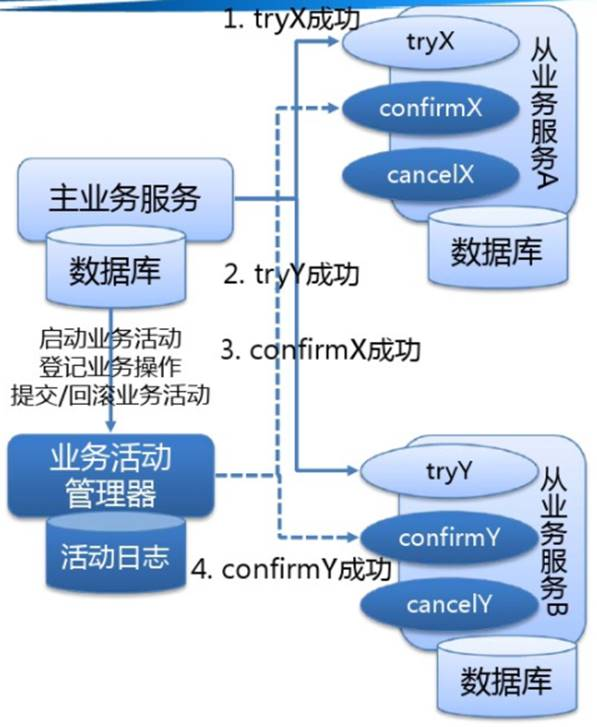

# 互联网的分布式事务的解决方案

目前互联网领域里有几种流行的分布式解决方案，但都没有像之前所说的XA事务一样形成X/OpenDTP那样的工业规范，而是仅仅在具体的行业里获得较多的认可

业务接口整合，避免分布式事务

这个方案就是把一个业务流程中需要在一个事务里执行的多个相关业务接口包装整合到一个事务中，比如我们可以讲A/B/C整合为一个服务D来实现单一事务的业务流程服务

## 最终一致性方案之ebay模式

eBay在2008年公布了一个关于BASE准则提到一个分布式事务解决方案。eBay的方案其实是一个最终一致性方案，它主要采用消息队列来辅助实现事务控制流程，方案的核心是将需要分布式处理的任务通过消息队列的方式来异步执行，如果事务失败，则可以发起人工重试的纠正流程。人工重试被更多的应用于支付场景，通过对账系统对事后问题进行处理

 

比如一个很常见的场景：某个用户产生了一笔交易，那么需要在交易表中增加记录，同时需要修改用户表的金额（余额），由于这两个表属于不同的远程服务，所以就会涉及到分布式事务与数据一致性的问题

 ````
 user(id, name, amt_sold,  amt_bought)   
 transaction(xid, seller_id,  buyer_id, amount)  
 ````


```
begin;   
INSERT INTO transaction  VALUES(xid, $seller_id, $buyer_id, $amount);   
UPDATE user SET amt_sold =  amt_sold + $amount WHERE id = $seller_id;   
UPDATE user SET amt_bought =  amt_bought + $amount WHERE id = $buyer_id;  
commit;  
```

那么在这里可以使用消息队列（MQ）来做

 先启动一个事务，更新交易表（transaction）后，并不直接更新user表，而是将要对user表进行的更新插入到消息队列中。

目标系统收到该消息以后，启动本地事务去对用户表的余额做调整

伪代码

```
bool result=dao.update();

if(result){

 mq.send();

}
```


根据上面的伪代码的实现方案，可能出现几种情况

1. 数据库操作成功，向MQ中投递消息也成功

2. 操作数据库失败，不会向MQ中投递消息

3. 操作数据库成功，但是向MQ中投递消息时失败，向外抛出异常。数据库操作回滚

对于上面几种情况，问题都不大。那么我们分析小消费端的问题

1. 消息出队列以后，消费者对应的业务操作要执行成功。如果执行失败，消息不能失效或者丢失。需要保证消息和业务操作一致

2. 尽量避免消息重复消费，如果重复消费，也不能影响业务的执行结果

 

对于第一个问题，如何保证消息不丢失

现在用的比较普遍的MQ都具有持久化消息的功能，如果消费者宕机或者消费失败，都可以执行重试机制

 

对于如何避免消息的重复消费

1. 保证消费者的幂等性；**也就是说如果队列中的消息因为网络异常导致发送多次的情况下，仍然需要保证消息被应用多次与应用一次产生的效果是一样的**

2. 通过消费日志表来记录消费状态；**增加一个message_applied（msg_id）表，用来记录已经被成功应用的消息。在目标系统执行更新操作之前，先检测该消息是否已经被消费过，消费完成后通过本地事务控制来更新这个“消费表状态”，用来避免消息重复消费问题**

 

上面这种方式是非常经典的实现，基本避免了分布式事务，实现了“最终一致性”。

*各大知名的电商平台和互联网公司，几乎都是采用类似的设计思路来实现“最终一致性”的。这种方式适合的业务场景广泛，而且比较可靠。不过这种方式技术实现的难度比较大*

 

## 保证最终一致性的模式

1. 查询模式

任何一个服务操作都提供一个查询接口，用来向外部输出操作执行的状态。服务操作的使用方可以通过接口得知服务操作执行的状态，然后根据不同状态做不同的处理操作

为了能够实现查询，每个服务操作都需要有唯一的流水号

2. 补偿模式

有了查询模式，我们就能够得知操作所处的具体状态，如果整个操作处于不正常状态，我们需要修正操作中的出现问题的子操作。也许是要重新执行，或者取消已完成的操作。通过修复使得整个分布式系统达到最终一致。这个过程就是补偿模式

根据发起形式又分为

自动恢复：通过对发生失败操作的接口自动重试或者回滚已经完成的操作

通知运营：如果程序无法自动完成恢复，则通过运营人员手动进行补偿

通知技术：通过监控或者告警通知到技术人员，通过技术手段进行修复

 

## X/OpenDTP模型的支付宝的DTS架构

DTS(Distributed Transaction Service)框架是由支付宝在X/OpenDTP模型的基础上改进的一个设计，定义了类似2PC的标准两阶段接口，业务系统只需要实现对应的接口就可以使用DTS的事务功能。DTS最大的特点是放宽了数据库的强一致约束，保证了数据的最终一致性。

 

具体的流程是



  TCC分为三个阶段TRYING-CONFIRMING-CANCELING。

每个阶段做不同的处理。   

TRYING、CONFIRMING、CANCELIING大致可以理解为SQL事务中的LOCK、COMMIT、ROLLBACK  

TRYING 阶段主要是对业务系统做检测及资源预留    

CONFIRMING 阶段主要是对业务系统做确认提交，TRYING阶段执行成功并开始执行CONFIRMING阶段时，默认 CONFIRMING阶段是不会出错的。即：只要TRYING成功，CONFIRMING一定成功。  

 CANCELING 阶段主要是在业务执行错误，需要回滚的状态下执行的业务取消，预留资源释放。    

以上所有的操作需要满足幂等性，幂等性的实现方式可以是：    

1、通过唯一键值做处理，即每次调用的时候传入唯一键值，通过唯一键值判断业务是否被操作，如果已被操作，则不再重复操作    

2、通过状态机处理，给业务数据设置状态，通过业务状态判断是否需要重复执行  

如何更通俗的理解TCC事务模型

 *支付系统接收到会员的支付请求后，需要扣减会员账户余额、增加会员积分（暂时假设需要同步实现）增加商户账户余额*  *会员系统、商户系统、积分系统是独立的三个子系统，无法通过传统的事务方式进行处理。*  *TRYING**阶段：我们需要做的就是会员资金账户的资金预留，即：冻结会员账户的金额（订单金额）*  *CONFIRMING**阶段：我们需要做的就是会员积分账户增加积分余额，商户账户增加账户余额*  *CANCELING**阶段：该阶段需要执行的就是解冻释放我们扣减的会员余额*  

开源的tcc框架

tcc-transaction

bytetcc

## 最大努力通知型

做过支付宝交易接口的同学都知道，我们一般会在支付宝的回调页面和接口里，解密参数，然后调用系统中更新交易状态相关的服务，将订单更新为付款成功。同时，只有当我们回调页面中输出了success字样或者标识业务处理成功相应状态码时，支付宝才会停止回调请求。否则，支付宝会每间隔一段时间后，再向客户方发起回调请求，直到输出成功标识为止。

其实这就是一个很典型的补偿例子，跟一些MQ重试补偿机制很类似。

